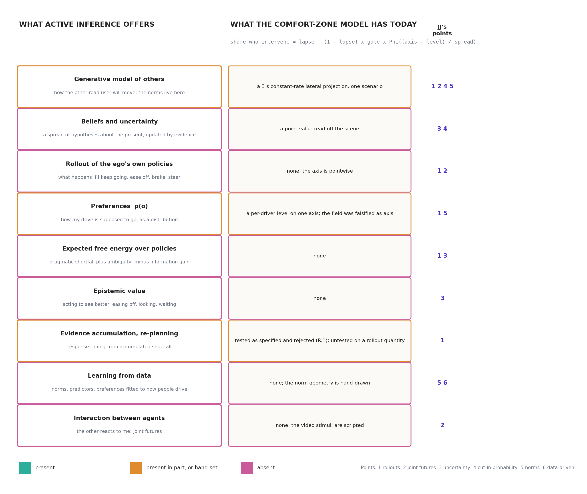
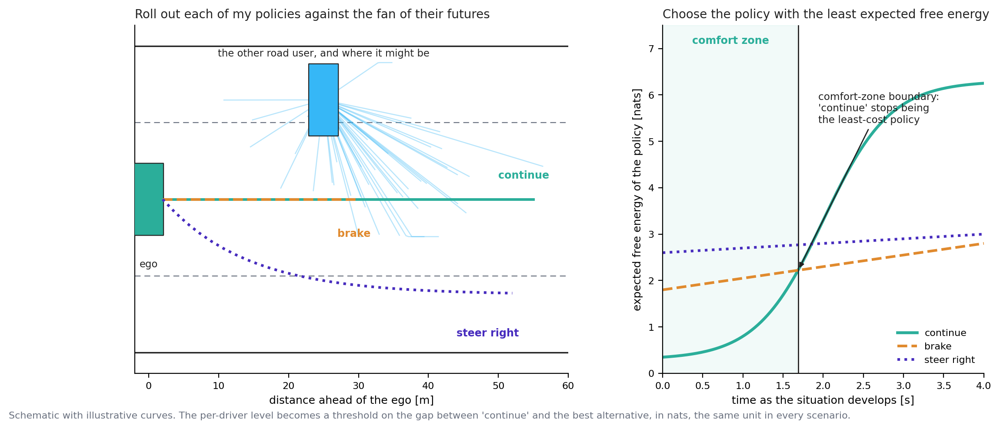
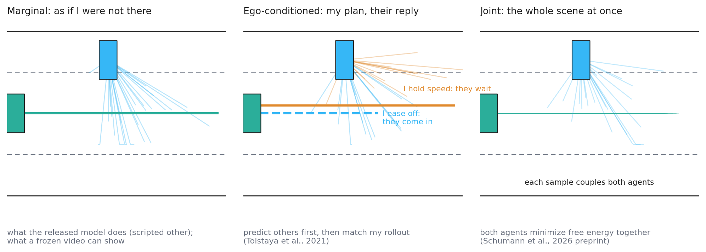
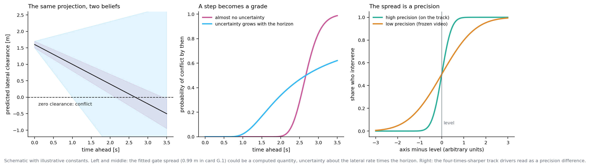
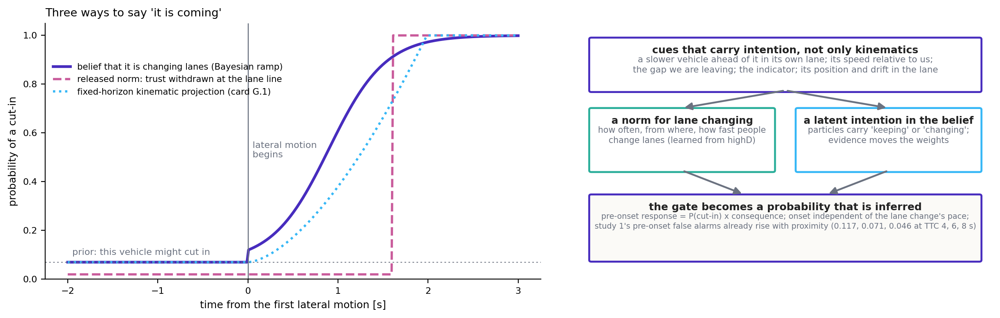
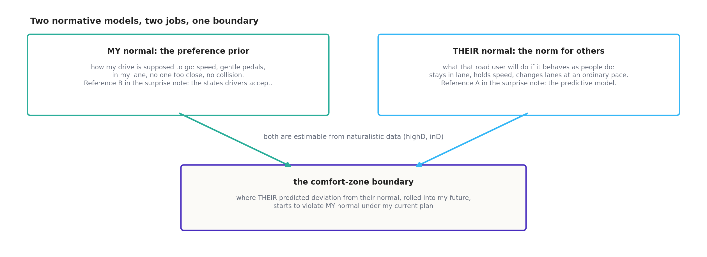
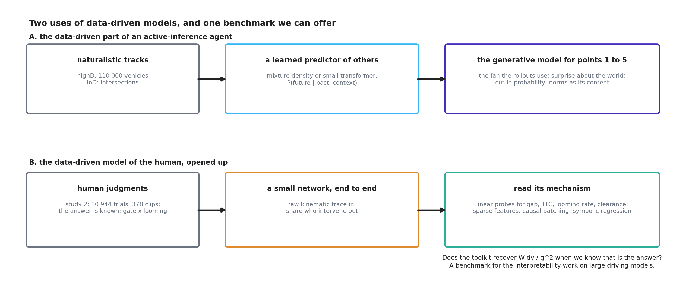
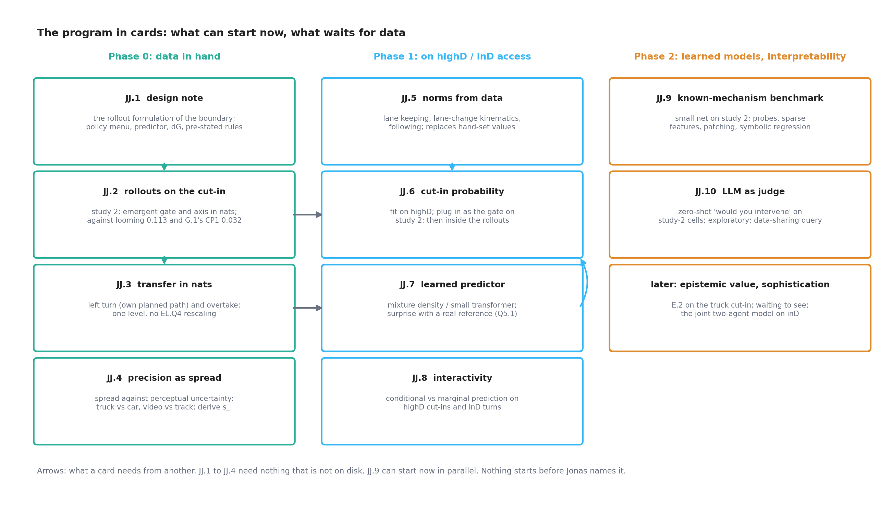

# Adding the rest of active inference: the six points from a colleague (JJ), what each would need, and a program to test them

*2026-09-17, written at Jonas's request after his discussion with a colleague (JJ) the same day. Analysis
and plan only: nothing here has been run, no card is authorized, and every number quoted from the
project's own work comes from a tracked output named at the point of quotation. The figures are
schematics generated by `docs/make_ai_program_figures.py`; none carries a fitted number. Opinions are
marked as opinions. References were checked in this session unless marked otherwise; two are cited by
title only because their pages could not be opened. Jonas said more will follow over several sessions;
this document is written to be extended; section 13 records his rulings so far and section 12 what it
still needs from him. The colleague is referred to as JJ throughout, at Jonas's request.*

## 0 What JJ said, as Jonas relayed it

1. We should work *with* active inference on what we are doing: identify what we are missing and add
   it, rather than keep the slice that survived and call the rest falsified.
2. Predictions should always be thought of as **the rollout of our own driver policy in the world of
   the other road users**, and the policy with the least free energy is the one to choose.
3. Ideally the prediction is one rollout of the entire world. In practice it is often done by
   predicting a set of rollouts of the other road users first, then asking how our own rollout matches
   them.
4. **Uncertainty** enters every model, and JJ sees it more and more as the core component: it is what
   drives what we do.
5. For the cut-in, the **probability that the vehicle will cut in** is likely a central part of the
   algorithm.
6. **Normative models** are at the core of the model and of the prediction.
7. We should look into **LLMs and other data-driven methods**, and into understanding a model's
   mechanisms by studying its weights; JJ's group is putting an intern on this.

Jonas asked for two things: what it would take, with all the components of active inference, for our
comfort-zone work to work and be better; and what we can do, test and develop to do what JJ
proposes. Sections 3 to 5 take the six points one at a time (the first point is the frame for all of
them). Section 6 shows how they fit into one architecture. Section 7 is the program, in cards.

## 1 The short version

**Where we stand, in JJ's terms.** The comfort-zone model as it is today,

> share who intervene = lapse + (1 − lapse) × gate × Φ((axis − level) / spread),

is an active-inference agent with almost everything switched off (figure 1). It has a generative model
of the other road user that consists of one straight-line projection over three seconds, in one
scenario. It has no belief with a spread, no rollout of the ego's own options, no comparison of
policies, no epistemic value, no learning, and no interaction. What it does have is a per-driver
threshold on a perceived quantity, estimated well. The falsifications on record (gates R.1 and R.2,
cards HS.1, PN.1 and PC.1) were of specific *slices*: the pointwise preference deficit with a worst-case
counterfactual as the axis, a non-leaky accumulator of that deficit as the timer, a positional norm's
trust withdrawal as the onset, and a fixed-horizon projected conflict as a scenario-agnostic gate. None
of them tested an agent that predicts, rolls out, and compares.

**The one move that ties JJ's points together.** Replace the pointwise axis by a *policy
comparison*: at each moment roll out a small menu of the ego's options (continue, ease off, brake,
steer) against the predicted futures of the other road user, score each with the preference function,
and take as the criticality quantity the gap in expected free energy between "continue" and the best
alternative, **ΔG, in nats**. The comfort zone is where continuing is still the least-cost policy; the
boundary is where an alternative overtakes it; the per-driver level is a threshold on ΔG, estimated
exactly as the levels are estimated now. Four things follow that the current model cannot offer:

- **The gate becomes emergent.** Before a cut-in starts, the predicted futures already contain cut-ins
  with a small prior probability; ΔG is small but nonzero, and it rises as the belief that the vehicle
  is changing lanes rises. No separate gate, no fixed horizon (points 1, 4, 5).
- **The anticipation horizon becomes the scenario's own**, which is what card PC.1 asked for
  (PC1.Q4): a rollout of the ego's *planned* left turn conflicts with the oncoming car when the two
  paths meet, and the uncertainty of the prediction grades that conflict rather than stepping it
  (points 1, 3).
- **One unit across scenarios.** ΔG is in nats on the cut-in, the left turn and the overtake alike, so
  the common-scale problem that blocks card EL.2 (query EL.Q4) is dissolved by construction, if the
  quantity works.
- **The falsified reference is replaced, not relabeled.** The pipeline review traced the field's
  loss to a worst-case counterfactual that orders by absolute speed, and to a projection to closure
  that depends on the lane change's pace. Rollouts score *predicted* futures under a normative model
  with uncertainty, and the belief about intention engages at the onset. Both mechanisms of the loss
  are addressed by design, which does not mean the replacement will win.

**What it would need.** For the cards that can start now: a predictor of the other road user (a
constant-velocity Gaussian with measured uncertainty growth to begin with; the released norm tournament
and a learned predictor later), a five-policy menu with closed-form kinematics, the preference function
already mirrored in `src/aidriver/preferences.py`, and the estimator already in `src/comfortzone/`.
Compute is trivial: no cross-entropy planner, no particle filter in the loop. For the rest: highD and
inD (applied for), from which the norms, the cut-in probability, the uncertainty growth and a learned
predictor come; and, for point 6, a small end-to-end network on the second cut-in study plus the
interpretability toolkit, which we can run on data whose mechanism we already know.

**The honest bar.** On the second cut-in study the looming rule sits at the sampling-noise floor
(0.113 held out against a floor of 0.118, `replication/czb/out/cutin2_looming.md`). Nothing can beat it
there. A rollout formulation earns its place only by matching it with fewer scenario-specific choices,
by predicting the pre-onset cells without a fitted gate, by transferring to the left turn and the
overtake with one level, and by making predictions about uncertainty (truck against car, video against
track) that the looming rule cannot make. Those are the pre-stated criteria of the cards in section 7.

**Recommendation** [opinion]: write the design note (JJ.1) and run the cut-in rollout card (JJ.2) on
data in hand; they cost days and settle whether the rest is worth building. In parallel, start the
known-mechanism interpretability benchmark (JJ.9), which needs no new data and gives JJ's group's intern a
case where the answer is known. Everything that needs highD or inD waits for access, as the
naturalistic plan already says.

## 2 Where we stand, said the way JJ would say it

*Figure 1. The active-inference stack (left) against the current comfort-zone model (middle), row by
row, with the points of JJ's that each row serves (right). Nothing in the current model is a belief,
a rollout, or a comparison of options.*

The scope map of 2026-08-29 (`docs/active_inference_scope_map.md`) described the project as using a
"thin, deliberately chosen slice" of active inference. Since then the slice has become thinner still:
the field was falsified as the axis, the looming rate replaced it, and the gate arrived from a
colleague's kinematic analysis. Read as an active-inference agent, the model of today is one in which
every component but the preference threshold has been set to a degenerate value:

| component | what an active-inference agent has | what the comfort-zone model has |
|---|---|---|
| generative model of the other | a distribution over its futures, shaped by norms | one straight line at the current lateral rate, 3 s long, on the cut-in only |
| belief | a spread of hypotheses, updated by evidence | a point value read off the scene |
| ego policies | a menu, each rolled out | none; the participant's "would you intervene" is scored against the scene, not against alternatives |
| preferences | a distribution over observations | a threshold on one axis, per driver |
| expected free energy | pragmatic shortfall plus ambiguity, minus information gain, per policy | none |
| response | the least-cost policy; a re-plan when accumulated shortfall crosses a bound | a probit on the axis, gated |
| learning | norms and parameters fitted to how people drive | hand-set constants (3 s horizon, 0.5 m/s lower bound of the crossing norm) |

The falsifications were real, pre-registered, and stand. What they were *of* is the point JJ is
making. Each one, read against the stack, points to a component that was absent rather than to the
framework:

| what failed | how it failed | the absent component that would plausibly change it |
|---|---|---|
| the field as axis (R.2), 56% of the loss | the safety term's worst-case counterfactual orders matched-TTC cells by absolute speed; participants order by gap (`docs/r2_pipeline_review.md` §3.2) | scoring *predicted* futures under a normative model, not one worst case (points 1, 3, 5) |
| the field as axis (R.2), 44% of the loss | the lane-entry gate projected to closure made the conflict depend on the lane change's pace; participants do not (§3.1) | a belief about intention that engages at the onset (point 4) |
| the deficit accumulator (R.1) | responding is graded before any post-onset evidence exists | a prior over the other's intentions in the rollouts: anticipation *is* the prior (points 1, 4) |
| surprise as the onset (HS.1) | people respond before the world surprises them | the rollout of the ego's own plan: anticipated conflict, not surprise (point 1) |
| trust withdrawal as the onset (PN.1) | a positional norm withdraws trust later for slower lane changes | a norm written for lane changing, learned from data (point 5) |
| one fixed-horizon projected conflict (PC.1) | the horizon is the scenario's own | the horizon emerges from where the rolled-out paths meet and how uncertain the arrival is (points 1, 3) |

None of this says the replacement will win; the second cut-in study is at the noise floor and a richer
model can at best tie it there. It says that the negative results do not license giving up on the
architecture, which is JJ's first point, and that the components to add are named.

## 3 Point 1, and the frame for the rest: predictions as rollouts of our own policy

### 3.1 What it means, in plain words

A driver does not evaluate the present. A driver imagines a few seconds ahead: *if I keep doing what I
am doing, where will that car be, and where will I be?* The imagined future is not one line but a
fan, because the other driver might do several things. Then the same question for each thing the
driver could do instead: ease off, brake, move over. Each imagined future is scored against how the
drive is supposed to go: at my speed, in my lane, no one too close, no collision. The policy whose
imagined futures score best, taken over the whole fan, is the one to follow. In active inference the
score is the expected free energy, and "best" is "least".

The comfort zone, in these terms, is not a region of the road or a value of a cue. It is the set of
situations in which **continuing is still the least-cost policy**. The boundary is where some
alternative overtakes it. The dread boundary is where every alternative is bad. Figure 2 draws it.

*Figure 2. Left: the other road user and the fan of where it might be over the next seconds; three
policies of the ego, each rolled out. Right: the expected free energy of each policy as the situation
develops (illustrative curves). The comfort zone is where "continue" is lowest; the boundary is where
"brake" overtakes it. The per-driver level becomes a threshold on the gap between the two, in nats.*

This is what the released model does internally (handbook chapter 3): particles are rolled 6 s
forward under a candidate plan, scored by the preference function, and the plan is kept or replaced.
It is also what the project deliberately switched off (`docs/czb_validation_roadmap.md` §4b), on the
argument that for a frozen clip "when does doing nothing stop being acceptable" is the pointwise deficit
of the no-action trajectory. The roadmap already conceded where that argument fails: "where scenarios
differ in escape affordances, which is precisely the transfer set (LTAP: yield or proceed; overtake:
abort or continue)". Its experiment E.3, "a policy-set field for the transfer scenarios", is the seed of
what follows.

### 3.2 The construction, precisely enough to be wrong

At the moment a clip is frozen, t₀:

1. **A belief about the present**, b(s₀): the two vehicles' positions, speeds, the other's lateral rate,
   and, for the cut-in, a latent intention (keeping lane, changing lane) with prior probability p₀ of
   changing. For the video studies the belief is read from the shown window, with a measurement
   uncertainty set from the traces' jitter floor as card HS.1 learned to do.
2. **A predictive distribution over the other's futures**, p(x_other(τ) | b), τ up to H. Three
   candidates, in order of ambition: a constant-velocity Gaussian whose spread grows with the horizon
   (the baseline of the trajectory-prediction literature; the surprise note's stand-in); the released
   model's norm tournament run open loop (`src/common/dynamics.py::forward_tar_agent`, norms as
   content, section 5); a predictor learned from highD (section 6). Under a latent intention the
   distribution is a mixture: p₀ × (lane-change futures) + (1 − p₀) × (lane-keeping futures).
3. **A policy menu** Π for the ego: continue at the current controls; ease off (−1 m/s²); brake
   (−3 m/s²); brake hard (−6 m/s²); steer away by half a lane over 2 s. Each is a closed-form
   kinematic rollout. For the left turn the menu is {proceed with the turn, wait}; for the overtake
   {continue the pass at the current clearance, abort}. The menu is the one scenario-specific element,
   and it is the *instructed alternatives* of each study rather than a modeling choice.
4. **Expected free energy per policy**, in the released model's own residual-information form:
   G(π) = Σ_τ [max_o log p(o) − E log p(o_τ | π, b)] ≥ 0 over the sampled futures, using the six
   preference terms mirrored in `src/aidriver/preferences.py`. Epistemic value off in the primary
   analysis (the authors' own validated configuration), on as a secondary (section 4).
5. **The criticality quantity** ΔG(t₀) = G(continue) − min_π G(π) ≥ 0, in nats.
6. **The response model**, unchanged in form: share who intervene = lapse + (1 − lapse) ×
   Φ((log ΔG − log c_i) / σ), with c_i the per-driver level estimated hierarchically as now
   (`replication/czb/stage1_*.py`). No gate term. If ΔG needs a gate to reach the pre-onset cells,
   the construction has failed at what it was for.

Two things distinguish this from the falsified field. The field was the deficit of the *present state*
under one *worst-case* counterfactual; ΔG is the expected shortfall of *continuing* over *predicted*
futures, **relative to the best alternative**. A situation in which continuing is bad but nothing
better exists has a small ΔG and a large G(continue): that is the dread zone, and the two quantities
separate it from the comfort boundary, which the field could only do by moving a parameter
(`notes/04_comfort_zone_method.md` §4).

### 3.3 Why the gate and the horizon should emerge

**Pre-onset.** With p₀ > 0 the fan contains lane-change futures before any lateral motion. Continuing
collides in a share of them; braking does not. So ΔG ≈ p₀ × (consequence of a cut-in at this gap),
small but graded in proximity. That is what the data show: the pre-onset false-alarm rate in study 1
already rises with proximity (0.117, 0.071, 0.046 at starting TTC 4, 6, 8 s; handbook chapter 11), and
card G.1's fitted gate sits at 0.063 to 0.070 across every pre-onset cell (`out/cutin2_gate.md` §4), which
reads naturally as a prior probability of a cut-in over the next few seconds rather than as a
kinematic projection. Once lateral motion begins, the belief about intention rises and ΔG with it. The
onset is where the intention becomes legible, which does not depend on the lane change's pace, the
first of the two constraints the pipeline review extracted from the data.

**The horizon.** On the left turn, card PC.1 found that only the ego's *planned* path (its recorded
future, reading P) opened a projected-conflict gate, and at no fixed horizon consistently. In the
rollout formulation the ego's policy "proceed with the turn" is exactly that planned path; the conflict
with the oncoming car is at the crossing, whenever the crossing is; and the *probability* of conflict
at the crossing is graded by the uncertainty of the oncoming car's arrival, which grows with its
distance (section 4). A scenario-specific anticipation horizon is then not a parameter but a
consequence of where the paths meet and how well the arrival can be predicted. This is a hypothesis
with a clear failure mode: if ΔG on the left turn does not reproduce the smooth decline of
intervention with PET (`out/ltap_two_axis.md`), the emergence claim is wrong.

**Why looming might come out of it, and might not.** The looming rate θ̇ ≈ W Δv / g² is what the
released perception stage computes, and it is what won the axis competition. Under a constant-velocity
predictor with uncertainty growing as σ_v τ, the probability that "continue" collides within the horizon
is a function of gap and closing rate through g / Δv and g / (σ_v H): related to TTC and gap, not
identical to looming. Whether ΔG orders the 288 decisive cells like looming does, or like TTC does
(0.168) or gap does (0.152), is the empirical question card JJ.2 asks, and the pipeline review's second
constraint gives the model-free check: within matched-TTC rows, does ΔG order by gap rather than by
absolute speed? If it inherits the speed ordering through the safety term's counterfactual inside the
rollouts, the preference variant without that term is the pre-stated alternative (query JJ.Q2).

### 3.4 Timing, and sophistication

Two extensions follow once ΔG exists, neither for the first card.

**Accumulating a rollout quantity.** Gate R.1 rejected a non-leaky accumulator of the pointwise
deficit. The standard traffic architectures accumulate a perceptual quantity with leakage and a
starting point (Bontje et al., 2026; Zgonnikov et al., 2024, whose generalized drift-diffusion model
of left-turn gap acceptance uses exactly a time-varying drift). Accumulating ΔG, with leakage, is the
natural re-test, and the anticipation that defeated R.1 is now in the prior rather than in the
evidence. This is the handover's queue item 5 (the looming accumulator) in rollout form.

**Sophisticated inference.** The released model is "unsophisticated" in Friston et al.'s (2021) sense:
its imagined futures do not include the observations it would make along them, so it cannot value
*waiting to see*. A driver facing a vehicle that might be drifting knows that half a second will tell,
and that easing off buys that half second cheaply. Friston et al. (2021) give the recursive form of
expected free energy that prices this; Schumann et al. (2026a) list its absence as a limitation. For
the comfort-zone question it is the mechanism behind "they respond when the intention is legible", and
it is where the epistemic term does real work (section 4). It belongs in a later card, after the
unsophisticated version has been scored.

## 4 Point 2: one rollout of the world, or others first and then ours

### 4.1 Three ways to predict, and which one the data can see

*Figure 3. Marginal prediction treats the other as if the ego were not there. Ego-conditioned
prediction asks, for each of the ego's plans, how the other would reply. Joint prediction rolls the
whole scene out at once, each sample coupling both agents.*

JJ's distinction is the one the motion-forecasting literature draws (Tolstaya et al., 2021; Seff et
al., 2023). **Marginal** prediction: the other's futures do not depend on what I do. **Conditional**
prediction: for a query plan of mine, the other's futures given that plan; Tolstaya et al. (2021)
define an *interactivity score* as the divergence between the conditional and the marginal, which
measures how much my plan changes their behavior. **Joint** prediction: a single distribution over
everyone's futures; MotionLM's joint mode samples all agents' motion tokens together, and Schumann et
al. (2026b) simulate two active-inference agents at an intersection who resolve a space-sharing
conflict by reducing uncertainty about each other.

The released collision-avoidance model is marginal by construction: the other vehicle follows a script
and never sees the ego (handbook chapter 6). So are our video stimuli: the cut-in vehicle, the
oncoming car and the cyclist are scripted, and the participant is a passenger of an automated ego whose
plan is fixed. **For the data in hand, the conditional collapses onto the marginal, and JJ's
"others first, then ours" is exactly the right construction**, with one policy set for the ego and one
fan for the other. This is the construction of section 3, and it should be built first.

### 4.2 Where the joint rollout matters, and how to test it

Interaction matters where the other road user watches the ego. A driver who leaves a gap invites the
cut-in; a follower who holds speed discourages it; an oncoming driver may slow for a turning car. In
naturalistic data the *revealed* comfort-zone boundary is then conditional on a negotiation that the
video studies cannot contain, and the mapping assumption in the naturalistic plan ("would intervene"
on video corresponds to a highD deceleration) acquires a second caveat.

The test is Tolstaya et al.'s score, in a cheap form: on highD cut-ins, fit a predictor of the cutting-in
vehicle's lateral pace with and without the follower's recent deceleration as an input, and measure
how much the follower's behavior changes the prediction. If the interactivity is small, marginal
prediction suffices for the comfort-zone cards and the video-to-highD mapping stands. If it is large,
the ego's expected policy shapes the other's future, the boundary is a property of an interaction, and
the rollout formulation must carry the conditional fan (for each of the ego's policies, its own fan),
which the construction of section 3 accommodates at the cost of one predictor call per policy.

The full joint model, two active-inference agents in one simulation, is Schumann et al.'s (2026b)
new preprint, and the closest data we will have to it are inD's left turns with oncoming traffic. It
is a later step, and a place where the collaboration with Julian Schumann and Arkady Zgonnikov is the
natural route rather than an independent build.

## 5 Point 3: uncertainty as the core component

### 5.1 What "uncertainty drives what we do" means

Uncertainty here is not noise on top of a signal. It is the width of the fan in figure 2, and it is
what turns a yes-or-no question ("will our paths cross?") into a probability that can grade a response.
Three places carry it in an active-inference agent, and all three are absent from the current model:

- **Perceptual precision.** Looming perception has noise that grows with distance and a threshold below
  which expansion is invisible (handbook chapter 3). A far vehicle's arrival time is known less well
  than a near one's.
- **Predictive uncertainty.** Even a perfectly seen vehicle may change its mind; the fan widens with
  the horizon, at a rate that the normative model sets (section 6).
- **Epistemic value.** Acting to narrow the fan: easing off to see whether the drift is a lane change,
  looking back to the road, waiting for the intention to become legible.

*Figure 4. Left: the same projected clearance under two beliefs about how uncertainty grows.
Middle: the probability of conflict by each horizon, a step under near-certainty and a grade under
uncertainty. Right: the psychometric spread as a precision, steep where the stimulus is well perceived
(the test track) and shallow where it is not (frozen video). Illustrative constants throughout.*

### 5.2 What the project has already seen of it

Several findings on file are uncertainty effects wearing other names, and this is the strongest
internal argument for JJ's point.

- **Drivers are four times sharper in the car than on video** (card TT.1, within-driver spread 0.20 s
  against 0.86 s of PET, `out/ltapod_testtrack.md`). The level barely moves; the spread collapses. In
  signal-detection terms that is a sensitivity difference attributable to the stimulus: a real
  approach with self-motion, stereo and the full field is perceived with higher precision than a frozen
  monocular clip. The spread parameter of the psychometric is, on this reading, a precision.
- **The gate's spread is a fitted 0.99 m** (card G.1, `out/cutin2_gate.md`). Under the gate's own
  construction, Φ((m − c)/s) is the probability that a projected clearance falls below a minimum when
  the projection is uncertain; s should then be the uncertainty of the lateral rate times the 3 s
  horizon, about 0.33 m/s. Whether that matches the lateral-rate jitter of the traces plus a plausible
  prediction uncertainty is a derivation that would turn a fitted parameter into a computed one.
- **Distance beats time on the left turn** (card B.3.v2, `out/ltap_two_axis.md`: distance 0.056,
  time 0.112). The same phenomenon in gap acceptance is explained by Wang et al. (2025) as bounded-optimal
  decision-making under noisy visual perception: a faster, farther vehicle's arrival time is estimated
  with more noise, and the rational response to a noisier estimate with asymmetric costs is caution.
  Zgonnikov et al. (2024) needed a generalized gap combining time and distance for the same reason. The
  project's own note (`docs/lateral_and_uncertainty_note.md`, correction of 2026-08-28) records a
  trap here: averaging a convex deficit over a wider spread pushes the *expected* deficit the wrong way
  for the distance effect; it is the decision rule under noise, not the expectation alone, that
  produces caution. The rollout formulation contains a decision rule (the policy comparison), so it can
  carry this; the pointwise field could not.
- **The released model's own behavior is governed by assumed uncertainty** (GZ2.Q2,
  `replication/causation/gz2/gz2_following_braking.md`): whether it brakes spontaneously in steady
  following is decided by the assumed noise on the lateral and heading channels, through the belief
  update. Uncertainty drives what the model does, literally, and it is the *assumed* uncertainty, the
  driver's model of its own senses, not the world's noise.

### 5.3 What adding it needs, and what to test

- **In the predictor**: an uncertainty growth rate per axis that is measured, not swept. highD gives it
  directly: the distribution of constant-velocity prediction error against horizon, for lateral and
  longitudinal motion, in ordinary driving and around lane changes. This replaces the unverified
  σ₁ ∈ {0.5, 1, 2} m/s sweep of the surprise note's card Q5.1 with a number and a source.
- **In perception**: the released looming model's distance-dependent noise, applied to the other's
  state as seen from the ego. The arrival time of a car at 70 km/h and 60 m carries more uncertainty
  than at 50 km/h and 43 m; that alone predicts the direction of the left-turn speed effect, and card
  JJ.3 pre-states it.
- **In the response model**: spread as precision (card JJ.4). Two contrasts are in hand. The truck and
  car cut-ins of study 1 are matched on TTC and differ in apparent size and occlusion, which is the
  roadmap's E.2. The video and track left turns are matched on the model and differ in medium. The
  test is whether one precision parameter tied to the stimulus's perceptual uncertainty replaces two
  free spreads without loss.
- **Epistemic value**: α > 0 as a secondary in JJ.2 and JJ.3, and later the sophisticated form.
  The authors' ablation found epistemic value inert in longitudinal conflicts and hinted at usefulness
  in lateral ones; our cyclist overtake is the lateral case in our data.

## 6 Points 4 and 5: the cut-in probability, and the normative model behind it

These two points are one object seen from two sides, so they are taken together.

### 6.1 The cut-in probability is an inference about intention

The current gate projects kinematics: clearance now plus lateral rate times 3 s. A cut-in probability
is an inference about a *latent intention*, informed by kinematics but not only by them. Figure 5 shows
three ways to say "it is coming".

*Figure 5. Left: a Bayesian belief that the vehicle is changing lanes (a prior before any motion, a
ramp once motion begins), against the released norm's trust withdrawal at the lane line and the
fixed-horizon kinematic projection of card G.1. Right: what feeds the belief. Illustrative curves.*

Three consequences for the model, each testable:

- **A prior before anything happens.** A vehicle in the adjacent lane with a slower vehicle ahead of
  it, faster than us, alongside a gap we are leaving, is a vehicle that might cut in. The pre-onset
  response is then P(cut-in) × consequence, and it should vary with these cues across pre-onset cells.
  Study 1's pre-onset false alarms rise with proximity, as recorded above; whether study 2's 90
  pre-onset cells carry contextual cues beyond proximity depends on the stimuli's design, which query
  JJ.Q4 asks Jonas to confirm.
- **An onset that does not depend on the pace.** A Bayesian ramp on the intention starts at the first
  legible lateral motion and rises at a rate set by how quickly evidence accumulates against the
  lane-keeping hypothesis; a slow lane change ramps more slowly but starts at the same moment. This is
  the pipeline review's first constraint again, and it is why the released norm's trust withdrawal
  (a step at the lane line, later for slower lane changes) failed as the onset in card PN.1.
- **Inside the rollouts** the intention weights the mixture of futures, so ΔG carries P(cut-in)
  without a separate gate (section 3.3).

**What the literature offers.** Lane-change intention prediction on highD is a mature task: recent
work reports accuracies around 99% at a one-second horizon from kinematics plus interaction features
such as headway, TTC and closing-gap time (Shi et al., 2025), with the caveat, stated in the same
literature, that the class imbalance is about 29 to 1 to 1 and macro-F1 is the honest number. What we
need is not a classifier but a **calibrated probability of a lane change within the next τ seconds as
a function of the observable state**, which is a different output from the same data, and which a
logistic or additive model on physics-informed features delivers transparently before any network is
trained. That probability is a gate on study 2 (against G.1's 0.1027 post-onset and 0.0319 pre-onset)
and a mixture weight inside JJ.2's rollouts.

### 6.2 Two normals, and the boundary where they meet

*Figure 6. The driver's own normal (the preference prior; the states drivers accept) and the normal
expected of others (the norm; the predictive model). The comfort-zone boundary is where the other's
predicted deviation from their normal, rolled into the ego's future, begins to violate the ego's own
normal under the current plan.*

Handbook chapter 7 already separates the two normals the released model contains: *my* normal, the
preference prior that shapes what the driver does, and *their* normal, the norm geometry that shapes
what the driver predicts. The surprise note (`docs/surprise_without_the_field.md`) found the same pair
from the other direction: the two scenario-agnostic references a surprise measure can have are a
predictive model of what others normally do (reference A) and a population distribution of the states
drivers normally accept (reference B), and it showed that the CZB ellipse is residual information under
reference B. JJ's point puts both at the core, and the rollout formulation is where they meet: the
fan is *their* normal with uncertainty; the score is *my* normal; the boundary is where the first
starts to threaten the second under my current plan.

Two things follow for the work.

**Norms should be learned, not drawn.** The released norms are hand-drawn regions per scenario
(handbook chapter 7, part B), which the handbook already calls the extension it would rank most
valuable. Our own cut-in norm proposal (`docs/cutin_norm_proposal.md`) has a lower bound of 0.5 m/s of
lateral crossing speed that it declares the value it is least sure of, with no naturalistic check.
highD gives every distribution the norms need: lateral position in lane, lateral speed and duration of
lane changes, following headway by speed, the frequency of lane changes by context. inD gives gap
acceptance and approach behavior at intersections. A norm estimated as a conditional density
p(next state | state, context) is simultaneously the lane-change probability of section 6.1, the
uncertainty growth of section 5.3, and the fan of section 3. This is why the three points are one
object: **the generative model of the other road user, estimated from data**.

**The ego's normal can be estimated too.** The distribution of states drivers accept in free driving
(following headways, passing clearances, accepted gaps) is the population reference the ellipse needs
and the naturalistic plan's card NC.5 measures it. Wei et al. (2023a, 2023b) went further and learned
both the world model and the preferences of an active-inference driver from car-following
demonstrations by inverse reinforcement learning, with the honest finding that the result is sensitive
to the chosen input features and fails in extreme situations absent from the data. For the comfort-zone
question that is a caution rather than a recipe: the structured preference function should stay, its
constants may be calibrated from free driving as the authors calibrated the worst-case deceleration,
and the *others'* model is where learning earns most.

## 7 Point 6: LLMs, data-driven models, and reading the weights

### 7.1 Three different things under one heading

JJ's sixth point bundles three distinct uses, and they need separating because they have different
costs and different claims.

**A. A learned predictor as the generative model of an active-inference agent.** This is the
Dinparastdjadid et al. (2023) construction: a machine-learned trajectory predictor (Wayformer in their
case) emits, per agent, a weighted set of future trajectories with Gaussian uncertainty, and that
mixture *is* the belief against which surprise is measured. For us it is the ambitious end of the
predictor ladder in section 3.2, trained on highD: a mixture density network or a small transformer
that outputs P(future | past, context). Once it exists it serves points 1 to 5 at once (figure 7, row A),
and it revives card Q5.1 with a real reference instead of a constant-velocity stand-in. The same industrial
line has moved further along this road with MotionLM (Seff et al., 2023), which casts multi-agent
forecasting as language modeling over motion tokens, and with EMMA (Hwang et al., 2024), an
end-to-end driving model built on a multimodal language model. Neither is a model of a *human*
driver; both are generative models of traffic that an active-inference agent could use.

**B. A data-driven model of the human, opened up.** Train a small network end to end from the raw
kinematic trace of a clip to the share who intervene, and read what it computes. This is where "study
the weights" applies, and where we have something JJ's group's intern does not: **a dataset on which the
mechanism is already known.** On the second cut-in study the answer is gate times a threshold on
W Δv / g², at the noise floor. If the interpretability toolkit recovers that from a network that was
never told it, the toolkit has passed a controlled test; if it recovers something else that predicts
as well, we have learned something about the data; if it recovers nothing legible, that is a finding
about the toolkit at this scale. Figure 7, row B.

**C. LLMs as models of the driver, or as judges.** Mohammad, Mooi and Zgonnikov (2026) ran o3 and
Gemini 2.5 Pro as closed-loop driver agents in a simplified merge: both reproduced human-like
intermittent control and spatial dependencies zero-shot, neither captured the dependence on
kinematic conditions, safety diverged between the two, and prompt components acted as
model-specific inductive biases that did not transfer. A Transportation Research Part C paper of 2026
reports that LLM agents partially mimic human driving decisions but align with aggressive profiles
(cited by title in the references; its page could not be opened). The cheap analogue for us is an LLM
as a *judge* of our study-2 cells: describe each frozen clip's kinematics in text, ask "would you
intervene", and compare the answer to the human share. It is exploratory, it has a data-sharing
question attached (JJ.Q5), and its most likely value is as a contrast: where a language model's
judgment departs from the human curve tells us what the humans are using that a text description does
not carry.

*Figure 7. Row A: a predictor learned from naturalistic tracks becomes the generative model the
rollouts, the surprise measures and the cut-in probability all use. Row B: a small network trained on
human judgments, then opened with probes, sparse features, causal patching and symbolic regression,
on data where the answer is known.*

### 7.2 Reading the weights, in plain words

The toolkit JJ's group's intern will use has four main instruments, and each has a plain description and a
known limitation.

- **Linear probes** (Alain & Bengio, 2016): hold a ruler against the network's hidden layer and ask
  whether a quantity (the gap, the TTC, the looming rate, the projected clearance) can be read off it
  linearly. Li et al. (2023) showed that a sequence model trained only to predict legal Othello moves
  had built an internal board; Nanda, Lee and Wattenberg (2023) showed the representation was linear
  once the right frame ("mine or theirs" rather than "black or white") was chosen. The limitation:
  a probe can find a quantity the network *represents* but does not *use*, so probing is followed by
  intervention.
- **Causal patching**: change the network's internal representation of one quantity and see whether
  the output changes as that quantity's causal role predicts. Li et al. (2023) edited the internal
  board and the model's predicted moves followed. For us: shift the represented looming rate and hold
  the gap; the response should follow the looming rate if the network has learned what the humans do.
- **Sparse autoencoders** (Bricken et al., 2023; Templeton et al., 2024): decompose the hidden
  activations into a dictionary of sparse features, each hopefully one concept. At the scale of Claude 3
  Sonnet this recovers interpretable features; at small scale it is cheap to run. The limitation the
  field itself states is feature consistency across training runs, which a known-mechanism benchmark
  can quantify directly.
- **Symbolic regression**: ask for a formula. Fit a compact expression from the input kinematics to the
  network's output (or to the human shares directly) and see whether W Δv / g² appears. This is the most
  direct test of "does the model know looming".

The known-mechanism benchmark (card JJ.9) does all four on a small network trained on study 2's 10 944
trials, with a participant embedding so that individual differences are not mistaken for noise, and
with held-out folds grouped by starting TTC as every verdict in this project is. Its value to the
interpretability work in JJ's group is a case with ground truth; its value to us is a second, model-free check on
whether looming is the whole story on this data, since a network that beats the floor's 0.118 cannot
exist and one that reaches it may do so by a different route.

### 7.3 What it needs, and the license question

Study 2 is in hand. Networks of the size needed train on CPU in minutes. The toolkit is open source.
highD is under a non-commercial license that forbids redistribution; a predictor trained on it is
derived data, and whether its weights may leave the project is a question to settle before anything is
shared with JJ's group's intern or anyone else (JJ.Q3). The video studies are unpublished and come from a
related project; describing their clips to an external language-model API is a form of sharing that
needs Jonas's ruling (JJ.Q5).

## 8 How the six points fit together

Read together, JJ's points describe one architecture with one estimated object at its center:

> **the generative model of the other road user**, estimated from data (points 5 and 6), carrying
> uncertainty that grows with the horizon (point 3) and a latent intention with a probability (point
> 4), against which the ego's own policies are rolled out (point 1), conditionally or jointly where
> the other reacts (point 2), and scored by the ego's preferences; the comfort zone is where continuing
> is still the least-cost policy.

The comfort-zone deliverable keeps its form. The **level** is still per driver, still a threshold, still
estimated hierarchically, still reported as a percentile; it is now a threshold on ΔG in nats, which is
the same unit in every scenario. The **axis** is no longer chosen per scenario; it is ΔG, and the
looming rate, the distance and the clearance become what ΔG approximately reduces to in each scenario's
geometry, which is what handbook chapter 11 hoped the field would be and the field was not. The
**gate** is no longer a separate term; it is the prior and the inferred intention inside the fan. The
**trait** (the same driver across scenarios, +0.647 between the two fitted levels, `out/driver_levels.md`)
becomes testable on one scale without the rescaling that EL.Q4 asks about.

What the architecture costs, relative to the looming rule, is stated plainly. A looming threshold is a
sentence and a number; ΔG needs a predictor, a policy menu and a preference function to compute, in
the vehicle as in the analysis. In return it generalizes, it carries uncertainty, and it explains where
the sentence and the number come from. Whether that trade is worth making is what the cards decide.

## 9 What would be needed

| need | for which cards | what exists | what is missing | cost |
|---|---|---|---|---|
| a predictor of the other road user | JJ.2, JJ.3, JJ.6, JJ.7 | constant-velocity Gaussian (surprise note); the released norm tournament (`src/common/dynamics.py`); path corridors (`src/comfortzone/conflict.py`) | uncertainty growth rates from data; a learned predictor | days (baseline); weeks (learned, on highD) |
| a policy menu and rollouts | JJ.2, JJ.3 | kinematic loaders and jitter floors from cards HS.1 and PC.1 | `src/rollout/` module with property tests | days |
| the preference function | JJ.2, JJ.3 | `src/aidriver/preferences.py`, verified against the released code | a flag for the expected-outcome variant (never a default change) | hours |
| the estimator | all | stage-1 hierarchical fit, LOPO, held-out folds | ΔG as the axis; log scale | hours |
| naturalistic data | JJ.5 to JJ.8 | highD and inD applied for; ingest planned (NC.0) | access | waits on the providers |
| a small end-to-end network and the toolkit | JJ.9 | study 2 in hand; torch CPU | training and probing scripts | days |
| an LLM judge | JJ.10 | nothing | a ruling on sharing clip descriptions; a budget | hours, after the ruling |
| compute | all | CPU only | nothing for the open-loop cards; the closed loop stays confirmatory (NM.1) | none beyond what exists |
| people | JJ.7, JJ.9, later joint models | Jonas; sessions | JJ's group's intern (benchmark, predictor probing); Julian Schumann and Arkady Zgonnikov (norms, intention, joint model) | coordination |

## 10 The program, in cards

*Figure 8. Cards by phase. Phase 0 needs nothing that is not on disk. Phase 1 waits for highD and inD.
Phase 2 can start now in parallel. Arrows are dependencies. Nothing starts before Jonas names it.*

Each card follows the standing rules (`docs/czb_work_orders.md` §2): a pre-registered script, a
generated report, a worklog entry, queries, the suite green, one commit. The decision rules below are
proposals for the design note to fix; they are stated now so that the bar is visible before anything is
built.

### Phase 0: data in hand

**JJ.1 — design note: the rollout formulation of the comfort-zone boundary.** The construction of
section 3.2 in full: the belief at the freeze, the predictor and its uncertainty growth with sources,
the policy menu per scenario as the instructed alternatives, the preference variants (released six
terms; the same without the safety counterfactual; each with α = 0 and α > 0), ΔG, the response model,
and the pre-stated rules of JJ.2 to JJ.4. Stop for review before coding.

**JJ.2 — rollouts on the cut-in (study 2).** Compute ΔG at every shown window's end for the 378 cells
under the constant-velocity Gaussian predictor with a prior p₀ on lane changing; fit the three-parameter
threshold model on log ΔG with the registered folds and metric of card R.2. Pre-stated rules:
(a) post-onset held-out wRMSE within 0.01 of the looming rule's 0.113 (`out/cutin2_looming.md`), with
the noise floor 0.118 as the reference; (b) the 90 pre-onset cells predicted out of sample below 0.05
*with no gate term* (G.1's gated model: 0.032; ungated: 0.483); (c) the model-free check of the
pipeline review: within matched-TTC rows, ΔG's rank correlation with response is positive in more
rows than the gap's is negative, or the variant without the safety counterfactual is promoted;
(d) sensitivity to p₀, the uncertainty growth and the horizon reported as tables, never chosen after
the fact. Verdict: adopt as the primary axis if (a) and (b) hold; keep as a comparator if (a) holds and
(b) fails; drop if (a) fails.

**JJ.3 — transfer in nats: the left turn and the cyclist overtake (study 1).** The same ΔG with the
scenario's menu ({proceed, wait}; {continue, abort}) and the released looming noise on the perceived
arrival. Pre-stated: on the left turn, held-out cost against distance alone (0.056,
`out/ltap_two_axis.md`) within 0.01, and the 70 km/h cells lower than the 50 km/h cells at matched PET
in the predicted shares (the direction of the speed effect); on the overtake, intervention graded in
clearance across the 15 cells, which the field could not produce (`out/overtake_field_check.md`).
Then the trait test on one scale: per-driver levels on ΔG across the cut-in and the left turn, against
the +0.647 of card TR.1 in mixed units, and against the TR.1 reliability ceiling. This card answers
EL.Q4 by making it unnecessary, if it passes.

**JJ.4 — precision as spread.** Refit the stage-1 estimator with the spread tied to a stimulus
precision: one parameter for video, one for the track (card TT.1's data), and a second contrast between
the truck and car cut-ins at matched TTC. Pre-stated: a model with one precision per medium loses less
than 2 held-out log-likelihood units against free per-scenario spreads. Also the derivation of G.1's
s_l from the lateral-rate uncertainty times the horizon, reported as a computed value against the
fitted 0.99 m.

### Phase 1: on highD and inD access (after NC.0 of the naturalistic plan)

**JJ.5 — norms from data.** Empirical distributions: lateral position in lane, lateral speed and
duration of lane changes, lane-change frequency by context, following headway by speed, gap acceptance
in inD. Outputs: the constants the crossing norm and the predictor need, with intervals, replacing the
0.5 m/s and 3.0 m/s bounds and the 3 s horizon; and the uncertainty growth curves of section 5.3.

**JJ.6 — the cut-in probability.** A calibrated P(lane change within τ | state, context) fitted on
highD with physics-informed features (lateral offset and rate, relative speed, headway to the vehicle
ahead in its own lane, gap in ours), transparent before any network. Plugged in as the gate on study 2
(against G.1's 0.1027 and 0.0319), then as the mixture weight in JJ.2's rollouts. Pre-stated: the
onset lag of the probability's rise is independent of lane-change duration (the review's first
constraint), and the pre-onset cells improve or hold.

**JJ.7 — a learned predictor.** A mixture density network or small transformer, P(future | past,
context), trained on highD; validated on held-out recordings by calibration and by the constant-velocity
baseline. Used as the fan in JJ.2 and JJ.3 (rerun), and as the reference for the surprise card Q5.1,
which then has a real reference.

**JJ.8 — interactivity.** Tolstaya et al.'s score in cheap form on highD cut-ins and inD turns: the
divergence between the other's predicted behavior with and without the ego's recent action as an
input. Pre-stated threshold for "interaction matters" written in the note; the consequence for the
video-to-highD mapping stated in card NC.3's report either way.

### Phase 2: learned models and interpretability (can start now)

**JJ.9 — the known-mechanism benchmark.** A small network from the raw kinematic trace to the response,
with a participant embedding, on study 2, folds by starting TTC. Then: linear probes for gap, TTC,
looming rate, projected clearance and intention cues; causal patching of the looming direction;
a sparse autoencoder on the hidden layer with a consistency check across seeds; symbolic regression on
the network's function and on the human shares. Pre-stated: the network's held-out wRMSE (it cannot beat
0.118); whether the looming rate is linearly decodable above 0.9 R² and whether patching it moves the
output as a threshold model predicts. Report written so that it can be handed to JJ's group's intern as a
worked case.

**JJ.10 — an LLM as judge (exploratory, after JJ.Q5).** Text descriptions of the 378 cells' kinematics
to two language models; their "would you intervene" against the human share; the divergence by
condition. No adoption rule; a contrast, with the prompt ablation Mohammad et al. (2026) found
necessary.

**Later**: epistemic value and sophistication (E.2 on the truck; waiting to see as a policy); the
joint two-agent model of Schumann et al. (2026b) on inD, with its authors; the closed-loop confirmations
already planned (NM.1).

### How this relates to the queue

- **PC1.Q4** (the gate's scenario-specific horizon, or G.1 on the cut-in only): JJ.2 and JJ.3 make the
  horizon emergent; if they pass, the question is answered by construction; if they fail, PC1.Q4
  stands as posed.
- **EL.Q4 and card EL.2** (the common scale): JJ.3 in nats is the alternative to any rescaling; EL.2 as
  designed stays as the fallback.
- **Queue item 5** (the looming accumulator): becomes the ΔG accumulator with leakage, after JJ.2.
- **Card Q5.1** (world surprise): revived by JJ.7 with a learned reference; its constant-velocity form
  is superseded by JJ.2's predictor baseline.
- **The naturalistic plan** (NC and NM cards): JJ.5 to JJ.8 depend on NC.0 and share its loaders; NC.3
  (the video-fitted level on highD) should be run on ΔG as well as on looming if JJ.2 passes.
- **The perspectives of 2026-09-17** (worklog): perspective 6, predictive processing, is this document;
  perspective 5, a starting-point diffusion model, is the ΔG accumulator; perspective 3, affordance
  boundaries, is the policy menu.

## 11 Where this may be wrong

Stated as opinions, since nothing has been run.

- **The floor.** Study 2 cannot distinguish a model at 0.113 from one at 0.118. JJ.2 can show that ΔG
  is *as good* and *needs no gate*; it cannot show that it is better. The case for the architecture then
  rests on JJ.3 and on the naturalistic cards, and a reader who weights parsimony differently may find
  the looming rule preferable even after JJ.2 passes.
- **The safety term inside the rollouts.** The released preference's safety counterfactual is
  evaluated on imagined futures in the released model too. If ΔG inherits its absolute-speed ordering,
  the variant without it becomes primary, and the model is then no longer "the released preference
  function": it is a collision-expectation model under a predictive fan, which is a coherent and
  perhaps better theory, but a different one. Query JJ.Q2 asks which to pre-state as primary.
- **Identifiability.** The level c_i, the prior p₀, the uncertainty growth and the preference
  precisions trade off. The cards fix all but the level from data or from the paper and vary one at a
  time in sensitivity tables; a free joint fit would find a good score and teach nothing.
- **The passenger's policy.** In the video studies the participant does not drive; the "policies" are
  the automation's, and "would you intervene" is a judgment that continuing is no longer acceptable.
  ΔG is the right quantity for that judgment only if the participant's alternatives are the menu's.
  The instructed alternatives are the best available reading; a mismatch would show as a scenario
  offset the design cannot separate from the level.
- **Emergence may not be clean.** The left turn's early responding at five to seven seconds may be
  learned (card EX.1 found it largest at first exposure, which argues against learning within the
  study, but says nothing about lifetime experience). Uncertainty growth may grade the conflict too
  weakly to reproduce the smooth PET curve. JJ.3's pre-stated direction test is where this shows.
- **Domain shift.** Norms and uncertainty growth estimated on German highways and applied to
  simulator-scripted Swedish stimuli carry a shift no test in this program measures directly.
- **The interpretability benchmark may be too easy or too small.** A tiny network on 378 cells may
  learn the psychometric surface without any internal "looming"; then the probes find nothing, which is
  a finding about scale, not about the toolkit. JJ.9 should report the network's size and the probe
  results together, and offer the intern the design rather than a verdict.
- **References.** All were checked in this session except the two cited by title, and Engström et
  al. (2018), carried from the project's notes.

## 12 Queries for Jonas

Written to the worklog as `@JJ.Q<n>` in the standing form; collected here.

- **JJ.Q1 (judgment):** Authorize JJ.1, the design note, as the next card? It is days of work, needs
  nothing off disk, and its result decides whether the rest is built.
- **JJ.Q2 (judgment):** Which preference variant is primary in JJ.2: the released six terms including
  the safety counterfactual (faithful to the paper), or the expected collision outcome under the
  predictive fan without the counterfactual (the theory the pipeline review points at)? My
  recommendation: the released form as primary, the other as the pre-stated alternative promoted only
  by rule (c).
- **JJ.Q3 (judgment):** May a predictor trained on highD, or its weights, be shared outside the
  project (JJ's group's intern, the paper's authors)? The license forbids redistribution of the data; the
  status of derived models needs a ruling before JJ.7 is planned for sharing.
- **JJ.Q4 (minor):** Do study 2's cut-in stimuli contain contextual cues to intention beyond
  proximity (a vehicle ahead of the cut-in vehicle in its own lane, an indicator, its speed relative to
  its lane)? This decides whether JJ.6's contextual features can be tested on the video data or only on
  highD.
- **JJ.Q5 (judgment):** May text descriptions of the unpublished video studies' cells be sent to an
  external language-model API for JJ.10? If not, JJ.10 is dropped or run on a local model only.
- **JJ.Q6 (judgment):** Coordination with JJ: offer the known-mechanism benchmark (JJ.9) to his
  intern as a shared case, and ask which model the intern will probe, so that JJ.7's predictor can be
  built to be comparable?

## 13 Jonas's rulings of 2026-09-17, and what they changed

Recorded the same evening, so that the document carries its own history. The colleague is JJ throughout;
neither the colleague nor the company is named in any project document, at Jonas's instruction.

| query | ruling | consequence |
|---|---|---|
| JJ.Q1 | go as proposed | card JJ.1 is written: `docs/rollout_boundary_design_note.md`, stop for review before coding |
| JJ.Q2 | as proposed, asking the cost of testing both variants | one flag and one column; both variants run in every card, the released form primary |
| JJ.Q3 | a real problem; work locally, then the same on VCC data if it can be had; build a framework prepared on the drone data and run on VCC data | `docs/generative_model_framework.md`, `src/generative/`, card GM.0 done; the data-size argument in that note's section 1 |
| JJ.Q4 | no usable intention cues in the stimuli today | JJ.6's contextual features are tested on highD only; the design note's prior p0 is a constant on the video data |
| JJ.Q5 | not yet answered | JJ.10 stays unauthorized |
| JJ.Q6 | the colleague's group deals with its own intern | JJ.9 stays our own check, built for our question; a worked case can be offered later in writing |

Two remarks Jonas relayed with the rulings, and a reading of each [opinion]:

- **One of the paper's authors said that the most important part of a cut-in model is likely the
  normative, generative model of the probability that the cut-in vehicle initiates a lane change.**
  That is component C1 of the framework (the initiation hazard) and the prior p0 of the design note made
  a function of the scene. It also says where the video data stop: with no context cues in the stimuli,
  p0 can only be a constant there, and the hazard's content has to come from naturalistic data.
- **JJ finds that surprise lacks urgency, and holds that urgency should not be patched on top; the
  alternative JJ had in mind Jonas will try to recall.** My reading, to be checked against his recall:
  in the rollout form urgency is not an addition but a property of the quantity. A conflict two seconds
  away occupies more of the horizon's steps in violation than one five seconds away, collides at a higher
  relative speed in more of the sampled futures, and leaves fewer alternatives with a low cost, so ΔG
  rises faster as the conflict nears. That is also why the released model accumulates the pragmatic
  shortfall of its own policy over the horizon rather than surprise about the world: the former carries
  urgency, the latter does not. If JJ's alternative is something else, section 3.4 is where it belongs.

**Rulings of 2026-09-18.** JJ.1 read and authorized ("go"), with the implementation delegated to a less
expensive model under `handover_jj1_implementation.md`. JJ1.Q1: no steering in the policy menus to start
with. JJ1.Q3: as proposed. GM.Q1: yes, extend the data request with exposure episodes and the partner's
context. GM.Q2: Jonas applies for exiD. GM.Q3: stop at the structured components for now and keep the
learned density open for when they are done. JJ.Q5 still open; its implications are stated in the
worklog entry of 2026-09-18 (JJ.10 is exploratory and low-cost either way; without external access it
runs on a local model or is dropped, and nothing else depends on it).

On the data worry Jonas raised with JJ.Q3, the framework note's answer in one sentence: the generative
model the rollouts need is structured, so data has to fix a handful of distributions, and highD's 5 600
complete lane changes are enough for every one of them except a learned conditional density, which is
optional and for which public motion datasets exist.

## References

Alain, G., & Bengio, Y. (2016). *Understanding intermediate layers using linear classifier probes*
(arXiv:1610.01644). arXiv. https://arxiv.org/abs/1610.01644

Bontje, F., van Waveren, F., van Maanen, L., Nallapu, B., Markkula, G., & Zgonnikov, A. (2026).
*Knowing when to move: Evidence accumulation models of human behavior in traffic* (arXiv:2606.00727).
arXiv. https://arxiv.org/abs/2606.00727 — verified in `docs/active_inference_scope_map.md`.

Bricken, T., Templeton, A., Batson, J., et al. (2023). Towards monosemanticity: Decomposing language
models with dictionary learning. *Transformer Circuits Thread*.
https://transformer-circuits.pub/2023/monosemantic-features

Dinparastdjadid, A., Supeene, I., & Engström, J. (2023). *Measuring surprise in the wild*
(arXiv:2305.07733). arXiv. https://arxiv.org/abs/2305.07733

Engström, J., Bärgman, J., Nilsson, D., Seppelt, B., Markkula, G., Piccinini, G. B., & Victor, T.
(2018). Great expectations: A predictive processing account of automobile driving. *Theoretical
Issues in Ergonomics Science, 19*(2), 156–194. — as cited in the project's notes; not re-verified
in this session.

Engström, J., Wei, R., McDonald, A. D., Garcia, A., O'Kelly, M., & Johnson, L. (2024). Resolving
uncertainty on the fly: Modeling adaptive driving behavior as active inference. *Frontiers in
Neurorobotics, 18*, Article 1341750. https://doi.org/10.3389/fnbot.2024.1341750

Friston, K., Da Costa, L., Hafner, D., Hesp, C., & Parr, T. (2021). Sophisticated inference. *Neural
Computation, 33*(3), 713–763. https://doi.org/10.1162/neco_a_01351

Hwang, J.-J., Xu, R., Lin, H., et al. (2024). *EMMA: End-to-end multimodal model for autonomous
driving* (arXiv:2410.23262). arXiv. https://arxiv.org/abs/2410.23262

Li, K., Hopkins, A. K., Bau, D., Viégas, F., Pfister, H., & Wattenberg, M. (2023). Emergent world
representations: Exploring a sequence model trained on a synthetic task. *International Conference
on Learning Representations (ICLR 2023)*. https://arxiv.org/abs/2210.13382

Markkula, G., Lin, Y.-S., Srinivasan, A. R., Billington, J., Leonetti, M., Kalantari, A. H., Yang, Y.,
Lee, Y. M., & Madigan, R. (2023). Explaining human interactions on the road by large-scale integration
of computational psychological theory. *PNAS Nexus, 2*(6), pgad163.
https://doi.org/10.1093/pnasnexus/pgad163

Modirshanechi, A., Brea, J., & Gerstner, W. (2022). A taxonomy of surprise definitions. *Journal of
Mathematical Psychology, 110*, Article 102712. https://doi.org/10.1016/j.jmp.2022.102712

Mohammad, S. H. A., Mooi, W., & Zgonnikov, A. (2026). *General-purpose LLMs as models of human driver
behavior: The case of simplified merging* (arXiv:2604.09609; to appear in IEEE ITSC 2026). arXiv.
https://arxiv.org/abs/2604.09609

Nanda, N., Lee, A., & Wattenberg, M. (2023). Emergent linear representations in world models of
self-supervised sequence models. *Proceedings of the 6th BlackboxNLP Workshop*.
https://arxiv.org/abs/2309.00941

Pekkanen, J., Lappi, O., Rinkkala, P., Tuhkanen, S., Frantsi, R., & Summala, H. (2018). A
computational model for driver's cognitive state, visual perception and intermittent attention in a
distracted car following task. *Royal Society Open Science, 5*(9), 180194.
https://doi.org/10.1098/rsos.180194

Schumann, J. F., Engström, J., Johnson, L., O'Kelly, M., Messias, J., Kober, J., & Zgonnikov, A.
(2026a). Active inference as a model of collision avoidance behavior in human drivers. *Nature
Communications, 17*, Article 5009. https://doi.org/10.1038/s41467-026-73345-0

Schumann, J. F., Engström, J., Wei, R., Liu, S.-Y., Kober, J., & Zgonnikov, A. (2026b). *Resolving
space-sharing conflicts in road user interactions through uncertainty reduction: An active
inference-based computational model* (arXiv:2604.19838). arXiv. https://arxiv.org/abs/2604.19838

Seff, A., Cera, B., Chen, D., Ng, M., Zhou, A., Nayakanti, N., Refaat, K. S., Al-Rfou, R., & Sapp, B.
(2023). MotionLM: Multi-agent motion forecasting as language modeling. *Proceedings of the IEEE/CVF
International Conference on Computer Vision (ICCV 2023)*. https://arxiv.org/abs/2309.16534

Shi, J., Lin, Y., Hua, Y., Wang, Z., Zhang, Z., Zheng, W., Song, Y., Lu, K., & Lu, S. (2025).
*Multi-scenario highway lane-change intention prediction: A physics-informed AI framework for
three-class classification* (arXiv:2509.17354). arXiv. https://arxiv.org/abs/2509.17354

Templeton, A., Conerly, T., Marcus, J., et al. (2024). Scaling monosemanticity: Extracting
interpretable features from Claude 3 Sonnet. *Transformer Circuits Thread*.
https://transformer-circuits.pub/2024/scaling-monosemanticity/

Tolstaya, E., Mahjourian, R., Downey, C., Vadarajan, B., Sapp, B., & Anguelov, D. (2021). Identifying
driver interactions via conditional behavior prediction. *2021 IEEE International Conference on
Robotics and Automation (ICRA)*. https://arxiv.org/abs/2104.09959

Wang, Y., Srinivasan, A. R., Jokinen, J. P. P., Oulasvirta, A., & Markkula, G. (2025). Pedestrian
crossing decisions can be explained by bounded optimal decision-making under noisy visual perception.
*Transportation Research Part C: Emerging Technologies, 171*, Article 104963.
https://doi.org/10.1016/j.trc.2024.104963

Wei, R., Garcia, A., McDonald, A., Markkula, G., Engström, J., & O'Kelly, M. (2023a). *An active
inference model of car following: Advantages and applications* (arXiv:2303.15201). arXiv.
https://arxiv.org/abs/2303.15201

Wei, R., Garcia, A., McDonald, A., Markkula, G., Engström, J., Supeene, I., & O'Kelly, M. (2023b).
World model learning from demonstrations with active inference: Application to driving behavior.
Book chapter, Springer; details from the publisher's listing; the chapter itself is one of the papers
still missing from `papers/` (HANDOFF.md §6).

Zgonnikov, A., Abbink, D., & Markkula, G. (2024). Should I stay or should I go? Cognitive modeling of
left-turn gap acceptance decisions in human drivers. *Human Factors, 66*(5), 1399–1413.
https://doi.org/10.1177/00187208221144561

*Cited by title only, pages not openable in this session:* "LC-LLM: Explainable lane-change intention
and trajectory predictions with large language models" (arXiv:2403.18344; *Communications in
Transportation Research*, 2025); "LLM agents can partially mimic human driving behaviors and decision
values but better align with aggressive profiles" (*Transportation Research Part C*, 2026).
