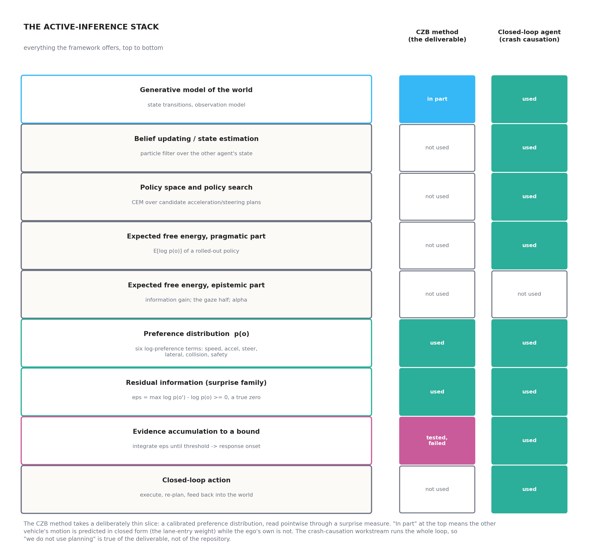
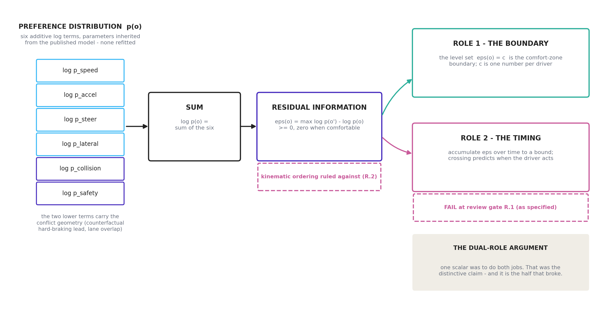
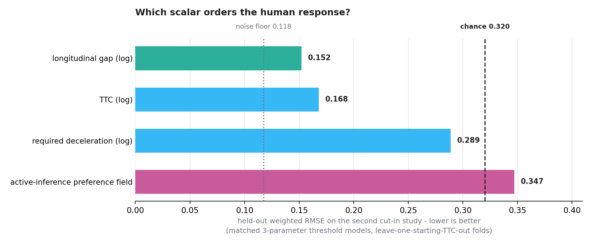
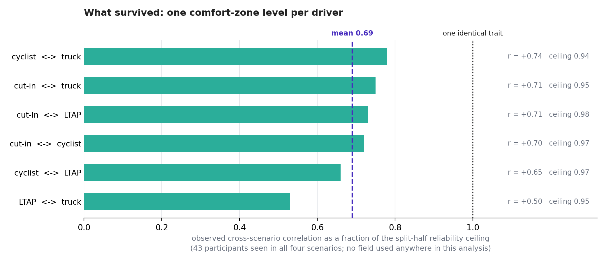
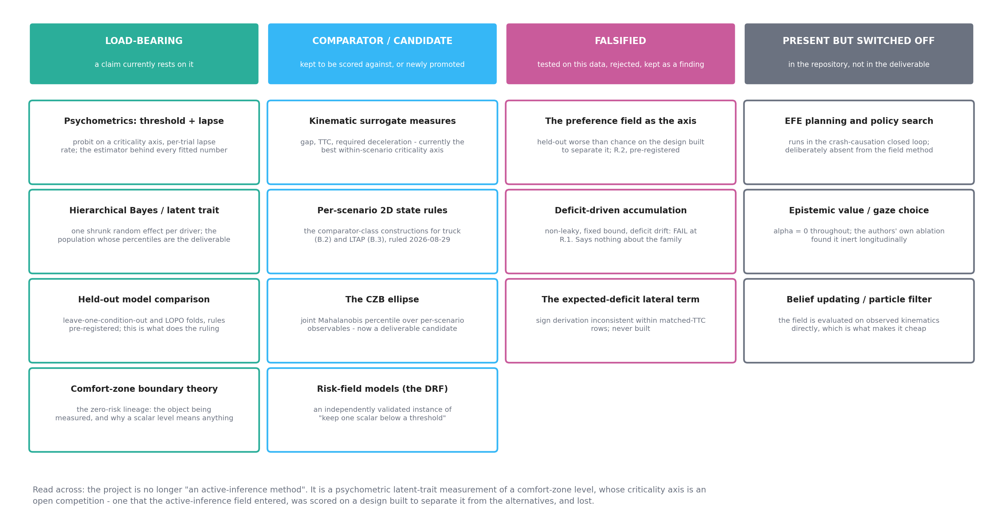
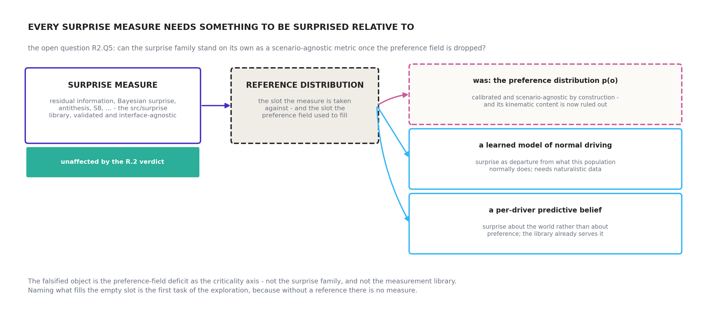

# Scope map: what we use of active inference, what we do not, and what the method actually is

*2026-08-29, written at Jonas's request for an overview, after his rulings on queries
R2.Q4–Q6. This document does not introduce new analysis. It collects what is already
established across `docs/active_inference_for_czb_assessment.md`,
`docs/r2_gate_decisions.md`, the handovers and the code, and states it in one place with
diagrams. Every number quoted here comes from a committed script with a tracked output,
and the source file is named at the point of quotation. Figures are generated by
`docs/make_ai_scope_figures.py`; the two data figures read their numbers from those
tracked outputs rather than from literals, so a re-run of an analysis moves the figure.*

## 0 The overview in one paragraph

The project uses a **thin, deliberately chosen slice** of active inference: a calibrated
preference distribution *p(o)* inherited from a published and behaviorally validated
driver model, read through one member of the surprise family (residual information) to
give a non-negative scalar with a true zero. Everything else in the framework — belief
updating, policy search, expected-free-energy planning, epistemic value — is switched
off in the deliverable, though the repository does contain a full closed-loop
active-inference agent used in the crash-causation workstream. The distinctive claim was
never "we use active inference"; it was that **one scalar does two jobs** — its level set
defines the comfort-zone boundary, and its accumulation over time predicts when a driver
acts. Both halves of that claim have now been tested on human data and both failed: the
accumulator at review gate R.1, and the field's kinematic ordering at review gate R.2,
where it scored worse than chance on the design built to separate it from the simple
alternatives. What is left, and what the project's headline now is, is **not an
active-inference method at all**: it is a psychometric, hierarchical-Bayesian measurement
of a per-driver comfort-zone level, whose criticality axis is an open competition that
the longitudinal gap currently leads. The active-inference contribution that survives is
the framing, the calibration pipeline, and the falsification itself.

---

## 1 What we use

Three components, and only three, carry the method.

**The preference distribution *p(o)*.** Six additive log terms — speed, longitudinal
acceleration, steering rate, lateral position, collision, safety — implemented in
`src/aidriver/preferences.py` following the released code of Schumann et al. (2026). Not
one of its parameters is refitted by us. This is the whole point of the inheritance: the
functional form and its constants arrive pre-shaped by someone else's behavioral
validation, and are documented, rather than being invented by us as a hand-designed cost
function. The two lower terms carry the conflict geometry: `p_coll` from the predicted
overlap, and `p_safe` from the counterfactual in which the lead vehicle brakes as hard as
it can.

**Residual information.** The surprise measure that converts a log-preference into a
usable scalar:

> ε(o) = maxo′ log p(o′) − log p(o) ≥ 0

The property that matters is the **true zero**: ε is exactly zero at the driver's
preferred observation, so "comfortable" is a value rather than a convention. That is what
makes a level set interpretable as a boundary. `src/surprise/` implements this alongside
the rest of the Modirshanechi et al. (2022) taxonomy, and it is the one library component
that is validated on its own terms and independent of everything else here.

**Evidence accumulation — used, and now falsified as specified.** Integrating ε to a
bound gives a response onset. This is the link to timing, and it is what review gate R.1
tested and rejected in our formulation.

**One qualification on "no prediction".** The lane-entry weight *is* a closed-form
prediction of the *other* vehicle's motion — that is why the figure marks the generative
model "in part" rather than "not used". What is absent is any rollout of the **ego's own**
policies (`docs/czb_validation_roadmap.md` §4b). For the study stimuli that omission is
arguably correct rather than approximate: participants are asked when doing nothing stops
being acceptable, which is exactly the pointwise deficit of the no-action trajectory.

## 2 What we do not use

**Expected-free-energy planning and policy search.** The field method is rollout-free by
design; that is what makes it closed-form in observables and cheap enough to run in a
vehicle. The full closed loop costs roughly 18 s of CPU per simulated step.

**Epistemic value and the gaze half.** α = 0 throughout. The authors' own ablation found
epistemic value inert in the longitudinal scenarios, so this matches their validated
configuration rather than departing from it. Choosing glances by epistemic pricing —
handbook ch. 08's second proposal — remains the largest unexercised half of the machinery.

**Belief updating and state estimation.** The field is evaluated on observed kinematics
directly, with no particle filter. This is what makes it applicable to naturalistic data
without model roll-out.

**A caveat about that list.** All three are switched off *in the deliverable*. The
repository's crash-causation workstream (`src/aidriver/agent.py`, `src/causation/`) runs
the entire loop — particle-filter beliefs, CEM policy search, expected free energy,
closed-loop action — on all 5 000 QUADRIS seeds. So "we do not do planning" is a true
statement about the CZB method and a false one about the repository, and the distinction
matters whenever the project is described to someone else.

## 3 The claim that made the framework worth the trouble — and its two failures

The honest unique selling point was never the label. It was the **dual role**: the same
scalar whose accumulation explains *when* drivers act is the scalar whose level set
*defines* the boundary. No conventional indicator has that property, and — decisively —
it is testable. Both tests have now been run.

**Failure 1: the timing half (review gate R.1).** Three structurally-argued accumulator
variants all fit worse in sample than the stage-0 static two-parameter probit (the final
v3 variant 0.169 against 0.125), and v3's held-out RMSE of **0.255** failed the
pre-registered rule fixed before fitting — ≤ 0.11 closes the gap, > 0.13 is failure
(`replication/czb/out/stage2_summary.md`). The named reason: criticality-graded
responding is already present at C1–C2, where at most 0.05–0.15 s of post-onset evidence
exists under any plausible motor latency — anticipation from repeated exposure, which no
evidence-gated integrator can express.

> **Discrepancy found while writing this document, not reconciled here.**
> `docs/active_inference_for_czb_assessment.md` §3.3 records the same verdict as "best
> 0.178 vs 0.125" in sample and "held-out RMSE 0.267". The tracked output
> `replication/czb/out/stage2_summary.md` (v3, the final iteration at R.1) gives 0.169
> and 0.255. The repository beats the document, so the numbers above are the output's;
> the assessment document appears to quote an earlier iteration and should be corrected
> in place. Raised as query `SCOPE.Q1`. The verdict itself — FAIL, by a wide margin
> against a rule of ≤ 0.11 — is unaffected either way.

*Scope, narrowed at R.2 on Bontje et al. (2026):* the FAIL is a verdict on the
accumulator **we specified** — deficit-driven drift, non-leaky, fixed bound, on this
repeated-exposure stimulus set. The standard traffic architectures (looming or TTC drift,
leaky accumulation, collapsing bounds) were never tested, so the result licenses no claim
about evidence accumulation as a family.

**Failure 2: the boundary half's axis (review gate R.2).** This is the decisive one.

On the second cut-in study's 288 post-onset cells, with matched three-parameter threshold
models (lapse + probit) on identical leave-one-starting-TTC-out folds, and with models,
folds and decision rule committed before the run at commit e9203c6
(`replication/czb/out/cutin2_field_vs_gap.md`): the field scores held-out wRMSE **0.347**
— *worse than chance*, 0.320 — against a log-gap threshold's **0.152**, with the
sampling-noise floor at 0.118. The pre-registered rule fired at dRMSE = +0.195. The
verdict is robust to excluding the 20 non-modal attention-check participants (+0.202) and
to repairing a trace-noise handicap found after the registered run (0.356).

Why the earlier evidence did not catch this: in the *first* cut-in study relative speed
is constant across all 18 cells, so correlation(gap, TTC) = 1.0000 — the longitudinal
dimension has one degree of freedom, and the field's encouraging 0.90 correlation was
equally consistent with a driver simply thresholding the gap. The second study breaks that
collinearity over a six-fold range of gap, and the field loses
(`replication/czb/out/cutin2_scope.md`).

**Consequence now in force:** no document may describe the field as validated against
human data on the longitudinal dimension.

## 4 What survived

The gate's own pre-commitment was that if the field lost, the project's claim would be
restated around what survives. Four things do.

1. **A driver carries one comfort-zone level across scenarios.** Per-driver
   criticality-adjusted propensity correlates +0.50 to +0.74 across all six scenario
   pairs, which is 0.53–0.78 of the split-half reliability ceiling, mean **0.69** — and
   this is measured with **no field at all**
   (`replication/czb/out/cross_scenario_consistency.md`). About a third of reliable
   per-driver variance is scenario-specific, which caps every transfer test that will
   ever be run on this data.
2. **The boundary distribution is well estimated on its own scale, and stable.** Under
   the current full specification the 50th/80th/95th percentiles moved by
   +0.9% / +0.2% / −0.5% when the covariate defect was fixed and k changed to 12
   (`replication/czb/out/stage1_summary.md`).
3. **Transfer works once the per-scenario lapse is freed** (0.136 against chance 0.158,
   refit ceiling 0.120; `replication/czb/out/transfer_overtake_summary.md`).
4. **The best within-scenario criticality axis is the longitudinal gap** (log scale),
   with TTC close behind and required deceleration nowhere — a statement about *any*
   demand-based axis, not only ours.

The recommended wording, from the gate record: *each driver carries a scalar comfort-zone
threshold that is substantially shared across scenarios; the right criticality axis is an
open empirical question on which simple scene scalars currently beat the active-inference
preference field, whose kinematic content is ruled out as fitted.*

## 5 What the method now actually consists of

Read as a list of paradigms rather than as a narrative, the project is now this:

| Paradigm | Role | Status |
|---|---|---|
| **Psychophysics / signal detection** — probit threshold plus a per-trial lapse rate | the estimator behind every fitted number in the project | load-bearing |
| **Hierarchical Bayesian latent-trait modeling** — one shrunk random effect per driver, marginal quadrature plus Laplace | produces the population whose percentiles *are* the deliverable | load-bearing |
| **Held-out model comparison with pre-registered decision rules** — leave-one-condition-out, LOPO | the machinery that does the ruling; it is what killed both halves of the dual-role claim | load-bearing |
| **Comfort-zone boundary theory** (the Näätänen & Summala zero-risk lineage) | defines the object being measured and why a scalar level is meaningful at all | load-bearing |
| **Kinematic surrogate measures** — gap, TTC, required deceleration | currently the best within-scenario criticality axis | comparator, currently winning |
| **Per-scenario 2D state rules** | how B.2 (truck) and B.3 (LTAP) are now built, per Jonas's ruling of 2026-08-29 | comparator class, primary |
| **The CZB ellipse** — joint Mahalanobis percentile over per-scenario observables | promoted from comparator to deliverable candidate by the same ruling | candidate |
| **Risk-field models** (Kolekar et al.'s DRF) | an independently validated instance of "keep one scalar below a threshold" | comparator |
| **Active inference: preference field as criticality axis** | ruled against on its own scenario, pre-registered | falsified |
| **Active inference: deficit-driven evidence accumulation** | FAIL at R.1, as specified | falsified |
| **Active inference: EFE planning, epistemic value, belief updating** | present in the repository's closed-loop agent; absent from the deliverable | switched off |
| **Counterfactual crash-causation simulation** (Bärgman et al. 2024 mechanisms, Wu et al. ROPE equivalence) | a separate, complete workstream that *does* run the full active-inference loop | complete, parallel |

The one-line summary: **the deliverable is a psychometric measurement instrument, not an
active-inference model.** Active inference supplied the candidate axis, a principled
zero, and the vocabulary; the axis then entered a competition against simple scene
scalars on a design built to separate them, and lost.

That is not a failed project. A pre-registered falsification of a plausible,
theoretically-motivated construct — run on a design specifically built to discriminate,
against matched-complexity alternatives, with the noise floor measured — is a publishable
result in its own right, and the trait finding is a positive one that no field was needed
to establish.

## 6 The open question, and why it is the right one to ask next

Jonas's ruling on R2.Q5 left the positioning unsettled pending one exploration: **can the
surprise elements stand on their own as a scenario-agnostic metric, even with the
preference field dropped?**

The crux, and the first task of that exploration: **every surprise measure needs a
reference distribution to be surprised relative to.** In this project the preference field
*was* that reference. So "surprise without the field" is not yet a specification — it is a
slot with nothing in it, and naming what fills the slot has to come before anything is
measured. What is falsified is the preference-field deficit as the criticality axis, not
the surprise family and not `src/surprise`, which is validated and interface-agnostic by
construction and works unchanged on Gaussians, mixtures, particle sets and categoricals.

Two candidates worth taking seriously, both of which relocate the question from *surprise
about one's own preferred state* to *surprise about the world*: a learned predictive model
of normal driving for this population (which is what naturalistic data would be for), and
a per-driver predictive belief. Both are already served by the library's other interfaces.

**The three live threads, in the order the handover queues them**: the B.3.v2 LTAP
construction note written for the comparator class; a design note for the CZB ellipse; and
this exploration.

## 7 Where I may be wrong

Stated as opinions, since this document interprets rather than measures.

- The R.2 verdict is about the **longitudinal** kinematic content of the field as fitted,
  with the lane gate engaged and k = 12. It does not test the lateral machinery (which
  failed separately on the overtake, B.1), and it does not rule out a differently
  constructed demand measure — though required deceleration's showing makes that
  unpromising on this data.
- Calling the project "a psychometric instrument" is my framing, not a gate decision. A
  reasonable alternative framing is that it is a *comparative study of criticality axes*
  with a psychometric estimator, which puts the emphasis on the competition rather than on
  the measurement.
- The claim that active inference contributed "the framing, the pipeline and the
  falsification" is a positioning argument, and R2.Q5 is precisely the question of whether
  it holds. It should not be treated as settled here.
- Everything about percentiles rests on 43 crowdsourced participants watching clips in one
  paradigm. That supports method development and contrast; it does not support setting a
  fleet trigger.

## References

Bontje, F., van Waveren, F., van Maanen, L., Nallapu, B., Markkula, G., & Zgonnikov, A.
(2026). *Knowing when to move: Evidence accumulation models of human behavior in traffic*
(arXiv:2606.00727). arXiv. https://arxiv.org/abs/2606.00727

Kolekar, S., de Winter, J., & Abbink, D. (2020). Human-like driving behaviour emerges from
a risk-based driver model. *Nature Communications, 11*, Article 4850.
https://doi.org/10.1038/s41467-020-18353-4

Modirshanechi, A., Brea, J., & Gerstner, W. (2022). A taxonomy of surprise definitions.
*Journal of Mathematical Psychology, 110*, Article 102712.
https://doi.org/10.1016/j.jmp.2022.102712

Schumann, J. F., Engström, J., Johnson, A., O'Kelly, M., Messias, J., Kober, J., &
Zgonnikov, A. (2026). Active inference as a model of collision avoidance behavior in human
drivers. *Nature Communications, 17*, Article 5009.
https://doi.org/10.1038/s41467-026-73345-0

*Näätänen and Summala's zero-risk theory is referred to here as the comfort-zone lineage;
per `docs/data_requirements.md`, the originals have not been consulted in this project and
the attribution rests on secondary sources.*
