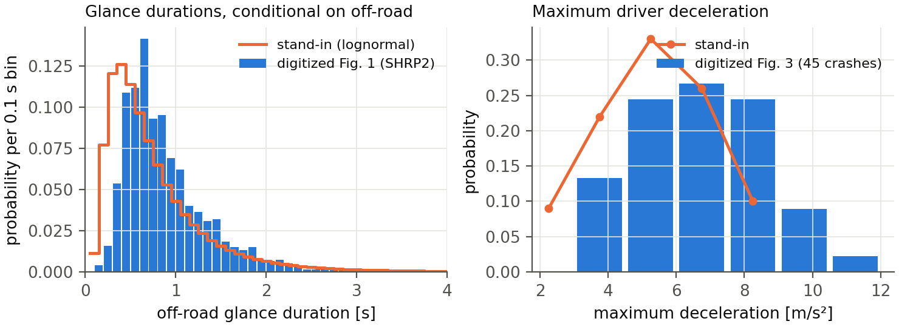
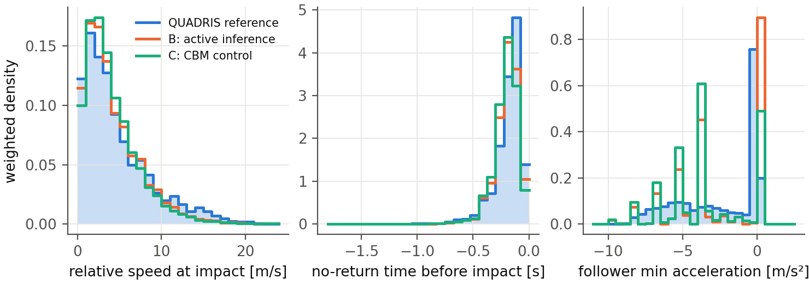
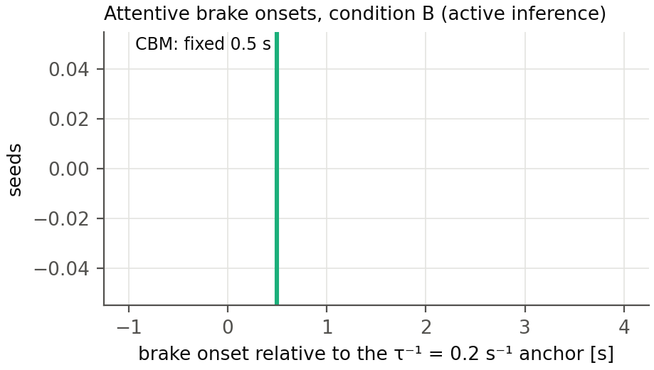

# Crash causation with an active-inference response process: method and results

Results document, 2026-08-24 (revised the same day after the counterfactual and
glance-placement decisions; the first version's numbers are superseded but reproducible
from the tagged outputs). Prepared by Claude at the request of Jonas Bärgman. Markdown is
the source; Word and PDF are generated from it. The design, the reading notes on the
source papers, and the protocol live in `docs/crash_causation_plan.md`. Provenance tags:
[B24] Bärgman, Svärd, Lundell & Hartelius (2024), [W25a] Wu et al. (2025, scenario
generation), [W26] Wu et al. (2026, practical validation), [Code] the Schumann et al.
released code, [OSF] their deposit, [Repo] this repository, [Opinion] a judgment.

---

## 1 The method in one page

The question: can the active-inference driver model serve as the *response process*
inside a crash-causation model — and what does it add or cost relative to the fixed-delay
response of the crash-causation model (CBM) of [B24]?

- **Seeds.** 100 rear-end pre-crash scenarios sampled weight-proportionally (stratified
  by initial speed) from the 5 000 synthetic QUADRIS scenarios of [W25a]; every seed
  carries its real-world weight ω.
- **The counterfactual.** Before the modeled response, the follower runs the seed's
  original speed profile **with its braking removed from the lead's braking onset onward**
  (acceleration clamped at ≥ 0). This keeps the accelerating creeping/queue seeds intact
  while excluding the generator-follower's own evasive action, which the plain "original"
  profile embeds in 14 of 100 seeds. Clamping from t = 0 instead changes headline results
  by only a few percent (section 4.4), so the rule choice is not consequential.
- **Causation components**, each switchable: off-road glances, too-close following
  (inherent in the seed), a maximum-deceleration cap, a no-response mixture (10% of
  crashes [B24]), and — added at the study's request — the **abnormal-acceleration
  follower** of [W25a]: 9.2% of crashes, the follower ignoring the lead at a constant
  +1.8 m/s² (their fitted mean; their onset-time distribution is unpublished, so the
  acceleration is applied from the lead's braking onset).
- **Input distributions** digitized from [B24]'s published figures
  (`replication/causation/digitize_b24.py`): the SHRP2 off-road glance distribution
  (vector-exact; two independent axis calibrations agree within 0.9%; on-road point mass
  0.80) and the 45-crash maximum-deceleration histogram (integer counts summing to
  exactly 45).
- **Glance placement.** Primary: the **renewal process** — on/off glance sequences over
  the whole scenario, off-road durations from the digitized distribution, on-road dwells
  exponential with the mean set by the 80% on-road share, 50 Monte Carlo draws per seed
  (flagged for a later increase). The [B24] anchored-overshot construction is kept as the
  CBM-native comparison case; section 4.5 quantifies what the process placement buys.
- **Two response processes** behind one interface: the CBM's (respond 0.5 s after eyes
  return; ramp to the drawn deceleration) and the tier-1 active-inference surrogate (the
  model's preference function on the seed kinematics, fed through its evidence
  accumulator, drift rate calibrated on the authors' 896 deposited trials [Repo]).
- **Conditions.** A: attentive active inference (benchmark). B: active inference + all
  components. C: CBM response + all components (the control). D: active inference +
  glances only.
- **Comparison** against the full 5 000-scenario reference with the [W26] equivalence
  framework (θ/Θ, ROPEs 0.10/0.05, bootstrap HDIs), crashes weighted by Eq. 10, plus the
  exposure-weight variant (plan §6b). Metrics: P_inj, **relative speed at impact** (the
  assumption-free severity primitive; the deposit's delta-v was derived from it under
  equal masses), t_nr, and the follower's minimum acceleration.

## 2 Input distributions

The digitized glance distribution is close to the earlier lognormal stand-in (mode ~0.2 s
later); the deceleration distribution is not — the real one has 24% of its mass at
7.5 m/s² and harder, where the stand-in had almost none. All results below use the
digitized distributions.

## 3 Crash generation

**Full population (all 5 000 seeds, 2026-08-25).** With the no-brake counterfactual,
process glances for the active-inference conditions, anchored glances for the CBM
control, and 10 process draws per seed:

| condition | response | components | seeds crashing (any draw) | weighted crash probability |
|---|---|---|---|---|
| A | active inference | decel. cap | 1 635/5 000 | 0.156 |
| B | active inference | glances, decel. cap, no-response | 3 854/5 000 | 0.280 |
| C | CBM (control) | glances, decel. cap, no-response | 4 705/5 000 | 0.059 |
| D | active inference | glances, decel. cap | 3 854/5 000 | 0.280 |

(The earlier 100-seed tables' "weighted crash prob" column was normalized against the
full reference weight and is therefore a share, not a rate; the population rates above
supersede it. Ratios between conditions were and remain comparable.)

1. **An attentive active-inference driver avoids 67% of the QUADRIS crash population**
   (3 365 of 5 000 seeds) across the full deceleration sweep; the rest are the
   kinematically hard core, concentrated at short headways.
2. **The response process drives a factor ~4.7 in crash probability** (B 0.280 versus C
   0.059 with identical components), from timing: the active-inference accumulator's
   attentive onsets sit at a median 1.25 s after the τ⁻¹ = 0.2 s⁻¹ anchor (IQR
   0.50–1.75 s) against the CBM's fixed 0.50 s (section 5).
3. The crash rate was initially sensitive to the accumulator's starting level (zero
   start 0.023 versus 0.004 with a "stationary" half-threshold start), but the tier-2
   arbiter run has **resolved the convention in favor of the zero start** (section 5):
   the closed-loop model's own onsets match the zero-start surrogate to a median 0.42 s
   across 24 seeds and reject the stationary start on 20 of 24. The 0.023 figure stands;
   the stationary variant remains in the outputs as a tested-and-rejected sensitivity.

## 4 Comparison with the original data

### 4.1 Summary statistics (full population)

Weighted medians (weighted mean for P_inj); reference weighted by ω, conditions by the
Eq. 10 crash weights; all conditions on all 5 000 seeds:

| | rel. speed at impact [m/s] | mean P_inj | follower a_min [m/s²] |
|---|---|---|---|
| QUADRIS reference (n = 5 000) | 3.54 | 0.0062 | −1.03 |
| B: active inference | 3.33 | 0.0052 | −3.46 |
| C: CBM control | 3.34 | 0.0050 | −3.75 |
| B + abnormal acceleration | 3.63 | 0.0069 | −0.05 |
| C + abnormal acceleration | 3.63 | 0.0068 | −3.75 |

The 100-seed sample's over-production of mild crashes (its B median relative impact
speed was 1.88 m/s) largely dissolves at full population — it was substantially a
property of the weight-proportional sample, which concentrates on the common, benign
seeds. Severity medians now sit within 0.2 m/s of the reference for B and C alike, and
within 0.1 for the abnormal variants; the abnormal component overshoots the mean injury
risk slightly (+11%) where it landed exactly on it in the sample.

### 4.2 Distributions

- **Severity (relative speed at impact).** At full population both response models track
  the reference across the entire severity range — the distributions nearly overlay,
  with B marginally under-producing the extreme tail and C marginally over-producing the
  2–6 m/s range. (The figure shows the full-population run.)
- **Urgency (t_nr).** Essentially inherited from the seeds by both models, as before.
- **Braking (follower minimum acceleration).** The remaining structural difference.
  Condition B reproduces — indeed slightly overshoots — the reference's dominant
  non-braking spike (crashes in which a glance or the no-response class covers the
  conflict); condition C cannot produce it and instead concentrates on its discrete
  hard-braking values from the deceleration bins. This is the panel that keeps a_f,min
  from passing for any configuration, and it separates the two response models more
  clearly than severity does.

### 4.3 Equivalence at full population

Headline θ (Eq. 10 weights, 95% bootstrap HDIs), all 5 000 seeds; full tables in
`replication/causation/out/summary_fullp.md` and `summary_fullp_abn.md`:

| configuration | P_inj / v_rel θ | t_nr θ | a_f,min θ |
|---|---|---|---|
| B: active inference | 0.31 [0.26, 0.35] | 0.38 [0.33, 0.45] | 1.00 |
| C: CBM control | 0.39 [0.35, 0.42] | 0.43 [0.38, 0.51] | 1.65 |
| D: glances only | 0.44 [0.39, 0.47] | 0.38 [0.33, 0.45] | 1.13 |
| **B + abnormal acceleration** | **0.148 [0.116, 0.190]** | 0.42 [0.36, 0.50] | 1.06 |
| C + abnormal acceleration | 0.209 [0.172, 0.267] | 0.46 [0.41, 0.54] | 1.38 |

Three things changed against the 100-seed sample. First, everything tightened and most
things improved — the sample's widest HDIs were sampling noise. Second, **the ordering
reversed: the active-inference conditions are now closer to the reference than the CBM
control on severity** (B 0.31 versus C 0.39; with the abnormal component 0.148 versus
0.209) — the control's advantage in the sample did not survive the population. Third,
the best configuration — active inference with all five components — reaches
**P_inj θ = 0.148 against a ROPE of 0.10**, still not practically equivalent but by a
factor of 1.5 rather than the factor of 14 the study started from; its HDI's lower edge
(0.116) sits just outside the ROPE. The braking distribution (a_f,min) remains the
structural failure for every configuration, for the reasons of section 4.2.

### The sensitivity ladder (100-seed sample, kept as method history)

No configuration reaches practical equivalence (ROPE 0.10 for θ; full tables in
`replication/causation/out/summary_nb*.md`), but the distance now has a visible
structure. Headline θ for P_inj (= relative impact speed; the two give identical bins),
Eq. 10 weights, 95% bootstrap HDIs:

| configuration | P_inj θ | t_nr θ | a_f,min θ |
|---|---|---|---|
| B, embedded-evasive counterfactual (superseded) | 1.44 | 0.66 | 1.00 |
| B, no-brake counterfactual, anchored glances | 0.87 [0.82, 0.99] | 0.40 | 1.04 |
| B, + process glances (primary) | 0.61 [0.55, 0.76] | 0.41 | 1.18 |
| B, + abnormal acceleration | **0.46 [0.41, 0.60]** | **0.30** | 1.37 |
| B, process, stationary accumulator | 0.42 [0.29, 0.52] | 0.39 | 1.00 |
| C, no-brake, anchored (CBM-native) | **0.40 [0.36, 0.46]** | 0.41 | 1.81 |
| C, + process glances | 0.63 [0.44, 0.74] | 0.51 | 1.61 |
| C, + abnormal acceleration | 0.59 [0.42, 0.71] | 0.45 | 1.35 |

Readings:

- **Each methodological correction moved condition B toward the reference**: removing the
  embedded evasive action (1.44 → 0.87), placing glances as a process (→ 0.61), adding
  the abnormal-acceleration component (→ 0.46). The remaining distance is dominated by
  the over-produced mildest-severity bin.
- **The best active-inference configurations now sit at the CBM control's level**
  (θ ≈ 0.4–0.5 for both) — the response-model gap visible in the first analysis was
  largely an artifact of the embedded evasive action and the anchor-locked glances.
  What still separates the two models is *where* they miss: B misses on mild crashes,
  C on moderate ones and on the braking distribution (a_f,min θ 1.4–1.8 versus B's
  1.0–1.4).
- **The abnormal-acceleration component works as intended**: it restores the reference's
  mean injury risk exactly for B (0.0063 vs 0.0062) by adding the harder, non-braking
  crashes the four [B24] mechanisms cannot produce. Its cost is a slight overshoot for C.

### 4.4 The counterfactual rule barely matters

Clamping the follower's braking from t = 0 instead of from the lead's onset changes B's
P_inj θ from 0.87 to 0.82 and C's from 0.400 to 0.396 (anchored glances) — the choice of
clamp rule is not a consequential degree of freedom.

### 4.5 What the process placement buys, against its cost

For the **active-inference** response, process glances improve severity equivalence
substantially (P_inj θ 0.87 → 0.61) besides being theoretically required (the anchored
construction assumes the response cannot depend on pre-anchor glance history, which is
false for an accumulator). For the **CBM**, the anchored construction — which is exactly
Markkula's shortcut for a fixed-delay responder — performs *better* than the process
variant (0.40 vs 0.63), partly because the process run's smaller crash-record count
(2 076 vs 11 587) widens its uncertainty. Cost: 50 draws per seed versus ~12 bins,
minutes either way at tier 1. Conclusion: process placement for active inference,
anchored placement for the CBM, each on its own merits; the 50-draw budget is marked for
a later increase, which mainly tightens the process runs' HDIs.

## 5 Response timing

Attentive onsets: active inference median 1.25 s after the anchor (IQR 0.50–1.75 s),
CBM fixed at 0.50 s. Ten of 100 seeds respond *before* the anchor — all within 0.45 s of
it, all after the lead's braking onset, concentrated at short initial headways — so the
active-inference model treats the anchor as nothing special, responding to sub-threshold
looming when the gap is short.

**The arbiter verdict (2026-08-25).** The response-timing claim was initially bracketed
by the accumulator's starting convention: zero start (the paper's) versus a "stationary"
half-threshold start representing a driver arriving mid-cycle from long steady following;
crash probability 0.023 versus 0.004. The tier-2 arbiter run — the full closed-loop model
on 23 seeds spanning 1.3–35.5 m/s, four repeats each, lead profiles replayed
(`replication/causation/tier2/arbiter_comparison.csv`) — settles it:

| comparison (attentive onsets, n = 24 seeds) | median difference | median \|difference\| | closer on |
|---|---|---|---|
| closed loop − tier-1 zero start | +0.42 s | 0.55 s | **20/24 seeds** |
| closed loop − tier-1 stationary start | +1.03 s | 1.08 s | 4/24 seeds |

The closed loop behaves like the zero start — if anything it responds slightly *later*
than the zero-start surrogate, so the stationary correction points the wrong way. The
scope of the verdict should be stated precisely: it validates the zero start *for this
study's design*, in which simulation windows open a few seconds before the conflict at
mostly comfortable headways, so the closed loop's benign drift accumulates little before
the event. What a driver carries after minutes of continuous short-gap following is a
question neither tier answers, because both open their windows near the conflict; within
this design it is a non-issue by construction. Consequently the zero-start results are
the study's results, and the conclusion stands: **the active-inference response is slower
and more variable than the CBM's fixed rule** — confirmed, not contradicted, by the
closed loop.

A deliberate non-action: the +0.30 s median offset between the closed loop and the
surrogate could be folded into the surrogate as a calibration correction. We do not do
this. Twenty-three seeds are a thin base to fit on, the offset is well inside the
response-time dispersion the study is about, and an *untuned* surrogate landing within
0.55 s median absolute difference is a stronger validation statement than a tuned one
landing on zero [Opinion].

## 6 The closed loop is not the CBM with extra steps: the glance-gate finding

The tier-2 adapter (plan §11.4) runs the authors' full closed-loop model on QUADRIS
seeds with the lead replaced by a replay of the seed's speed profile, and can force
off-road glances through the code's own observation gate (`I_factor`, the mechanism of
the Engström et al. 2024 visual time-sharing model).

**Forcing a 1.0–3.0 s off-road glance during the conflict did not delay the response.**
On the test seed the driver braked at 2.4–2.6 s — inside the glance — both under the
shipped observation-noise factor (3) and under an effectively total gate (factor 1000).
The reason is architectural: the lead's braking had been registered before the glance
began, and during the glance the belief cloud coasts forward on its own norm-shaped
prediction, so the evidence accumulator keeps filling from *remembered and extrapolated*
evidence. Looking away blocks new observations; it does not stop inference.

The CBM assumes the opposite: no information accumulates while the eyes are away, and no
response can begin until 0.5 s after they return [B24]. The two architectures therefore
make **divergent, testable predictions** that depend on glance timing:

- glance covering the conflict onset → both models delay the response until (or beyond)
  eyes-return; they roughly agree;
- glance beginning *after* the onset has been registered → the CBM still waits for
  eyes-return + 0.5 s, while the active-inference driver responds mid-glance on
  extrapolated evidence.

Naturalistic glance-conditional response data could separate these — drivers who brake
while still looking away (or within less than 0.5 s of looking back) in late-glance
conflicts would favor the active-inference account. To our knowledge the existing
glance-response literature conditions on eyes-off at conflict onset and does not isolate
the late-glance case [Opinion]. The tier-1 pipeline mirrors the distinction explicitly:
its evidence gate at weight 0 reproduces the CBM assumption, the Svärd et al. partial
looming weight is an intermediate, and the tier-2 precision gate is the full
active-inference behavior.

## 7 The pre-selection (exposure) critique, quantified

Applying causation mechanisms to crash-conditioned seeds answers "what does this driver
do in situations that crashed for the generator's driver", not "what crashes does this
driver produce in traffic". Three numbers from this study's own runs bound how far the
two questions are apart:

- **Support loss**: at full population, 295 of 5 000 seeds never crash under the CBM
  control at any glance or deceleration draw; they drop out of any exposure reweighting
  entirely (13 of 100 in the sample).
- **Effective sample size**: exposure reweighting (dividing each weight by its crash
  probability) leaves an effective sample size of **44.7 out of 5 000** (6.9 out of 100
  in the sample). Fifty times more seeds bought a factor of six in effective size —
  the reweighting's variance grows with exactly the benign scenarios the crash filter
  removed, so exposure-level claims stay out of reach of crash-only seeds at any
  practical n.
- **Directional bias**: the missing scenarios are the long-headway, mild-conflict ones
  in which crashes occur only through glances or non-response — for a glance-causation
  study, the worst possible region to lose.

The **B-versus-C contrast is far more robust to this critique than any absolute
number**, because both response models face the identical conditioned ensemble. Absolute
crash rates and severity distributions inherit the full bias. The proper fix is
upstream: the pre-filter scenario set (or the fitted scenario-generation models) of
[W25a], requested from its author; the 82 real SHRP2 near-crashes in the QUADRIS release
are an intermediate exposure extension available now.

## 8 Conclusions

1. The pipeline now runs the complete design: five switchable causation components, two
   response processes, digitized real input distributions, a defensible counterfactual,
   process-placed glances, and the full [W26] readout with the assumption-free severity
   metric.
2. At full population, **the active-inference conditions are closer to the QUADRIS
   reference than the CBM control** on severity (θ 0.31 versus 0.39; with the abnormal
   component 0.148 versus 0.209), despite generating 4.7 times its crash probability
   (0.280 versus 0.059) — slower responses produce more crashes, but the *right* crash
   population. The best configuration misses practical equivalence on severity by a
   factor of 1.5 (θ = 0.148 against a ROPE of 0.10), down from the factor of 14 the
   study started at. Only the active-inference conditions reproduce the reference's
   dominant non-braking crash character; the braking distribution (a_f,min) remains the
   structural failure for every configuration.
3. The active-inference response-timing claim is **settled by the tier-2 arbiter**: the
   closed loop matches the zero-start surrogate (median difference +0.42 s, 20/24 seeds
   closer) and rejects the stationary start, so the active-inference response is slower
   and more variable than the CBM's rule, with the tier-1 surrogate validated untuned to
   a median absolute onset difference of 0.55 s across 1.3–35.5 m/s.
4. The architectural finding stands: evidence gating versus inference gating during
   off-road glances is a real, behaviorally testable difference between the CBM and
   active inference (section 6).
5. Equivalence in the strict ROPE sense is not reached by any configuration — as it was
   not by the SCM in [W26] — and section 7's numbers show that exposure-level claims
   are outside what crash-conditioned seeds can support at any n.

## 9 Limitations and next steps

- Glance and deceleration distributions are digitized from published figures; the actual
  SHRP2 bins would remove the residual digitization error and the truncated glance tail.
  The abnormal-acceleration onset-time distribution of [W25a] is unpublished; the
  component applies its acceleration from the lead's braking onset instead.
- The full-population runs use 10 process draws per seed (seed-level variation dominates
  at n = 5 000; the 100-seed sensitivity runs used 50). The QUADRIS reference is itself
  model-generated, so all equivalence statements are relative to that generator.
- The accumulator-initialization question is closed for this design (section 5); what a
  driver carries into a conflict after minutes of continuous short-gap following remains
  outside both tiers' windows, and would matter for study designs with long run-ins.
- The stopped/creeping-follower seeds (20 of the 100-seed sample) have now run in
  tier 2 under the desired-speed convention of 2026-08-25 (the speed the original
  follower later reached), and the result is a finding rather than a fix: these are
  **both-stationary queue scenarios** — the lead also stands still — whose original
  crashes came from the generator's abnormal-acceleration mode driving into the queue
  (56% of both-stationary cases in [W25a]'s own statistics). The closed-loop driver,
  correctly, stays put: no attentive response process can produce these crashes, because
  there is no conflict to respond to. They are reachable only through the
  abnormal-acceleration and no-response components, which is how the tier-1 pipeline
  treats them; in the arbiter comparison they contribute no attentive onsets and are
  excluded automatically.

Regeneration: the tagged commands are in `replication/causation/out/log_nb*.txt`; figures
by `replication/causation/make_results_figures.py --tag nbp`; this document by
`docs/build_pdf.py docs/crash_causation_results.md`.
