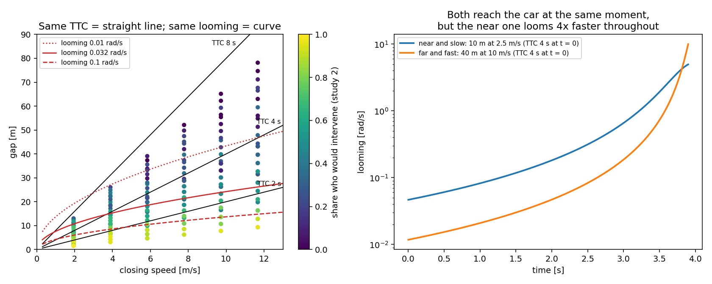
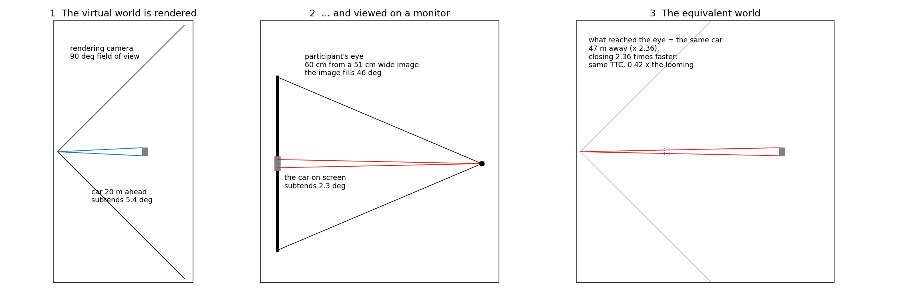
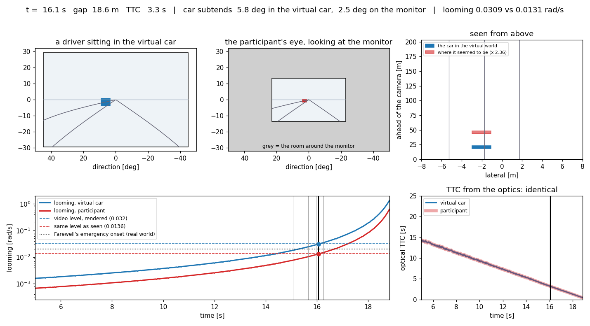
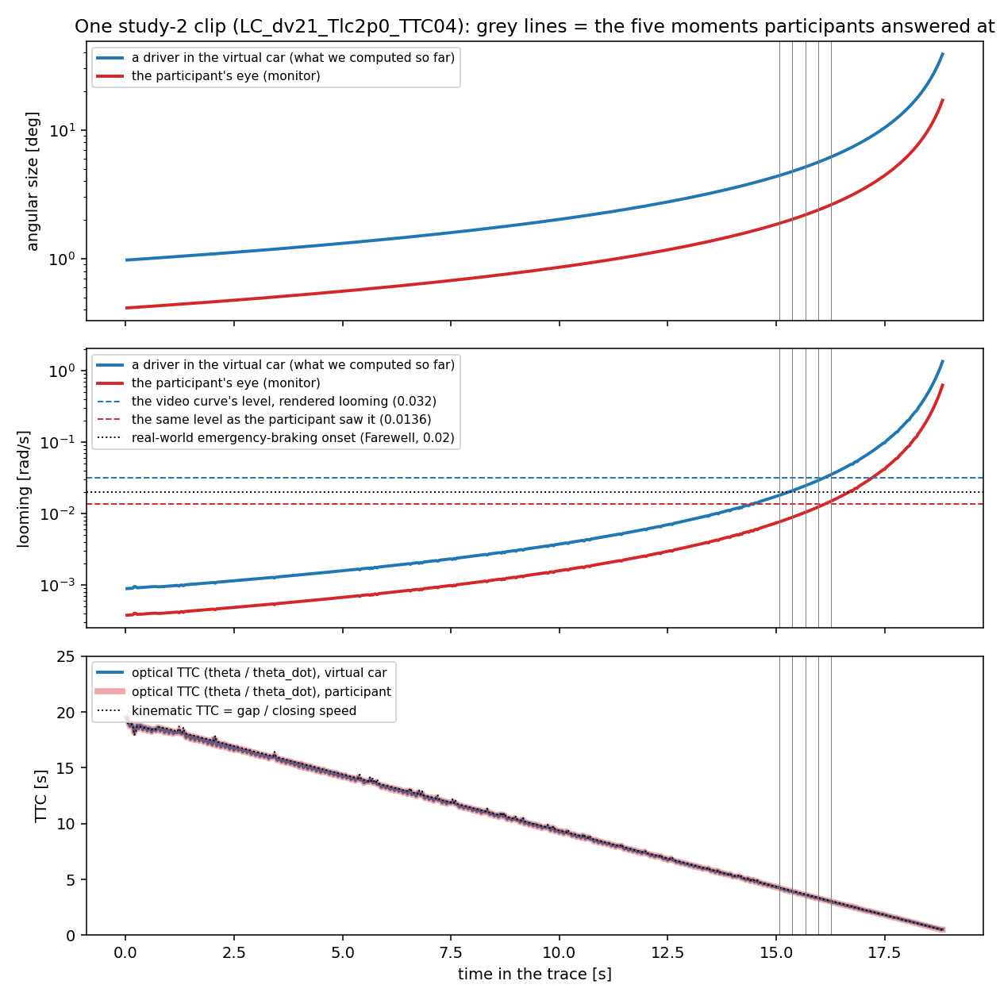

# The display transform, explained: looming, TTC and what the monitor did

*Written 2026-09-26 for Jonas. A companion to the specification `docs/display_transform.md` (which
holds the parameters and the exact formulas). The figures and the video are made by
`replication/czb/dt_media.py`; the numbers come from cards DT.1, DT.1b and DT.2
(`replication/czb/out/dt1_display_transform.md`, `dt1b_display_sensitivity.md`, `dt2_ltap_display.md`).
The video is `figures/display_transform/display_transform_clip.mp4` (about 20 s).*

## Summary

- **Looming and TTC are related but not the same.** Looming is how fast the other car's image grows.
  TTC is the ratio of how big the image is to how fast it grows. Looming therefore carries TTC *and*
  how big (how near) the car is; TTC carries only the timing.
- **The monitor shrank the picture.** A 90° rendering shown on a 23-inch screen at 60 cm fills only
  46° of the participant's view. Every image was 0.42 times the size a driver in the virtual car
  would have seen (the gain k = 0.4243).
- **Shrinking changes looming but not TTC.** Size and growth rate both shrink by the same factor, so
  their ratio, TTC, is untouched; looming alone shrinks by 0.42. Equivalently: what reached the
  participant's eye is exactly what a driver would see if the car were 2.36 times farther away and
  closing 2.36 times faster, which is the same TTC.
- **Within the video studies nothing changes but the looming levels.** Against real data three
  cut-in comparisons reverse if the participants judged the looming their eyes actually received.
- **The left turn says they probably did not.** On video the left-turn responses follow distance or
  looming, not time; the test track (real optics) agrees with the video only if the display did
  *not* shrink the participants' criterion. The effective gain that reconciles them is 0.99 [0.84,
  1.05], not 0.42. The participants seem to have judged something the shrinking leaves intact, such
  as the car's distance relative to the scene. Per-participant display data would settle it.

## 1 Looming and TTC: related, but not the same thing

Three quantities describe a car ahead that we are closing on:

| quantity | what it is | formula (car of width W, gap d, closing speed v) |
|---|---|---|
| angular size θ | how big the car's image is | θ = 2 atan(W / 2d) ≈ W / d |
| **looming** θ̇ | how fast the image grows | θ̇ = W v / (d² + W²/4) ≈ W v / d² |
| **TTC** | when we reach it at the current speeds | TTC = d / v |

The link between them is Lee's tau: θ / θ̇ ≈ d / v = TTC. **TTC is the ratio of two optical
quantities; looming is one of them on its own.** Rearranged, looming = angular size × (1 / TTC):
looming is large when the car is near (large θ) *or* when contact is soon (small TTC). TTC ignores
the first part.

That is why they can disagree. Two situations with the same TTC, one near and slow, one far and
fast, reach the car at the same moment, but the near one looms much faster all the way (right panel
below: 10 m at 2.5 m/s against 40 m at 10 m/s, both TTC 4 s; the near car looms four times faster).
In the second cut-in study (left panel) lines of equal TTC are straight lines through the origin in
the gap–closing-speed plane, while lines of equal looming are curves (gap ∝ √speed). The
participants' answers follow the curves: looming fitted clearly better than TTC (card EL.1b, held out
0.113 against 0.168). On real highD cut-ins it was the other way round, slightly (card NC.3).

## 2 What happened between the virtual world and the participant's eye

The clips were rendered by a camera with a 90° horizontal field of view and then shown on the
participants' own monitors. With the working assumptions (a 23-inch 16:9 screen, 51 cm wide,
viewed from 60 cm, the video filling the screen) the image covers only 46° of the participant's
field of view. A car 20 m ahead that subtends 5.4° for a driver in the virtual car subtends 2.3° on
the monitor.

The geometry is exact, not an approximation. A pinhole camera puts a point at horizontal angle α
at the screen position F tan α (F the rendering's focal length in screen units, 25.5 cm here). A
viewer at distance d sees that position at angle β with tan β = (F / d) tan α = k tan α, with k =
F / d = 0.4243. That is precisely the angle at which the viewer would see the point if it were
1/k = 2.36 times farther away along the line of sight, with its sideways position unchanged. So the
participants saw an **equivalent world**: the same scene, stretched in depth by 2.36.

## 3 Why looming changes and TTC does not

In the equivalent world the car is 2.36 times farther away, and because it approaches along the
line of sight it also closes 2.36 times faster (every metre of real approach is 2.36 metres of
equivalent approach, in the same time). TTC is distance divided by closing speed: **the two factors
cancel**, and TTC is exactly what it was. Looming is width × speed / distance²: one factor 2.36 up,
two factors down, so looming is 1/2.36 = 0.42 of its virtual-world value.

The same thing in optical terms: the monitor shrinks the car's image to 0.42 of its size and shrinks
its growth rate by the same 0.42. TTC = size / growth rate, so the shrinking cancels. Looming is the
growth rate alone, so it does not. A familiar example: a video of an approaching car filmed with a
wide-angle lens makes the car look small and far away, yet you can still tell exactly when it will
arrive.

| quantity | a driver in the virtual car | the participant at the monitor | ratio |
|---|---|---|---|
| distance to the car | d | as if d / 0.42 | 2.36 |
| closing speed | v | as if v / 0.42 | 2.36 |
| angular size | θ | ≈ 0.42 θ | 0.42 |
| **looming** | θ̇ | **≈ 0.42 θ̇** | **0.42** |
| **TTC** (and 1/TTC) | d / v | **d / v** | **1** |
| sideways position and speed | y, ẏ | y, ẏ | 1 |

(At the shortest gaps looming shrinks slightly less than 0.42, up to 0.54 in the second study's
cells, because the car's own width matters there; the specification gives the exact formula.)

## 4 One of our clips, frame by frame (the video)

The video shows the second study's clip LC_dv21_Tlc2p0_TTC04 (closing at 21 km/h, a 2 s lane
change; the participants answered at five frozen moments, the grey lines). Top left: what a driver
sitting in the virtual car would see (the 90° rendering at its true angular size). Top middle: what
the participant's eye received (the same picture shrunk into the 46° of the monitor, grey around
it). Top right: from above, the car in the virtual world (blue) and where it seemed to be (red,
2.36 times farther). Bottom: looming (left) and TTC computed from the optics (right) over time,
virtual car in blue, participant in red.

What to notice in the looming panel: the blue curve crosses the video curve's fitted level 0.032
rad/s at the same instant as the red curve crosses 0.0136. **It is the same moment described in two
currencies.** Within the video study the currency does not matter. It matters only when the number
is put next to something measured on real roads, such as Farewell's emergency-braking onset at 0.02
rad/s (the dotted line). In the virtual-car currency the video boundary lies above it; in the
participant's-eye currency, below it.

## 5 What the transform did to the cut-in results (cards DT.1 and DT.1b)

| result | as before (virtual-car optics) | with the transform (participant's-eye optics) |
|---|---|---|
| all within-study fits (held out), the axis ranking, the gate, two levels on one axis | unchanged | unchanged (0.1028 both) |
| the video curve's level | 0.0320 rad/s | 0.0136 rad/s |
| its 50% point against Farewell's 0.02 rad/s | 1.50 times (above it) | 0.64 times (below it) |
| highD's level against the video's | 1.21 times | 2.86 times |
| real followers match the video curve at braking of | 1.08 m/s² [0.97, 1.22] | 0.66 m/s² [0.61, 0.71] |
| the boundary as a real-world TTC at the video's own closing speeds | 2.3–5.7 s | 3.6–8.7 s (× 1.53) |
| every TTC result, including the hard boundary | unchanged | unchanged |

Over viewing distances of 50–70 cm and a video filling 60–100% of the screen the gain runs 0.22 to
0.51, and the corrected level 0.0070 to 0.0163 rad/s (DT.1b). These numbers hold *if* the participants
judged the looming their eyes received. Section 6 asks whether they did.

## 6 The left turn: video against the test track (card DT.2)

The test track is the one place where we have the same judgment made with real optics. In 2013,
drivers on the track chose to turn or wait in front of an oncoming (balloon) car at 50 km/h; their
comfort boundary was at PET 2.45 s (card TT.1). On video, participants' first-exposure boundary was
at 2.42 s (card EX.2). Without the transform they agree, and times are not touched by the transform.

But on video the left-turn answers follow the oncoming car's **distance** or **looming**, not its time
(card B.3.v2: held out 0.056 and 0.054 against 0.112 for time; at 70 km/h the answers are closer to the 50 km/h
ones at equal distance than at equal time, card B.3.v2's geometry check). On the monitor the oncoming car looked 2.36 times farther
away and loomed 0.42 times as fast. If the video participants and the track drivers had judged the
same *perceived* distance or looming, the video boundary should have moved far from the track's:

| criterion shared by track and video | video boundary predicted with the transform | observed | verdict | effective gain that would reconcile them |
|---|---|---|---|---|
| time to arrival | 2.45 s | 2.42 s | consistent | – (time is unaffected) |
| distance to the oncoming car | −1.38 s (outside the design) | 2.42 s | inconsistent | 0.99 [0.92, 1.02] |
| distance to the conflict point | −0.56 s | 2.42 s | inconsistent | 0.99 [0.90, 1.03] |
| looming at the eye | 0.39 s | 2.42 s | inconsistent | 0.99 [0.84, 1.05] |
| angular size | −1.38 s | 2.42 s | inconsistent | 0.99 [0.92, 1.02] |

So there are two readings, and the track cannot tell them apart because it ran at one speed only:

- **(A) The participants judged a distance-like quantity that the display does not distort.** The
  video's own evidence says distance or looming, not time, and the track agrees with the video as if
  the display gain were 1 (0.99). What survives shrinking is anything measured *against the scene*:
  the oncoming car's position relative to the intersection's layout, the lane markings, the size of a
  familiar car. Those relations are unchanged in the equivalent world. The participants would then have
  read the picture as a picture of a real place, as people usually do.
- **(B) The track drivers judged time and the video participants distance,** and the agreement at
  50 km/h is a coincidence of the design.

Reading A is the more economical: it explains both the video's distance dependence and the
agreement with the track without a coincidence. **If A holds for the cut-ins too, the transform
over-corrects them, and the untransformed comparisons of section 5 stand.** The left turn is, as
far as I can see, the only direct evidence either way, and it points toward A.

## 7 How to decide: the per-participant display data

Within a video study the transform cannot be tested: a constant gain only shifts the fitted level.
Differences *between* participants' displays can test it. For each participant with display
information (screen size, window size, a viewing-distance estimate), compute their gain k_i and
their own boundary level in rendered looming (card TR.1 already estimates per-driver levels). Then:

- if they judged the looming at their eye (the transform), a participant with a smaller k_i needs
  more rendered looming to reach the same perceived boundary: the slope of log level on log k_i is
  **−1**;
- if they judged a scene-relative quantity or TTC (reading A), the display does not matter: the
  slope is **0**.

A useful side effect: under the transform, part of the between-driver spread of levels (TR.1's
trait) would be screen size, not person. The same regression says how much.

What is needed from the subset you mentioned: per participant, the screen (or browser-window) width
in pixels and the physical screen size if logged, the video's displayed size, and any
viewing-distance information. Even the pixel sizes alone give the relative k_i, which is enough for
the slope. The power depends on how much the displays varied; I will estimate it once I see the
distribution.

## 8 Where things are

- Parameters and formulas: `docs/display_transform.md` (YAML block at the top). Code:
  `src/comfortzone/display.py` (switch: `CZB_DISPLAY_TRANSFORM=on`); checks: `tests/test_display.py`.
- Results: DT.1 (cut-in, with and without), DT.1b (over the parameters), DT.2 (left turn against the
  track).
- Queries: DT1.Q1 (confirm the display parameters), DT1.Q2 (should the corrected levels be the default
  for cross-domain comparisons; after DT.2 my recommendation is: not yet, report both, and let the
  per-participant test decide).
