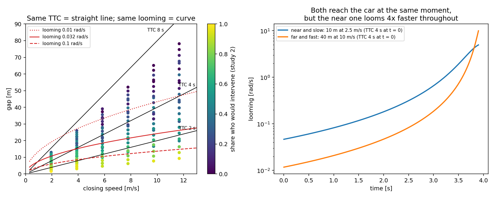
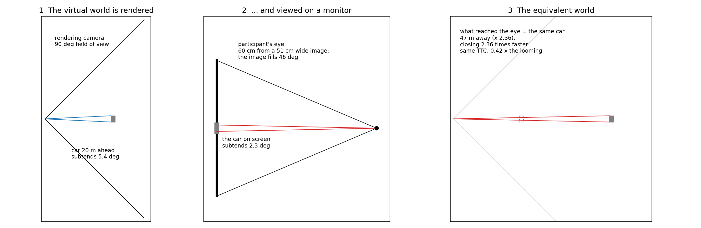
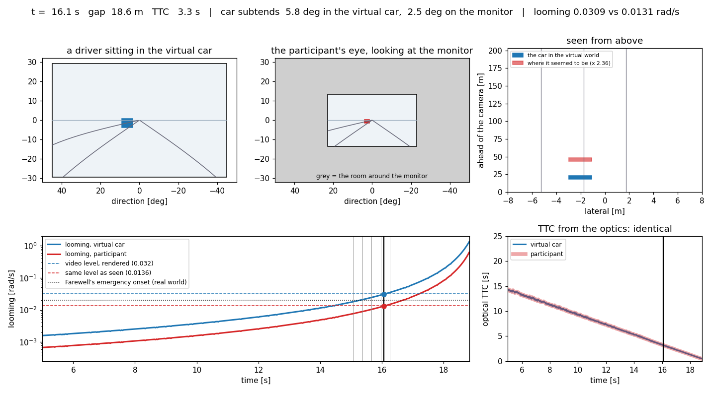
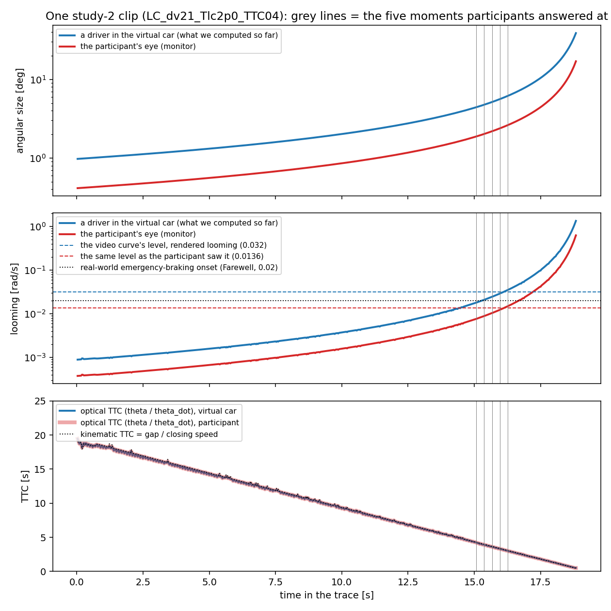
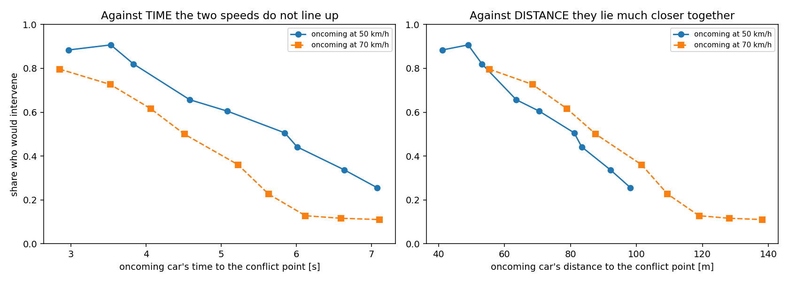

# The display transform, explained: looming, TTC and what the monitor did

*Written 2026-09-26 for Jonas; extended 2026-09-27 with the left-turn chapter (section 6). A companion
to the specification `docs/display_transform.md` (which holds the parameters and the exact formulas).
The figures and the video are made by `replication/czb/dt_media.py` (sections 1-5) and
`replication/czb/dt_ltap_media.py` (section 6); the numbers come from cards DT.1, DT.1b and DT.2
(`replication/czb/out/dt1_display_transform.md`, `dt1b_display_sensitivity.md`, `dt2_ltap_display.md`).
The video is `figures/display_transform/display_transform_clip.mp4` (about 20 s).*

## Summary

- **Looming and TTC are related but not the same.** Looming is how fast the other car's image grows.
  TTC is the ratio of how big the image is to how fast it grows. Looming therefore carries TTC *and*
  how big (how near) the car is; TTC carries only the timing.
- **The monitor shrank the picture.** A 90° rendering shown on a 23-inch screen at 60 cm fills only
  46° of the participant's view. Every image was 0.42 times the size a driver in the virtual car
  would have seen (the gain k = 0.4243).
- **Shrinking changes looming but not TTC.** Size and growth rate both shrink by the same factor, so
  their ratio, TTC, is untouched; looming alone shrinks by 0.42. Equivalently: what reached the
  participant's eye is exactly what a driver would see if the car were 2.36 times farther away and
  closing 2.36 times faster, which is the same TTC.
- **Within the video studies nothing changes but the looming levels.** Against real data three
  cut-in comparisons reverse if the participants judged the looming their eyes actually received.
- **The left turn says they probably did not.** On video the left-turn responses follow distance or
  looming, not time; the test track (real optics) agrees with the video only if the display did
  *not* shrink the participants' criterion. The effective gain that reconciles them is 0.99 [0.84,
  1.05], not 0.42. The participants seem to have judged something the shrinking leaves intact, such
  as the car's distance relative to the scene. On the monitor the oncoming car's looming near the
  boundary was at the edge of visibility, yet the answers kept varying. Per-participant display data
  would settle it (section 6 is the full account).

## 1 Looming and TTC: related, but not the same thing

Three quantities describe a car ahead that we are closing on:

| quantity | what it is | formula (car of width W, gap d, closing speed v) |
|---|---|---|
| angular size θ | how big the car's image is | θ = 2 atan(W / 2d) ≈ W / d |
| **looming** θ̇ | how fast the image grows | θ̇ = W v / (d² + W²/4) ≈ W v / d² |
| **TTC** | when we reach it at the current speeds | TTC = d / v |

The link between them is Lee's tau: θ / θ̇ ≈ d / v = TTC. **TTC is the ratio of two optical
quantities; looming is one of them on its own.** Rearranged, looming = angular size × (1 / TTC):
looming is large when the car is near (large θ) *or* when contact is soon (small TTC). TTC ignores
the first part.

That is why they can disagree. Two situations with the same TTC, one near and slow, one far and
fast, reach the car at the same moment, but the near one looms much faster all the way (right panel
below: 10 m at 2.5 m/s against 40 m at 10 m/s, both TTC 4 s; the near car looms four times faster).
In the second cut-in study (left panel) lines of equal TTC are straight lines through the origin in
the gap–closing-speed plane, while lines of equal looming are curves (gap ∝ √speed). The
participants' answers follow the curves: looming fitted clearly better than TTC (card EL.1b, held out
0.113 against 0.168). On real highD cut-ins it was the other way round, slightly (card NC.3).

## 2 What happened between the virtual world and the participant's eye

The clips were rendered by a camera with a 90° horizontal field of view and then shown on the
participants' own monitors. With the working assumptions (a 23-inch 16:9 screen, 51 cm wide,
viewed from 60 cm, the video filling the screen) the image covers only 46° of the participant's
field of view. A car 20 m ahead that subtends 5.4° for a driver in the virtual car subtends 2.3° on
the monitor.

The geometry is exact, not an approximation. A pinhole camera puts a point at horizontal angle α
at the screen position F tan α (F the rendering's focal length in screen units, 25.5 cm here). A
viewer at distance d sees that position at angle β with tan β = (F / d) tan α = k tan α, with k =
F / d = 0.4243. That is precisely the angle at which the viewer would see the point if it were
1/k = 2.36 times farther away along the line of sight, with its sideways position unchanged. So the
participants saw an **equivalent world**: the same scene, stretched in depth by 2.36.

## 3 Why looming changes and TTC does not

In the equivalent world the car is 2.36 times farther away, and because it approaches along the
line of sight it also closes 2.36 times faster (every metre of real approach is 2.36 metres of
equivalent approach, in the same time). TTC is distance divided by closing speed: **the two factors
cancel**, and TTC is exactly what it was. Looming is width × speed / distance²: one factor 2.36 up,
two factors down, so looming is 1/2.36 = 0.42 of its virtual-world value.

The same thing in optical terms: the monitor shrinks the car's image to 0.42 of its size and shrinks
its growth rate by the same 0.42. TTC = size / growth rate, so the shrinking cancels. Looming is the
growth rate alone, so it does not. A familiar example: a video of an approaching car filmed with a
wide-angle lens makes the car look small and far away, yet you can still tell exactly when it will
arrive.

| quantity | a driver in the virtual car | the participant at the monitor | ratio |
|---|---|---|---|
| distance to the car | d | as if d / 0.42 | 2.36 |
| closing speed | v | as if v / 0.42 | 2.36 |
| angular size | θ | ≈ 0.42 θ | 0.42 |
| **looming** | θ̇ | **≈ 0.42 θ̇** | **0.42** |
| **TTC** (and 1/TTC) | d / v | **d / v** | **1** |
| sideways position and speed | y, ẏ | y, ẏ | 1 |

(At the shortest gaps looming shrinks slightly less than 0.42, up to 0.54 in the second study's
cells, because the car's own width matters there; the specification gives the exact formula.)

## 4 One of our clips, frame by frame (the video)

The video shows the second study's clip LC_dv21_Tlc2p0_TTC04 (closing at 21 km/h, a 2 s lane
change; the participants answered at five frozen moments, the grey lines). Top left: what a driver
sitting in the virtual car would see (the 90° rendering at its true angular size). Top middle: what
the participant's eye received (the same picture shrunk into the 46° of the monitor, grey around
it). Top right: from above, the car in the virtual world (blue) and where it seemed to be (red,
2.36 times farther). Bottom: looming (left) and TTC computed from the optics (right) over time,
virtual car in blue, participant in red.

What to notice in the looming panel: the blue curve crosses the video curve's fitted level 0.032
rad/s at the same instant as the red curve crosses 0.0136. **It is the same moment described in two
currencies.** Within the video study the currency does not matter. It matters only when the number
is put next to something measured on real roads, such as Farewell's emergency-braking onset at 0.02
rad/s (the dotted line). In the virtual-car currency the video boundary lies above it; in the
participant's-eye currency, below it.

## 5 What the transform did to the cut-in results (cards DT.1 and DT.1b)

| result | as before (virtual-car optics) | with the transform (participant's-eye optics) |
|---|---|---|
| all within-study fits (held out), the axis ranking, the gate, two levels on one axis | unchanged | unchanged (0.1028 both) |
| the video curve's level | 0.0320 rad/s | 0.0136 rad/s |
| its 50% point against Farewell's 0.02 rad/s | 1.50 times (above it) | 0.64 times (below it) |
| highD's level against the video's | 1.21 times | 2.86 times |
| real followers match the video curve at braking of | 1.08 m/s² [0.97, 1.22] | 0.66 m/s² [0.61, 0.71] |
| the boundary as a real-world TTC at the video's own closing speeds | 2.3–5.7 s | 3.6–8.7 s (× 1.53) |
| every TTC result, including the hard boundary | unchanged | unchanged |

Over viewing distances of 50–70 cm and a video filling 60–100% of the screen the gain runs 0.22 to
0.51, and the corrected level 0.0070 to 0.0163 rad/s (DT.1b). These numbers hold *if* the participants
judged the looming their eyes received. Section 6 asks whether they did.

## 6 The left turn (LTAP/OD): video against the test track

*Numbers: cards TT.1 (`out/ltapod_testtrack.md`), EX.2 (`out/ex2_first_exposure_levels.md`), B.3.v2
(`out/ltap_two_axis.md`), DT.2 (`out/dt2_ltap_display.md`) and the figure script's own numbers
(`out/dt_ltap_media_numbers.md`). Figures 5 to 10 are made by `replication/czb/dt_ltap_media.py`.*

The cut-in results in section 5 are all *if*s: they hold if the participants judged the optics that
reached their eyes. For the cut-in there is no real-optics version of the same judgment to check
against; highD records braking, not "would you intervene". For the left turn across the path of an
oncoming car there is: the 2013 test-track study. This chapter uses it to ask whether the display
actually acted on the participants' judgments.

### 6.1 Two studies of the same decision

| | test track (2013) | crowd-sourced video (study 1, Random design) |
|---|---|---|
| who | 26 drivers, Vårgårda airfield (Bärgman, Smith & Werneke, 2015) | 43 participants on their own computers |
| what they saw | the real world through a windscreen: real optics | the rendered scene on a desktop monitor: the picture shrunk to 0.42 |
| the oncoming car | a self-propelled balloon car at 50 km/h | a rendered car at 50 and 70 km/h |
| the task | actually turn in front of it, or wait (comfort runs) | at a frozen moment: would you intervene (yield)? |
| the manipulation | SetPET, the post-encroachment time the reference turn would give | design PET 0 to 4 s in 0.5 s steps |
| data | 218 comfort runs | 1,548 answers at 50 km/h |
| comfort boundary, PET_50 | **2.45 s** (SE 0.04) | **2.42 s** at first exposure (SE 0.17); 2.18 s pooled over both sessions (SE 0.20) |

The two boundaries agree within the video design's resolution (card TT.1; card EX.2 for the first
exposure, the level comparable to the track drivers' single session). Figure 5 shows the two
response curves side by side.

### 6.2 What the video participants responded to: distance, not time

The video study ran the oncoming car at two speeds, which separates time from distance. At a
given PET, the 70 km/h car is farther away than the 50 km/h car but arrives at the same time. If
the participants judged time, the two speeds would give the same answers at the same time to
arrival; if they judged distance, the same answers at the same distance. Figure 6 shows the answers
against both. Against time the two speeds are far apart; against distance they lie much closer.
Card B.3.v2 made the comparison formally (held-out error, lower is better): distance 0.056, the
oncoming car's looming 0.054, time 0.112 (chance 0.288; the sampling-noise floor 0.033). **On the
monitor, the participants' answers followed how far away the oncoming car was, or how fast its
image grew, and not when it would arrive.**

This matters because distance and looming are exactly what the monitor distorts, and time is
exactly what it leaves alone (sections 2 and 3).

### 6.3 What the monitor did to the scene

Figure 7 is the scene at the decision moment for the design cell nearest both boundaries (PET
2.5 s, 50 km/h). A driver in the car, or on the track, sees the oncoming car 95 m ahead. The
monitor's picture puts it where a car 223 m ahead would be: 2.36 times farther along the line of
sight.

Seen from the driver's seat (Figure 8) the oncoming car is 1.21° wide, 2.1° left of straight ahead.
On the monitor it is 0.52° wide, 0.9° left. Its image grows (looms) at 0.0049 rad/s on the track at
the track's boundary; on the monitor, at the same moment, at 0.0021 rad/s.

Two things follow from Figure 8, and the rest of this chapter rests on them.

1. **Everything the eye measures in absolute terms changed**: the car's angular size, its angular
   distance from straight ahead, how fast it grows, and any distance the eye would infer from them
   (from the car's familiar size, or from how far below the horizon it touches the road).
2. **Everything measured against the scene itself did not**: where the car is relative to the
   intersection, the lane markings or the side road; how big it is relative to the road; the order
   of things. The whole picture was shrunk *together*, so the relations inside it survive.

### 6.4 The test: could track and video share one perceived boundary?

Suppose a video participant and a track driver make the same judgment about the same perceived
quantity. The track driver's boundary, at PET 2.45 s, fixes the value of that quantity at the
boundary under real optics. The video participant reaches that *perceived* value at some design
PET, which is then the predicted video boundary. For time it is 2.45 s, whatever the display did.
For distance, looming and angular size it depends on the display:

| criterion shared by track and video | video boundary predicted with the monitor's shrinking | observed | verdict |
|---|---|---|---|
| time to arrival | 2.45 s | 2.42 s | consistent |
| distance to the oncoming car | −1.38 s (outside the design) | 2.42 s | inconsistent |
| distance to the conflict point | −0.56 s | 2.42 s | inconsistent |
| looming at the eye | 0.39 s | 2.42 s | inconsistent |
| angular size | −1.38 s | 2.42 s | inconsistent |

To look as near as the track's 94 m, the car on the monitor would have had to be at 94 × 0.42 = 40 m.
That is closer than any cell in the design. The participants would then have intervened at almost
every PET, but they did not (Figure 9).

The same comparison can be turned around: **which display gain would make the track and the video
agree?** Figure 10 shows the predicted video boundary for every gain from 0.2 to 1.3. For every
distance-like criterion the prediction crosses the observed video boundary at a gain of about 1.
The effective gain is 0.99 for all three criteria with the first-exposure boundary (95% intervals
0.92–1.02, 0.90–1.03 and 0.84–1.05), and 0.94, 0.93 and 0.88 with the pooled boundary. The
monitor's geometric gain, 0.42, lies far outside every interval.

**The participants judged as if the monitor had not shrunk the scene at all.**

### 6.5 A second clue: on the monitor the looming was at the edge of visibility

At the track boundary the oncoming car's image grew at 0.0049 rad/s for the track driver, and at
0.0021 rad/s for the participant at the monitor. The released model of the Nature paper uses
0.00215 rad/s as the threshold below which looming is not detected (card PT.1's constant); published
human thresholds are of the same order (to be checked before citing). On the monitor, then, the
oncoming car's growth was at or below the edge of visibility near the boundary, and below it for
all cells from PET 2.5 s up (0.0020 to 0.0015 rad/s; card DT.2's table). Yet the answers keep
changing steadily over exactly those cells (from 0.51 to 0.26 who would intervene). Whatever the
participants used there, it was not the growth of the image at their eye. What remains visible and
changes with PET is the car's *position in the scene*.

### 6.6 Two readings

- **(A) The participants judged a scene-relative distance.** They read the oncoming car's distance
  from where it was in the picture relative to the intersection, the road and the other cues, as
  people normally read a picture of a real place. Such a judgment is immune to the shrinking,
  which is why the effective gain is 1. It also explains the video's own distance dependence
  (section 6.2) and why the answers keep varying where looming is invisible (section 6.5).
- **(B) The two groups judged different things.** The track drivers judged time (which the display
  does not touch) and the video participants judged distance, and the agreement at 50 km/h is a
  coincidence of the design. The track ran at a single speed, so it cannot show which quantity its
  drivers used.

Reading A explains three observations with one assumption. Reading B needs a coincidence and says
nothing about section 6.5. I would put the weight on A, and I mark this as a judgment, not a result.

### 6.7 Caveats

- **The track is mapped onto the video's geometry.** The 2013 protocol has no kinematics at the
  decision moment, so the track driver is assumed to have seen the oncoming car where the video
  stimulus puts it at the same PET (both follow the same reference turn at 50 km/h). If the track
  drivers decided earlier or later in the turn, the distances shift, but a shift of that kind cannot
  bridge a factor of 2.36.
- **Act against judge.** The track drivers turned or waited; the participants said whether they
  would intervene at a frozen moment. The agreement (TT.1) is the finding; why a judgment and an
  action agree is not settled by it.
- **Different people, different decades.** 26 employees in 2013; 43 crowd-sourced participants in
  2026.
- **One scenario.** The left turn's oncoming car is far away (55–110 m) and small, and the scene is
  full of landmarks (an intersection). The cut-in happens closer, on a motorway with fewer
  landmarks (the dashed lane markings are the main scale). Whether the cut-in participants also
  judged scene-relative quantities is not shown here; it is suggested.
- **The decision moment of the video** is an assumption (t = 13.5 s, card B.3.v2's query B3.Q1).

### 6.8 What it means

- **For the cut-in results.** If reading A carries over to the cut-in, the transform of section 5
  over-corrects, and the untransformed comparisons stand: the video boundary above Farewell's
  emergency level (1.5 times), highD's level within 21%, the gentle curve matched at 1.08 m/s². Until
  it is tested, both versions are reported.
- **For what "looming" means in the measurement model.** On the monitor the participants' judgments
  follow looming *as computed in the virtual world*, not as it reached their eyes. The quantity in
  the model is then the looming of the situation the participants *understood* themselves to be in:
  an inferred property of the world, not a raw signal on the retina.
- **For the active-inference account** (an opinion). This is what active inference would predict if
  the driver's preferences are over inferred states of the world rather than raw sensations.
  Perception inverts the generative model: from a shrunken picture of a familiar scene it recovers
  the scene's real layout, because the scene's own cues (road widths, car sizes, lane markings)
  outweigh the unfamiliar overall scale. A preference over the inferred state is then
  display-invariant, as observed. A preference over the raw signal would not be.
- **For the method.** A video study reproduces a test track here *because* people read pictures as
  scenes. That is good news for crowd-sourced comfort-zone studies, but it rests on the scene
  carrying enough scale cues. Minimal or abstract scenes might behave differently.

### 6.9 How to settle it

1. **The per-participant display data** (section 7): slope −1 if the display acted, 0 if it did not.
   It applies to both scenarios and is the most direct test.
2. **Real left turns at more than one speed.** Whether real drivers accept left-turn gaps by
   distance or by time decides between readings A and B for the track side. The inD extraction
   (card NC.1) was biased against accepted gaps. The redesign proposed in query NC1.Q1 (gaps timed
   at the conflict point) would give real acceptance at a range of oncoming speeds.
3. **A second track speed**, if the 2013 set-up or a successor could be rerun at 70 km/h (the video
   already has it).

## 7 How to decide: the per-participant display data

Within a video study the transform cannot be tested: a constant gain only shifts the fitted level.
Differences *between* participants' displays can test it. For each participant with display
information (screen size, window size, a viewing-distance estimate), compute their gain k_i and
their own boundary level in rendered looming (card TR.1 already estimates per-driver levels). Then:

- if they judged the looming at their eye (the transform), a participant with a smaller k_i needs
  more rendered looming to reach the same perceived boundary: the slope of log level on log k_i is
  **−1**;
- if they judged a scene-relative quantity or TTC (reading A), the display does not matter: the
  slope is **0**.

A useful side effect: under the transform, part of the between-driver spread of levels (TR.1's
trait) would be screen size, not person. The same regression says how much.

What is needed from the subset you mentioned: per participant, the screen (or browser-window) width
in pixels and the physical screen size if logged, the video's displayed size, and any
viewing-distance information. Even the pixel sizes alone give the relative k_i, which is enough for
the slope. The power depends on how much the displays varied; I will estimate it once I see the
distribution.

## 8 Where things are

- Parameters and formulas: `docs/display_transform.md` (YAML block at the top). Code:
  `src/comfortzone/display.py` (switch: `CZB_DISPLAY_TRANSFORM=on`); checks: `tests/test_display.py`.
- Results: DT.1 (cut-in, with and without), DT.1b (over the parameters), DT.2 (left turn against the
  track); the left-turn figures' own numbers in `replication/czb/out/dt_ltap_media_numbers.md`.
- Queries: DT1.Q1 (confirm the display parameters), DT1.Q2 (should the corrected levels be the default
  for cross-domain comparisons; after DT.2 my recommendation is: not yet, report both, and let the
  per-participant test decide).
