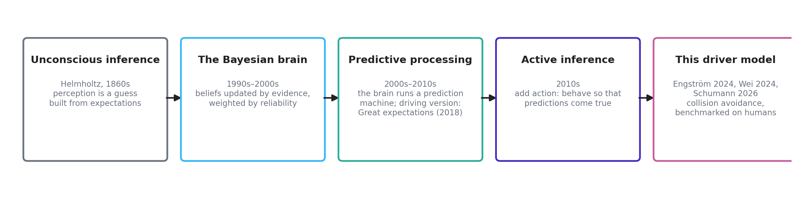

# Chapter 1: where this comes from

*Part of the WaymoActiveInference handbook. Draft for comment, 2026-08-22. Provenance tags:
[Paper] article, [SI] supplementary information, [Code] authors' code, [OSF] authors' own
simulation output, [Speculation] our ideas.*

## The idea in one paragraph

Active inference starts from a simple claim: the brain is not a camera followed by a
calculator. It is a prediction machine. It continuously guesses what its senses are about to
report, compares the guess with what actually arrives, and treats the difference — the
surprise — as the thing to get rid of. There are only two ways to get rid of it: change your
mind (update your beliefs until they fit the world) or change the world (act until it fits
your beliefs). The first is perception. The second is action. Active inference says these
are not two systems but one operation running in two directions, and it builds driver models
in which detecting a braking lead vehicle and pressing the brake pedal are, literally, the
same computation.



## A short history, told through what each step added

**Unconscious inference (Helmholtz, 1860s).** Perception is not passive reception; it is a
guess constructed from expectations plus sensory evidence. A century and a half later this is
uncontroversial in perception science — the visual system demonstrably fills in, corrects,
and predicts.

**The Bayesian brain (1990s–2000s).** The guessing was given arithmetic: beliefs are held
with degrees of confidence, evidence updates them, and less reliable evidence moves them
less. The important word is *reliability* — the framework automatically trusts a clear view
more than a glimpse in fog, without a separate rule saying so.

**Predictive processing (2000s–2010s).** The update arithmetic became an architecture: the
brain runs a generative model — an internal simulation of how the world produces sensations
— and works to minimize prediction error at every level, from retinal input up to "that car
is going to cut in". For driving, this is not an imported idea: *Great expectations*
(Engström, Bärgman, Nilsson, Seppelt, Markkula, Piccinini and Victor, 2018) laid out a
predictive-processing account of automobile driving before the present model line existed.
The way we read it, the Schumann model is the computational instantiation of the account
that paper gave verbally.

**Active inference (2010s, Friston and colleagues).** Predictive processing explains
perception. Active inference adds the second direction: an agent can also reduce prediction
error by acting on the world. The trick that makes this work is the **preference prior**:
the model treats the futures the agent *wants* as the futures it *expects*. A driver who
expects to be traveling safely in their lane, and who finds the world drifting away from
that expectation, will act to pull the world back to it. Goal-seeking becomes
surprise-avoidance, one currency for both.

**This driver model (2024–2026).** The Waymo / TU Delft line (Engström et al. 2024, Wei et
al. 2024, Schumann et al. 2026) turned the framework into a runnable model of human driving
in safety-critical situations: it perceives through optical looming like a human eye,
carries realistic uncertainty about what other road users will do, plans a few seconds
ahead with bounded effort, and — the part this project cares most about — times its
responses by accumulating surprise until action becomes necessary. It reproduces human
response-time patterns in three conflict types, one of which the authors held out entirely
from tuning [Paper].

## "Free energy," demystified in one page

The term that scares people off is *free energy*. What it names is mundane: **a computable
score of how badly your model of the world is doing**, given what you are sensing. High
score, poor fit; low score, good fit. The mathematical object (Level 2 note 1) is a clever
upper bound on surprise that can be computed without knowing everything about the world —
that is its entire job.

The word "energy" is a historical accident: the formula has the same shape as a quantity in
statistical physics, so the name was borrowed. Nothing thermodynamic is meant. No heat, no
calories, no metabolic claim. A reader who mentally substitutes "model-misfit score" for
"free energy" loses nothing in this handbook and, in our experience, most of the model
literature.

Two versions of the score matter, and the split between them organizes the whole model:

- **Present-tense misfit** (variational free energy): how badly current beliefs fit current
  sensations. Minimizing it is perception — the belief update.
- **Future-tense misfit** (expected free energy): how badly a *candidate plan* is expected
  to fit the *preferred* future. Minimizing it is action selection — choose the plan whose
  imagined consequences least depart from the future the driver treats as normal.

## Anchors: models you already know, and where they sit inside this one

The model is best understood not as a rival to the models this audience already uses but as
a container that holds versions of them [Paper] [SI]:

- **Evidence-accumulation / drift-diffusion response models** (Markkula and colleagues). The
  model's response timing *is* an accumulator: a quantity builds up over time and action
  follows when it crosses a threshold. The difference is that the accumulation rate is not a
  fitted constant — it is the moment-by-moment surprise computed from the driver's own
  predictions, so response times automatically depend on kinematics, urgency, and
  expectation.
- **Looming and visual threshold models.** The model perceives the lead vehicle through
  optical size and expansion rate, with a detection threshold on expansion. Detection delay
  therefore *emerges* from perception rather than being a fitted reaction-time constant.
- **Driver risk field / safety-margin models** (Kolekar; our own comfort-zone tradition).
  The preference prior defines a landscape over states — which situations are treated as
  normal and which as increasingly unacceptable. That landscape plays the role of a risk
  field, and chapter 11 argues it can be made to *be* one.
- **Motivational theories** (zero-risk, task-capability interface, task difficulty
  homeostasis). These describe drivers as regulating toward a comfortable region. Here the
  regulation is explicit: the comfortable region is where predicted futures match preferred
  ones and surprise stays near zero.

## The debate: biology, philosophy, or engineering

Active inference arrives with a large and sometimes heated literature attached, and it is
fair for a new reader to ask what they are being asked to believe. The way we read the
field, three distinct claims travel under the same name, and they deserve different levels
of commitment:

1. **A process theory of the brain** — neurons literally implement these computations. This
   is a serious neuroscience program with real but contested evidence. Nothing in this
   handbook depends on it.
2. **A universal principle of life** — every self-organizing system, from cells upward,
   minimizes free energy; in its strongest form this is argued almost as a mathematical
   necessity. Critics respond that a principle compatible with everything predicts nothing,
   and that the strongest versions are unfalsifiable. We do not take a position here, and we
   do not need to.
3. **An engineering framework** — a recipe for building agents that carry uncertainty
   honestly, unify goal-seeking with information-seeking, and time their actions by
   surprise. This is the only claim the driver model needs, and it is testable the ordinary
   way: build the model, benchmark it against human data, hold scenarios out.

The published model is squarely a use of claim 3, and its strongest evidential card is
conventional science rather than grand theory: the intersection scenario was never used for
tuning, and the model still predicted human response patterns there [Paper]. That said, the
framework's critics raise points worth keeping in view even at level 3: with a hand-built
preference function and thirteen tuned parameters, flexibility is real, and "the model can
be made to fit" is a fair worry. The honest defense is held-out prediction and ablation —
remove a mechanism, show the behavior degrades — both of which the paper does and both of
which we can now reproduce from the authors' released data [OSF].

For contrast with the paradigms this audience grew up with:

| Paradigm | The driver is... | Where it differs from active inference |
|---|---|---|
| Stimulus–response / threshold models | a trigger waiting for a cue | no expectations; response times must be fitted per situation |
| Information processing (perceive-decide-act stages) | a pipeline | stages are separate boxes; here perception, decision, and timing share one currency |
| Ecological psychology (Gibson) | attuned to optical invariants | closer than it looks — looming *is* an optical invariant; active inference adds explicit beliefs and preferences behind the optics |
| Optimal control | a perfect planner with a cost function | here planning effort is deliberately bounded, and the "cost function" is a probability distribution, which is what lets surprise time the response |
| Reinforcement learning | a reward maximizer trained by experience | no reward signal exists here; preferences are built in, not learned, and information-seeking comes for free rather than needing exploration bonuses |

Readers who want the deep end — the free-energy principle proper, variational inference,
Markov blankets, and the debate literature on both sides — will find it in chapter 14,
which exists precisely so that this chapter does not have to be longer.

## The permission slip

You can use everything in this handbook — the model, the code, the comfort-zone method —
while remaining entirely agnostic about brains and about universal principles. The model
stands or falls on whether it predicts human driving behavior, which is an empirical
question with published, partly held-out, answers. That is the spirit in which the rest of
the handbook is written.

---

## Notes for the mathematically curious

**Level 1 — the two scores.** Surprise of an observation is its negative log-probability
under the model: rare-according-to-you means surprising-to-you. Variational free energy is
an upper bound on surprise that is computable because it involves only the agent's own
beliefs and its generative model. Expected free energy scores a candidate policy by the
surprise its predicted observations would carry under the preference distribution, plus a
term rewarding observations expected to reduce uncertainty. Action selection picks the
policy with the lowest score; the two terms are the pragmatic and epistemic values that
chapter 03 treats as components.

**Level 2 — the objective.** With beliefs Q(s), generative model P(o, s), and preference
prior P(o):

```
Perception:  minimize over Q:   F = E_Q[log Q(s) − log P(o, s)]      (≥ −log P(o))
Action:      minimize over π:   G(π) = − E[ log P(o_future) ]         (pragmatic value)
                                        − E[ information gain ]        (epistemic value)
```

The preference prior P(o) is where "wanting" enters: it is a probability distribution over
observations in which preferred observations are the probable ones. In the driver model the
distribution is a product of six independent terms (speed, acceleration, steering, lane
position, heading, collision/safety); chapter 07 walks through each. The full forms, with
the collision and safety-margin terms that matter most for comfort zones, are SI §2.4,
Eqs. 44–52 [SI]. This project's `notes/02_active_inference_overview.md` §1–§2 states the
same material with more context, and the derivation-level treatment is in chapter 14.
