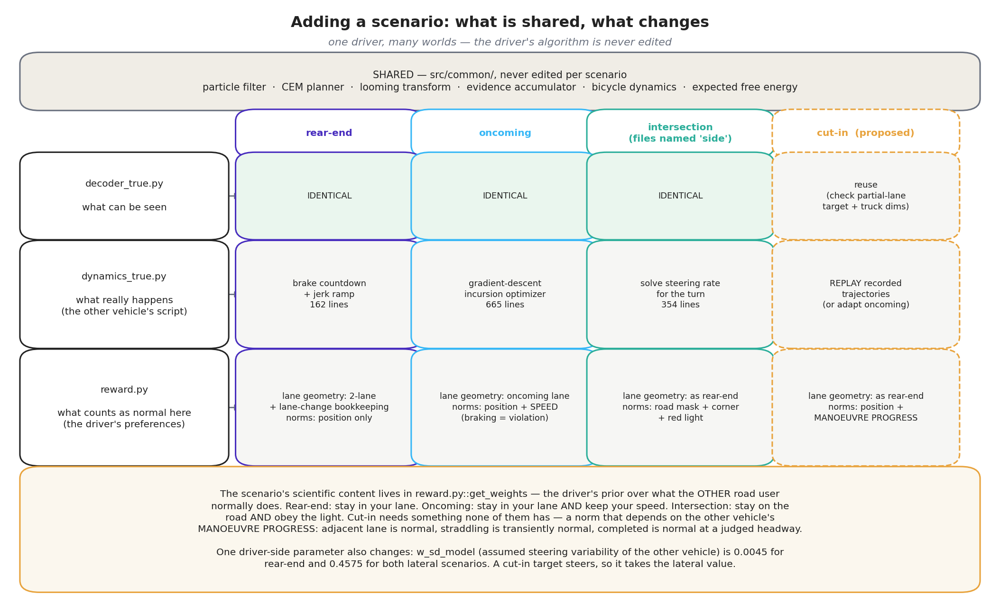

# Chapter 4: the scenario playbook — what actually changes, and the switching checklist

*Part of the WaymoActiveInference handbook. Draft for comment, 2026-08-22. This chapter's
core evidence is a column-by-column diff of the authors' own setup tables for all three
scenarios (`Setups_*.xlsx` in the OSF deposit, 65 parameters per run) [OSF], plus a file-level
diff of the per-scenario code [Code].*

## The headline: the driver barely changes; the world does

The published model runs three scenarios: **rear-end** (a braking lead vehicle),
**oncoming** (an opposite-direction vehicle drifting into our lane), and **intersection**
(a crossing vehicle turning across our path — the held-out one). Diffing the authors' own
setup tables across all baseline runs of the three scenarios gives an unambiguous answer to
"what is different, exactly": of 65 configuration parameters, everything describing the
*driver* — perception noise, looming threshold, preference weights, planning budget,
evidence accumulation, particle counts — is **identical across all three scenarios**, with
exactly one exception described below. What changes is the *world*: geometry, initial
speeds, and the other vehicle's scripted behavior [OSF].

The same conclusion appears at the file level. Each scenario is a package of three files,
and only three [Code]:

| File | Job | In plain terms |
|---|---|---|
| `dynamics_true.py` | the world's actual physics and the other vehicle's script | what really happens |
| `decoder_true.py` | how the true state becomes the driver's observations | what can be seen |
| `reward.py` | the preference terms and norms that are scenario-shaped | what counts as normal here |

Everything else — the particle filter, the planner, the looming transform, the evidence
accumulator — lives in `src/common/` and is shared untouched. The way we read it, this is
the model's strongest structural claim: *one driver, many worlds*. It is also what makes
the held-out intersection test meaningful — the driver that handled the rear-end scenario
was dropped into a new world, not re-engineered for it.

## The full diff, in five groups

**1. Stage-setting (different by definition).** Initial positions, speeds, headings, the
desired speed, and the episode length. Rear-end: both at 10–25 m/s in the same lane, gaps
giving 0.67–3.5 s headway. Oncoming: both at 17.88 m/s (40 mph), the other vehicle
202.7 m away in the opposite lane. Intersection: ego approaching at 14.7–16.3 m/s from
36–40 m out; the crossing vehicle either waiting at the junction or rolling at 6.8 m/s
[OSF].

**2. The other vehicle's script (the heart of a scenario).** Rear-end: a countdown, then
brake at a scripted intensity (the per-condition `a_tar_min_intensity` and
`brake_intensity` columns). Oncoming: a time-to-collision trigger (`ttc_trigger`), then a
lateral incursion to a target intrusion depth (`rel_target`) — implemented, notably, as the
script *optimizing* its own steering trajectory to hit that target. Intersection: a
TTC-triggered turn across our path. These script parameters exist **only** in their own
scenario's table — they are the scenario [OSF] [Code].

**3. The one driver-side change: assumed steering variability.** `w_sd_model` — how much
steering wobble the driver's internal model attributes to the *other* vehicle when
imagining its futures — is 0.0045 in rear-end and 0.4575 in both lateral scenarios, a
factor of one hundred [OSF]. This is not a perception setting; it is an assumption inside
the driver's head about what kind of agent it is facing: a lead in a queue does not steer,
an oncoming or crossing vehicle might. It is the single number by which the driver was
told what type of situation it is in. Whether a future version could *infer* this rather
than be told is, to us, an open and interesting question [Speculation].

**4. Scenario-shaped preference and norms (inside `reward.py`).** The preference terms for
speed, pedals, and collision are shared; what is scenario-shaped is the **lane structure**:
what "in my lane", "in the oncoming lane", and "off the road" mean geometrically, and what
the *other* vehicle counts as doing normally (its norms — chapter 07 details all three).
Rear-end's version even contains hand-built bookkeeping that penalizes dawdling mid-lane
or aborting a lane change; oncoming's version treats hard braking by the other vehicle as
a norm violation alongside leaving its lane; intersection's draws the geometry of running
a red light and cutting the corner [Code].

**5. Calibrated safety assumptions.** The safety-margin preference asks "would ordinary
braking still save me if the other vehicle did its worst?" — which requires assuming what
"its worst" is. That assumed worst-case deceleration is calibrated per scenario against a
free-following study rather than shared [SI]. {{R1}}The calibration table shipped with the
code covers steady-state headways only up to about 1.0–2.1 s depending on speed, so for
most of the paper's own rear-end conditions the lookup saturates at the most pessimistic
value, −8 m/s² [Code: `Analysis_following.xlsx`; `docs/method_review.md` §6.2]. This is a
property of the authors' published runs as much as of ours; it does not, as an earlier
draft of this chapter said, explain a difference between our replication and theirs,
because there is none.

## The switching checklist

To move the model to a new scenario — a cut-in, a cyclist overtake, a pedestrian crossing —
these are the decisions, in the order we would take them. Items 1–3 are mechanical; items
4–7 are modeling judgments that deserve explicit argument in any write-up.

1. **Stage the world.** Geometry, lanes, initial states, desired speed, episode length.
   (`Setups` columns; scenario `dynamics_true.py`)
2. **Script the other agent.** Trigger condition and maneuver, with its intensity as a
   sweepable condition parameter. (`dynamics_true.py`)
3. **Check observability.** Does the driver see the new agent through the same looming
   channel? A pedestrian subtends different angles than a truck; the decoder's geometry
   (vehicle dimensions) must match. (`decoder_true.py`)
4. **Draw the lane structure into the preferences.** Define what lateral positions mean —
   own lane, oncoming, shoulder — for *this* road. This is hand geometry today; there is
   no map format. (`reward.py`, lateral term)
5. **Write the other agent's norms.** What does *normal* behavior look like for that agent
   here, as regions in its state space with graded compliance weights? This is the most
   judgment-heavy step, and it directly shapes how paranoid or trusting predictions are.
   (`reward.py::get_weights`; chapter 06)
6. **Set the assumed variability.** Choose `w_sd_model` (and its longitudinal sibling) for
   the new agent type — the "what might this thing do" dial. (item 3 above)
7. **Re-calibrate the safety assumption.** Fit the assumed worst-case deceleration for the
   new context, and confirm the calibration covers the intended speed range — the failure
   mode our replication hit. ([SI]; `notes/03_replication.md`)
8. **Define the measurements.** Response-onset definition, collision definition, and the
   condition grid, so results are comparable with the published ones. (analysis scripts)

The honest summary of effort: steps 1–3 are days, steps 4–7 are where the scenario's
scientific content lives, and skipping the argument for any of 4–7 produces a model that
runs but persuades nobody.

{{R2}}**A shortcut demonstrated since (2026-08-25): replaying recorded scenarios.** When the
new "scenario" is a set of externally defined trajectories rather than a scripted world —
recorded conflicts, generated seed scenarios — the other vehicle's script (step 2) can be
replaced wholesale by a *replay* of its speed profile, leaving the driver and its
generative model untouched. The crash-causation study did exactly this to run the model
on the QUADRIS rear-end seeds (`replication/causation/tier2_rear_end.py`: a dynamics
subclass swapped into the loaded module, the authors' files unedited). Two lessons came
with it. First, external seeds force a **desired-speed decision**: the driver's desired
speed must be set from the data (this project's convention: the speed the recorded
follower later reached), or a stopped follower has no motive to move at all. Second,
count **road departures** as their own outcome class from the start — the high-speed
lane-change failure mode of chapter 05 appears in replayed scenarios too.

## The three files, line by line

{{R3}}*Added 2026-08-26 from a line-level diff of `src/rear_end_test/`, `src/oncoming/` and
`src/intersection/` in the authors' code [Code]. The summary above says what changes; this
section says exactly where, because the next scenario we add will be written by editing
these three files and it matters which lines are the scenario and which are the driver.*

{{R3}}The chart above is the whole of this section in one picture: the shared core is never
touched, `decoder_true.py` is identical across all three released scenarios, the bulk of the
code volume sits in the other vehicle's script, and the scenario's actual content is three
places inside `reward.py`. It is generated by `docs/handbook/make_scenario_diagram.py`.

{{R3}}**A naming trap first.** The intersection scenario's files are called *side* at top
level (`simulation_side.py` sets `name = 'intersection'`, and `Analysis_side.py` analyzes
it) but *intersection* inside `src/`. Searching for one name finds half the code.

{{R3}}**`decoder_true.py` — identical in all three.** This is worth stating plainly because
it is easy to assume otherwise: the three versions differ by exactly three lines, all of
them **docstring**, where the rear-end version documents two extra state variables
(`t_brake_tar`, `j_brake_tar`) belonging to its target's brake script. There is no
functional difference. How the world becomes observations — the looming transform, the
noise model, the gaze gate — is scenario-independent in the released code. The only thing
that can make it scenario-dependent is the *vehicle dimensions* it is constructed with,
since looming angle depends on the target's width.

{{R3}}**`dynamics_true.py` — where nearly all the code volume is, and none of the driver.**
The three versions are 162, 354 and 665 lines (rear-end, intersection, oncoming). That
four-fold spread is entirely the other vehicle's script:

| scenario | what `forward_state_tar` does | supporting machinery |
|---|---|---|
| rear-end | counts down to `t_brake_tar`, then ramps deceleration at `j_brake_tar` | none — it is a few lines of arithmetic |
| intersection | steers the target through the turn geometry | `tar_loss`, `get_tar_steering_rate`, `load_steering_rate` — solves for the steering rate that tracks the intended path |
| oncoming | drives the target along a synthesized incursion trajectory | `propagate_forward`, `cost_function`, `ctrl_gradient_descent`, `optimize_control_part` — a full gradient-descent optimal-control solve |

{{R3}}**The trap in this file is the word "cost".** `src/oncoming/dynamics_true.py` contains
a function called `cost_function`, and it has nothing to do with the driver's preferences.
It is the scenario author's own objective, penalizing deviation of the target's lateral
position from a reference path (`y_needed_ref`) plus a terminal state mismatch, minimized by
gradient descent to manufacture a smooth incursion that reaches the scripted intrusion depth
at the scripted moment. Reading it as part of the driver model would be a serious
misunderstanding — it is stage machinery, not psychology.

{{R3}}**`reward.py` — the driver's preferences, and the only file where the scenario changes
the driver.** The three versions differ in exactly three places, and it is worth knowing
which:

{{R3}}**(1) The lane-geometry mapping, in `compute_features`.** A handful of lines that turn
a raw lateral coordinate into "how far am I from where I should be". Rear-end and
intersection share one version, which treats the ego as being in a two-lane road with a
viable lane to the left and snaps near-zero offsets to exactly zero. Oncoming needs a
different one because the lane to the left is the *oncoming* lane rather than a free
overtaking lane, so it distinguishes `in_other_lane` from `left_lane` and maps them
separately. This is the "draw the lane structure into the preferences" step of the checklist
below, and it is roughly six lines.

{{R3}}**(2) A lane-change bookkeeping block that exists only in rear-end.** About twenty
lines that track how long the ego has been between lanes, add a heavy penalty for an
*aborted* lane change (returning to the lane it started in after more than 1.5 timesteps of
straddling) and a growing penalty for dwelling between lanes beyond nine timesteps. Both
oncoming and intersection simply delete this. As we read it, this is hand-built shaping
rather than principle — a patch to stop the planner from discovering that hovering on the
lane line is comfortable — and it is the least principled code in the three files. Anyone
porting the model should know it is there and decide deliberately whether to keep it.

{{R3}}**(3) `get_weights` — the norms, and the real scenario content.** This function is the
driver's prior over what the *other* vehicle will normally do; the dynamics call it as
`normative_probability` when propagating beliefs about the target (chapter 06). All three
versions differ completely, and the progression is instructive:

| scenario | what counts as normal behavior for the other vehicle |
|---|---|
| rear-end | position only: in its lane, weight 1; just outside, `weigh_particles`; off road, `weigh_particles × full_violation_factor` |
| oncoming | position (relative to the *oncoming* lane centre) **and speed** — a quadratic speed norm, `1 − 2.25·(v/v_mu − 1)²`, folded in by a minimum, with the code's own comment "consider breaking to be norm violating similar to off lane" |
| intersection | a two-dimensional road-geometry mask, including a quarter-circle corner of radius `10 + ½·lane_width + ½·l`, **plus** a term that down-weights the target running the red light |

{{R3}}So the driver's assumption about what other road users do gets richer as the scenario
gets more structured: stay in your lane, then also keep your speed, then also stay on the
road and obey the light. This is where the modeling judgment lives, and it is written by
hand each time — there is no map format and no norm library.

{{R3}}**Two smaller differences.** Rear-end's version keeps several selectable looming-reward
variants (`V2`–`V7`, and a non-looming fallback) where the two lateral scenarios hardcode
`V7`; and oncoming guards its braking-feasibility term with a check that the two vehicles
are actually travelling in the same direction, which rear-end does not need. Parameters are
almost entirely shared, with `lane_width` = 3.65 m in rear-end and oncoming against 3.5 m in
intersection, and the one driver-side change already noted above (`w_sd_model`).

## What a cut-in scenario would take

{{R3}}*Added 2026-08-26, ahead of implementing it. The cut-in is the next scenario, driven by
the clip-rating and button-press dataset described in `docs/czb_study1_data_plan.md`
[Repo].*

{{R3}}**`decoder_true.py`: probably unchanged, with one thing to verify.** Since the file is
already scenario-independent, the cut-in inherits it. The check that matters is whether the
looming machinery behaves for a target that is *partially* in our lane. A cut-in target
straddles the lane boundary for 2.4–2.6 s in the recorded clips, which is a state none of
the three existing scenarios sustains: the rear-end lead is always ahead in lane, the
oncoming vehicle crosses quickly, the crossing vehicle is lateral throughout. `Length_m` for
truck assets is zero in the new dataset's traces, so dimensions must be supplied explicitly
for the truck cut-ins regardless.

{{R3}}**`dynamics_true.py`: two routes, and we would take the cheap one first.** The
principled route is to adapt oncoming's incursion optimizer — a cut-in is the same
manoeuvre with the target travelling in the same direction rather than opposing, completing
the lane change rather than partially intruding, and triggered on gap or TTC. Most of that
665-line file transfers. The cheaper route is the replay shortcut described above: the new
dataset supplies recorded trajectories for every stimulus clip, so the target's script can
be a replay and no optimizer is needed at all. For the comfort-zone work the replay route is
sufficient and is what we would build first; the optimizer earns its cost only if we want to
generate cut-ins that were never recorded.

{{R3}}**`reward.py`: the three decisions, of which one is genuinely new.** The lane-geometry
mapping can be rear-end's unchanged — the ego is in its lane with a free lane to the left,
which is exactly rear-end's world. The lane-change bookkeeping should also be kept, since an
evasive lane change is available to the ego in a cut-in just as it is in a rear-end conflict.
The norms are the new work. A cut-in demands something none of the three existing
`get_weights` functions has: a norm that is **time-dependent on the other vehicle's
manoeuvre progress**. A vehicle in the adjacent lane is normal; a vehicle straddling the
boundary is *transiently* normal, because a lane change is a legal manoeuvre, but only for a
plausible duration; a vehicle that has completed the change is normal again, but now at a
headway that must itself be judged. Rear-end's norm is purely positional and would score a
straddling vehicle as a violation throughout; intersection's is geometric; oncoming's adds
speed but not progress. Writing this term is, to us, the scientific content of the cut-in
scenario, and it is where we would expect the argument in any write-up.

{{R3}}**The dials.** `w_sd_model` should start from the lateral scenarios' 0.4575 rather than
rear-end's 0.0045 — a cut-in target steers by definition, and this is the number that tells
the driver a lane change is something the other vehicle might do. The assumed worst-case
deceleration behind the safety-margin term needs re-calibrating for the cut-in context, with
the coverage check that our replication tripped over. Both belong to items 6 and 7 of the
checklist.

## The cut-in's open problem: making lane entry continuous

{{R3}}*Added 2026-08-26 after running the first cut-in predictors against the study traces.
This is the outstanding design question for the scenario and should be settled before any
fitting; Jonas asked that it be recorded as important and returned to.*

{{R3}}**The symptom.** Running the released preference function unchanged over two cut-in
stimuli that differ greatly in criticality — TTC4, with a 10.2 m gap at manoeuvre onset, and
TTC8, with 21.3 m — produces almost identical comfort-zone pressure, and it moves as a *step*
rather than a ramp. Decomposing the six preference terms shows why. The speed term sits at a
constant −483 in both, because the stimulus ego travels at 30.5 m/s while the default desired
speed is 15 m/s; that is a scenario-staging error, fixed by setting the desired speed from
the clip. The interesting failure is the safety term, which is exactly 0 before the target
enters the lane and exactly −2112 after, **identically for both criticality levels**. Only the
collision term discriminates them at all, and it is two orders of magnitude smaller.

{{R3}}**The cause is not really a bug.** The safety term asks "if the other vehicle did its
worst, could I still stop?" At 30.5 m/s with the assumed worst-case deceleration and reaction
time, the answer is no at 10 m *and* no at 21 m — both cut-ins end at a time headway under
0.75 s. The term is correct and saturated. What it cannot do is express *degrees* of
unsafety once saturated, and it only switches on when a binary test says the target is in the
ego's lane. A cut-in spends 2.4–2.6 s partially in the lane, and that entire continuum is
invisible.

{{R3}}**What the continuous replacement should be.** Our view, offered for argument rather
than as a conclusion. The physically honest quantity is not the lane test but **lateral
overlap**: the fraction of the two vehicles' widths that coincide laterally, which runs
smoothly from 0 to 1 through the manoeuvre and is exactly what determines whether a
longitudinal closure can become a collision. Weighting the collision and safety terms by that
fraction removes the step without adding a threshold.

{{R3}}That handles the present state. The more interesting half is predictive, and it is
where a cut-in genuinely differs from the released scenarios: a driver responds to a cut-in
*before* the vehicle is in the lane, on the expectation that it will be. The natural
predictive quantity is the **time until lateral overlap begins**, τ_lat = |Δy_edge| divided by
the lateral closing rate — Jonas's "predicted time to in-lane". A collision requires lateral
overlap to have begun by the time the longitudinal gap closes, so the quantity that should
drive the response is the *comparison* of two times: τ_lat against the longitudinal
time-to-collision. When τ_lat is much shorter, the cut-in is effectively already complete and
the situation is a following conflict; when τ_lat is much longer, the ego passes before the
target arrives and there is no conflict; the interesting region is where they are comparable,
and a smooth function of their difference gives a graded response that is monotone in both
criticality and manoeuvre progress — which is what the data show.

{{R3}}**Why lane-change duration is not the right variable**, consistent with the QUADRARUM
group's finding that it did not matter empirically: duration is a property of the manoeuvre
in isolation, whereas what a driver is exposed to is the lateral closing rate *relative to*
the longitudinal closing rate. A slow lane change into a large gap and a fast one into a
small gap can share a duration and pose entirely different problems. Formulating the term as
a comparison of τ_lat with the longitudinal TTC captures that; formulating it in terms of
duration cannot.

{{R3}}**Status.** Not implemented. `src/comfortzone/cutin.py` computes both ingredients
(`y_rel`, `dy_rel_dt`, `ttc_s`) so the candidate forms can be compared against the observed
3 × 6 response surface as soon as the form is agreed. Changing the collision and safety terms
this way is a modification to the authors' preference function, not a parameter choice, and
should be argued explicitly in any write-up.

{{R3}}**One caution carried over from the data.** In the new dataset the participant's
instruction differs by scenario — intervene against a cut-in, abort an overtake, yield
rather than turn — so the preference terms that should drive a boundary crossing are not the
same across scenarios. A cut-in crossing should be driven by the longitudinal safety and
collision terms; an overtake abort by the lateral clearance term. Pooling them under one
scalar without accounting for this seems to us the most likely way to produce a misleading
negative result in the transfer test.

---

## Notes for the mathematically curious

**Level 1 — why one driver can serve three worlds.** The agent's objective (expected free
energy over a 6 s horizon) never mentions the scenario; scenario enters only through (i)
the generative process being simulated, (ii) the lateral/lane geometry inside the
preference distribution, and (iii) the norm-compliance weighting inside the prediction
step. Since all three are data to the same algorithm, transferring the driver is exactly
transferring those three objects.

**Level 2 — the diff, precisely.** Baseline-run comparison across the three `Setups`
tables: differing columns are {initial state: `x_ego, v_ego, x_tar, y_tar, theta_tar,
v_tar, v_ego_des, T`}, {script: `a_tar_min_intensity, brake_intensity` (rear-end);
`ttc_trigger, rel_target` (oncoming); `ttc_trigger` (intersection)}, {driver-side:
`w_sd_model` = 0.0045 vs 0.4575}, and `num_plans` = 1000 in oncoming's extended-budget
sensitivity runs vs 100 baseline. All remaining ~50 columns are identical across
scenarios, including every preference weight (`v_ego_sd_des, a_ego_sd_des, w_ego_sd_des,
lane_change_cost, road_leave_cost, collision_cost`), every perception noise, the looming
threshold, `N_norm, H_norm, alpha`, and the evidence-accumulation settings (`EA_mode,
EA_fac` = λ, `EA_init`) [OSF]. Oncoming's target script solves a small optimal-control
problem for the incursion (gradient descent on a steering sequence to reach the scripted
lateral target at the scripted time; `src/oncoming/dynamics_true.py`) [Code].
