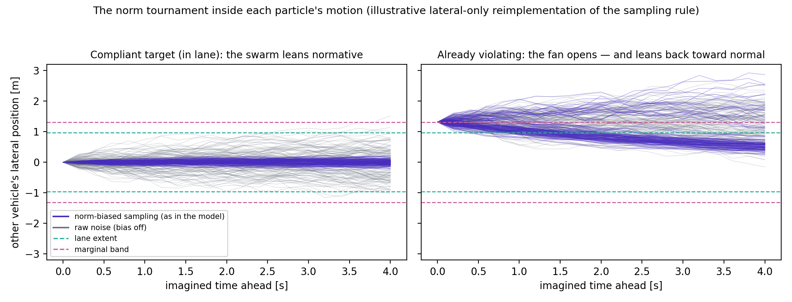

# Chapter 6: other agents, and what the driver believes about them

*Part of the WaymoActiveInference handbook. Draft for comment, 2026-08-22. Provenance tags
as in chapter 0. This chapter answers question (e) of the project brief: what defines what
the other vehicles are doing — including whether the particle filter is how it is done.*

## Two completely different questions, easily conflated

"What is the other vehicle doing?" has two answers in this model, produced by two
unrelated pieces of machinery, and keeping them apart is the key to reading the code and
the paper correctly:

1. **What the other vehicle actually does** is decided by a *script* — simple,
   deterministic, and entirely outside the driver model.
2. **What the driver believes the other vehicle is doing and might do next** is decided by
   the belief machinery — a particle swarm whose own motion is norm-shaped, serving both
   the tracking of the present and the imagining of futures.

The particle filter is *not* how the other vehicle's behavior is generated; it is how the
driver's uncertainty about that behavior is represented. The script answers question 1;
the particle filter and the prediction roll-outs answer question 2.

## Side one: the script (the truth)

Each scenario's `dynamics_true.py` [Code] contains the other vehicle's entire behavioral
repertoire, and it is deliberately primitive:

- **Rear-end:** drive at constant speed; when a countdown expires, ramp braking to a
  scripted intensity; stop. The intensity and timing are condition parameters swept across
  runs [OSF].
- **Oncoming:** drive straight in the opposite lane; when time-to-collision falls below a
  trigger, steer into our lane to a scripted intrusion depth. The incursion trajectory is
  computed by a small optimizer so it hits the scripted depth at the scripted time — a
  fancier script, but still a script [Code].
- **Intersection:** approach or wait at the junction; on a trigger, turn across our path.

Three properties matter more than the details. The script **never reacts to our driver** —
no negotiation, no yielding, no eye contact; every published result is about unilateral
avoidance, and any interaction study would need this replaced [Paper]. The script is
**where a scenario's difficulty lives** — sweeping its intensity and timing generates the
condition grids. The script is **invisible to the driver**, who meets it only through
optics.

## Side two: the beliefs (the driver's honest ledger)

**The present: a cloud of 75 hypotheses.** The particle filter maintains 75 complete
candidate states of the world — each one a full "it could be like this": positions,
speeds, headings, and, crucially, the other vehicle's current acceleration and steering.
Each observation re-weights the hypotheses by how well they explain it; hypotheses that
keep failing get culled and replaced near ones that succeed. The cloud's spread *is* the
model's uncertainty — no separate confidence number exists.

Between observations, each particle is *moved* by the norm-shaped transition described in
the next section — the swarm drifts toward "that vehicle will keep behaving", and each
arriving observation then corrects the drift toward what actually happened. Chapter 02
showed the resulting subtlety: in the rear-end configuration the observation channel is
sharp enough that the cloud tracks the present tightly (the believed lead deceleration
snapped to the truth in one step). The cloud earns its keep elsewhere — under ambiguity.
When an oncoming vehicle wanders near the lane line, hypotheses compatible with "drifting
but staying" and "beginning an incursion" coexist with real weight on both, and the
driver's planning sees *both* futures. A single-best-estimate tracker is structurally
unable to be of two minds; the particle cloud is of two minds routinely, which we read as
one of the model's most human features.

## Where the norms live: inside the particle swarm's own motion

This section exists because it answers a question we ourselves initially got only half
right, and which one of the authors (Engström, personal communication, 2026-08) pointed
to: the normative machinery is not a layer applied *on top of* predictions — **it is
built into how every particle moves**. We have verified the following against the code
line by line [Code], and it holds for the belief update and the planner alike, because
both are served by literally the same transition object
(`src/common/dynamics.py::forward_tar_agent`; attached to the norm weights once, in the
simulation setup).

Whenever any particle's picture of the other vehicle has to advance by one timestep —
which happens both when the belief cloud is updated between observations and when
futures are imagined during planning — the particle does not simply add random noise to
the other vehicle's controls. It runs a **mini-tournament**:

1. Propose 32 candidate next moves for the other vehicle (its current controls plus
   random variation, sized by the `a_sd_model` / `w_sd_model` dials).
2. Score each candidate by norm compliance in three snapshots: where the vehicle *is*
   now, where the candidate puts it *one step* ahead, and where the candidate would put
   it *four seconds* ahead if held. The "soon" and "later" scores are averaged; the
   overall score is the *worse* of "now" and "that average" — a candidate that looks
   fine now but drifts off the road later is tainted by its future.
3. Draw **one** winner by lottery, with tickets proportional to the scores. That winner
   becomes the particle's next state.

So a compliant lead vehicle's particles overwhelmingly "choose" futures that stay in
lane at speed — the swarm itself leans normative. This is, we believe, exactly what
"the normative part is included in the particle swarm" means: norms are the sampling
bias of the swarm's own dynamics, not a filter applied afterward.

**The trust cap falls out of the same arithmetic, elegantly.** The "now" score in step 2
is the same for all 32 candidates — it describes where the vehicle already is, which no
candidate can change. While the vehicle is behaving normally that shared score is high,
so the *differences* between candidates (their futures) decide the lottery, and the
normative bias bites (left panel of the figure: the biased fan hugs the lane while raw
noise sprays). The moment the vehicle is observed grossly misbehaving, the shared "now"
score collapses, becomes the ceiling for every candidate at once, and the lottery goes
momentarily near-uniform: the bias dissolves and the swarm fans out over everything the
vehicle could physically do. Trust is not a separate mechanism with its own parameter;
it is the min() in step 2 doing its work. Revoked on evidence, within a step or two.

The right panel shows a second-order consequence we verified in the arithmetic and think
is worth knowing: for a violating target the fan opens, *and* it leans back toward the
lane — any hypothesis that wanders back into the normal region regains its bias and is
recaptured. The swarm simultaneously entertains the long tail and expects the violator
to eventually return to normality, which strikes us as a rather human expectation to
hold [Code, our reading].

**The same tournament, two different jobs.** In the *belief update* the tournament runs
for one step and is immediately corrected by the next observation — so norms gently
shape where the cloud drifts between glances at the world, and reality has the last
word. In *planning roll-outs* the tournament runs 30 steps with no observations to
correct it — so norms shape the entire 6-second fan of imagined futures, which is where
they influence decisions. One mechanism, two exposures; the second is where the
behavioral consequences (relaxed following, late-but-not-too-late alarm) come from.

Two dials size the raw variation the tournament chooses among (`a_sd_model`,
`w_sd_model`): how much acceleration and steering wobble the driver attributes to
"vehicles in general". Chapter 04 showed the steering dial is the one number that
distinguishes the driver across scenarios (0.0045 for a queueing lead, 0.4575 for
oncoming and crossing traffic) [OSF]. Without the tournament, raw noise alone would
make the driver either paranoid (every future includes wild swerves) or oblivious
(noise too small to cover real incursions); the norm bias with its built-in trust cap
is the model's resolution of that dilemma [Paper].

## Why this arrangement is worth copying

- **Detection speed comes from expectation violation, not from tuned vigilance.** The
  driver is relaxed precisely because compliant futures are weighted up; it becomes alert
  precisely when compliance visibly fails. One mechanism covers both, with no
  free "alertness" parameter.
- **The uncertainty is decision-grade.** The same cloud that represents "they might brake
  / might not" is what plans are scored against, so caution scales automatically with
  genuine ambiguity — no hand-tuned safety buffer.
- **The seams are explicit.** Everything the driver assumes about others is localized in
  three places: two noise dials, one norm geometry, one trust cap. Chapter 09 uses
  exactly these seams for modifications (an inattentive-driver prior, a trusting-driver
  variant, a pedestrian norm set).

## The limits, stated plainly

The other agent has no mind: it does not perceive our driver, and the driver's model of
it contains no recursive "they see me seeing them". Cooperative and communicative
phenomena — gap negotiation, hesitation reading, signaling — are outside the published
model's scope [Paper]. The norms are hand-drawn per scenario, which is honest but does
not scale; learning them from data is, in our view, one of the most natural extension
projects this line offers [Speculation].

---

## Notes for the mathematically curious

**Level 1 — the filter.** Standard sequential importance resampling: predict each
particle through the dynamics, weight by observation likelihood, normalize, resample on
weight degeneracy. Later papers in the line replace raw particles with a kernel-density /
Gaussian-mixture representation so beliefs can move outside the initial particle support.
Prediction for planning: for each particle, sample other-agent control noise, roll the
joint state 6 s; the resulting bundle approximates the predictive distribution over
futures conditional on our candidate plan.

**Level 2 — the tournament as implemented** (`src/common/dynamics.py::forward_tar_agent`,
verified 2026-08-22) [Code]. Per particle and per transition: draw `N_norm` = 32 control
perturbations ~ N(0, `a_sd_model`/`w_sd_model`), scaled by `noise_pred_fac` = 0.2 when
called in prediction mode; for each candidate compute compliance weights from the
scenario's norm geometry (`reward.py::get_weights`) at the current state (w_now — note:
identical across candidates), one step ahead (w_next), and `H_norm` = 20 steps ≈ 4 s
ahead under held controls (w_long); combine w_future = harmonic mean(w_next, w_long);
overall w = min(w_now, w_future); normalize over the 32 candidates and sample one index
from the categorical — the sampled candidate becomes the particle's next target state.
Compliance weights: 1 inside the normal region, `weigh_particles` = 0.001 marginally
outside, times `full_violation_factor` = 0.01 for gross violations [OSF]. The trust cap
is the min() with the candidate-independent w_now: once w_now < w_future for all
candidates, every candidate carries the same weight and the categorical is uniform —
the bias vanishes without any dedicated switch. The same `Dynamics` instance is passed
to both the `Encoder` (belief update; one call per step, observation-corrected via the
KDE update) and `BeliefDynamics` (planner roll-outs; 30 uncorrected calls per imagined
future); the norm weights are attached once via `add_reward_function` in the simulation
setup [Code, `src/utils/simulation.py`]. Oncoming's norm set additionally treats speed
deviation as non-compliance (a braking oncoming vehicle is "abnormal"), chapter 07 [Code].
