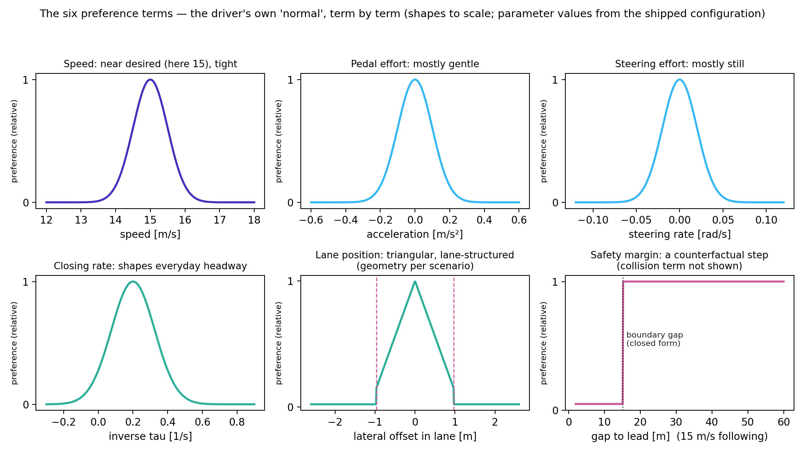

# Chapter 7: normative driving — what defines "normal", and every knob that moves it

*Part of the WaymoActiveInference handbook. Draft for comment, 2026-08-22. Provenance tags
as in chapter 0. This chapter answers question (d) of the project brief.*

## "Normal" appears twice, and they are different objects

The model contains two separate definitions of normal driving, implemented in different
places, doing different jobs:

- **The driver's own normal** — the preference prior: how *my* drive is supposed to go.
  This shapes what the driver does. It is the comfort-zone object.
- **Normal for the others** — the norm geometry of chapter 06: what *that other vehicle*
  is expected to do. This shapes what the driver predicts, hence when it worries.

Question (d) — "how is normative driving defined for the individual scenarios, in detail"
— needs both answers. We take them in turn.

## Part A: the driver's own normal — six preference terms

The preference prior is a product of six independent terms [SI §2.4]. Each term is a
distribution over one observed quantity: it says which values are treated as unremarkable
and how quickly departures become objectionable. Because the terms multiply, the model's
"how the drive should go" is simply the six read together — and because they are
independent, every exceedance can be attributed to the term responsible (the property the
comfort-zone method exploits, chapter 11).

| Term | Plain meaning | The knobs | Turning them does |
|---|---|---|---|
| **Speed** | I intend to travel near my desired speed | desired speed; tolerance (sd 0.5 m/s) | tighter tolerance → speed held more rigidly, stronger urge to return to it after braking |
| **Pedal effort** | acceleration should be mostly gentle | tolerance (sd 0.1 m/s²) | smaller → smoother driving, later/harder emergency trade-off felt |
| **Steering effort** | the wheel should be mostly still | tolerance (sd 0.02 rad/s) | smaller → steering escapes score worse, braking favored |
| **Lane position** | stay centered in a real lane | lane geometry; lane-change cost; road-leave cost | the scenario-shaped term — see below |
| {{R1}}**Closing rate** (inverse-tau) | do not close on the vehicle ahead faster than a TTC of about 5 s | preferred inverse-tau level and width | one-sided in the released code: closing slower than that, holding the gap, or falling back costs nothing, so this term bounds the *approach rate* and does not shape the following distance itself [Code: `reward.py`; the SI's symmetric form would, and an earlier draft of this row said so] |
| **Collision & safety margin** | collisions are unacceptable, scaled by severity — and so are states from which only heroic braking would save me | collision cost; severity floor; assumed worst-case lead braking; assumed own reaction time (1 s) | the comfort-zone term — see below |

Three of the six deserve a longer look.

**The lane term is where scenarios differ.** "Centered in my lane" requires knowing what
lanes exist and which direction they serve; that geometry is hand-drawn per scenario
[Code]. Rear-end's road adds explicit costs on dawdling between lanes or aborting a lane
change — hand-built craftsmanship, not derived theory, and worth knowing about before
attributing its effects to deep principles [Code]. There is no map format: a new road
means drawing new geometry (chapter 04, checklist item 4).

**The closing-rate term defines everyday tailgating comfort.** It is easy to overlook —
the article barely mentions it — but without it the model would happily sit at a tiny,
technically-safe gap. It encodes "being close and closing feels wrong before it is
dangerous", which the way we read it is the first appearance of a comfort-zone boundary
inside the model, distinct from the safety margin [SI].

**The safety-margin term is a counterfactual, and its assumptions are the boundary's
location.** It scores the present state by a what-if: *if* the lead braked at an assumed
worst-case level *and* I responded only after an assumed reaction time, would ordinary
braking still suffice? Both assumptions are parameters — the assumed worst case is
calibrated per scenario [SI], and any absolute number quoted from this term (a critical
headway, a boundary THW) inherits them. This project's standing rule: never report a
boundary value without stating both (`HANDOFF.md` §7).

## Part B: normal for the others — the three scenarios in detail

The norm geometry that chapter 06's prediction machinery consumes, read directly from the
code [Code]:

- **Rear-end.** Normal = the lead staying within the lane's width. Graded: fully normal
  in-lane; a small factor when marginally outside; a much smaller factor further out.
  Nothing about speed — a lead may brake without becoming "abnormal", which is consistent
  with braking leads being the scenario's whole point.
- **Oncoming.** Normal = staying in *its own* lane, **and** holding its speed: the
  compliance weight falls off quadratically as its speed departs from the nominal one.
  An oncoming vehicle that brakes hard is treated as abnormal even before it crosses the
  line — the earliest warning the driver can get in this geometry.
- **Intersection.** Normal = respecting the junction's geometry: not entering our
  carriageway past the yield line ("ignoring the light"), not cutting the corner arc, not
  leaving the paved area. Drawn as literal regions of the junction plan.

The pattern worth naming: each scenario's norm set encodes *the specific way that
scenario's threat announces itself* — lane exit for oncoming, junction entry for
crossing. The way we read it, writing a new scenario's norms (checklist item 5) amounts
to answering: "what is the earliest observable sign, in this geometry, that the other
agent has stopped being ordinary?"

## Part C: how normal can be changed

Because both normals are explicit objects, changing them is parameter work, not
rearchitecting — with effects that are predictable in direction and, for the safety
margin, in closed form (chapter 11).

**Traits (stable differences between drivers).** A cautious driver: the assumed
worst-case lead braking is made more severe (they plan for worse) and the pedal tolerance
tightened. A hurried driver: higher desired speed, tighter speed tolerance, shorter
assumed reaction time. A smooth-ride chauffeur: pedal and steering tolerances tightened,
closing-rate preference widened. Each is a handful of interpretable numbers
[Speculation, though the parameter meanings are the paper's].

**States (the same driver on a bad day).** The classic "extra motives" of the
comfort-zone literature — hurry, anger, social pressure — become *temporary reshapings of
the preference prior*. This project has computed two examples end to end
(`notes/04_comfort_zone_method.md` §5): shortening the assumed reaction time 1.0 → 0.6 s
moves the comfort boundary at 15 m/s from 1.67 to 1.27 s of headway; trusting the lead
(assumed worst braking −6 → −3 m/s²) moves it to 0.42 s. The theory predicts *how much*
the boundary moves, not merely that it moves — the most falsifiable thing this framework
offers the human-factors community, in our opinion.

**Norm changes (the others' normal).** Widening the lead's normal region makes the driver
slower to worry; tightening it makes the driver jumpy. A learned, data-driven norm set —
replacing the hand geometry with distributions fitted to observed traffic — is the
extension we would rank most valuable [Speculation]. Chapter 10 gives our proposed
procedure for it, and — more generally — where every number in this chapter came from
and the discipline for setting new ones.

## Part D: what, ultimately, defines it

Honesty about provenance: the shape of every preference term is **specified by the
authors**, not derived from first principles; thirteen parameters were hand-tuned to
produce human-like behavior [Paper]; one (the assumed worst-case braking) is calibrated
against a separate free-following dataset per scenario [SI]; none are fitted to the
conflict data they are evaluated on. So "normative driving" in this model is a *stated
hypothesis about drivers' standards*, made falsifiable by its behavioral consequences —
response times, maneuver choices, headways — rather than an empirical measurement of
those standards. Fitting the preference parameters to individual human drivers, and
checking whether the fitted values are stable across scenarios, is precisely the research
program the comfort-zone work opens (chapter 11).

---

## Notes for the mathematically curious

**Level 1 — preference as log-probability.** Each term contributes a log-probability;
the six add. "Zero cost" is the mode of each distribution; the cost of a departure is
the log-density drop. The additive decomposition is what lets an exceedance be blamed on
a term: the residual ε (chapter 02) is a sum of per-term residuals.

{{R1}}**Level 2 — forms and numbers.** Speed, pedal, steering: Gaussians with sds 0.5 m/s,
0.1 m/s², 0.02 rad/s around desired speed / 0 / 0 — with two code-only twists on the
pedal term: positive accelerations are doubled before the Gaussian, and the quantity
penalized is the total acceleration √(a_lat² + a_long²), not the longitudinal component
[Code: `reward.py:166,173`; neither is in the SI]. Lane: triangular within-lane density
with hard log-costs −1000 (lane boundary) and −15000 (road edge; the SI's −5000 is a
documentation error), lane-structured per scenario (SI Eq. 52). Inverse-tau: Gaussian on
1/τ with mean 0.2 s⁻¹, sd 0.125 s⁻¹, evaluated on max(1/τ, 0.2) so that it is one-sided
[Code: `reward.py:272`; SI Eq. 48 writes it symmetric]. Our mirror (`src/aidriver/
preferences.py`) follows the code for all of these and keeps the SI forms behind flags.
Collision: cost −10000 scaled by severity = max(Δv/10 m/s, 0.2) — the floor is SI
Eq. 48, not a fudge. Safety margin (SI Eqs. 49–51): required deceleration under the
counterfactual (lead brakes at min(observed, assumed worst); own response after
t_react = 1 s), compared against the achievable 8 m/s²; the closed-form boundary this
yields is `src/comfortzone/field.py::critical_gap` and chapter 11. Norm weights: Part
B's geometries with factors 0.001 and 0.001 × 0.01 (`weigh_particles`,
`full_violation_factor`); oncoming's speed compliance 1 − 2.25 (v/v₀ − 1)², clipped
[Code]. The thirteen hand-tuned parameters are listed in the paper's methods [Paper].
