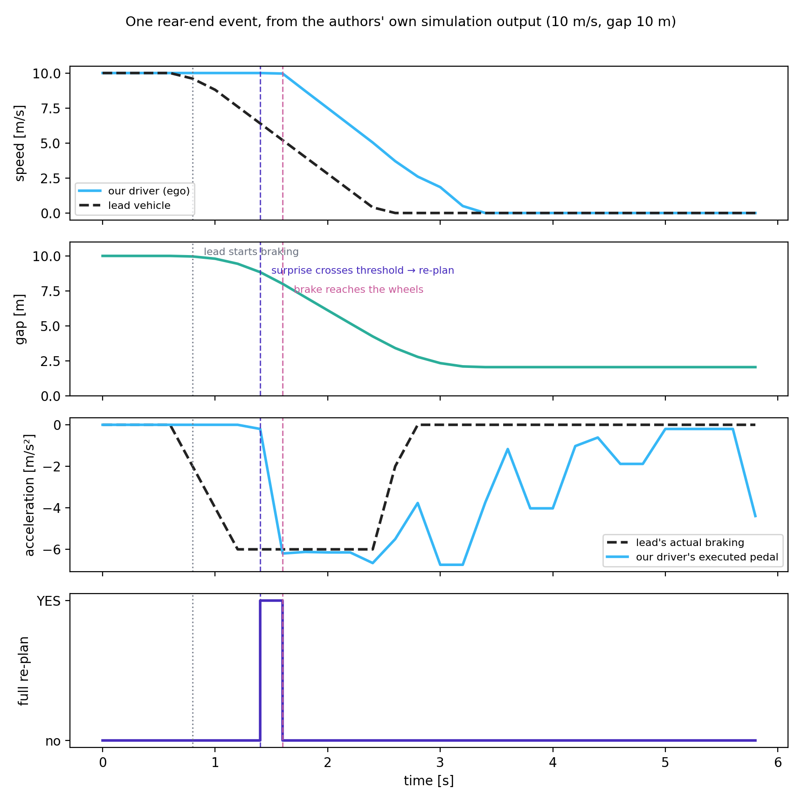
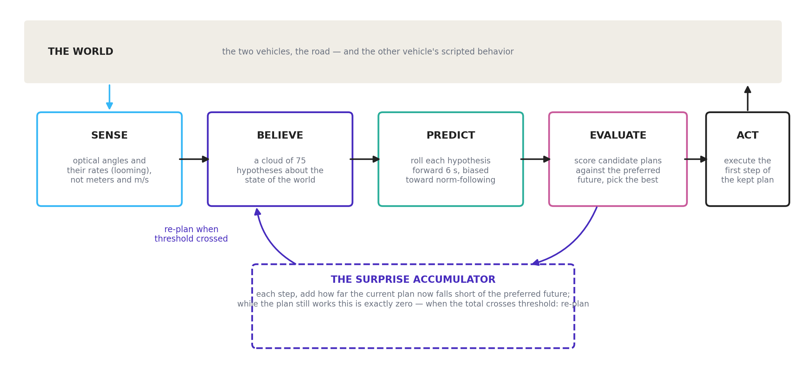

# The active-inference driver model: a reader's handbook

*Prepared at Chalmers University of Technology by Jonas Bärgman, with drafting assistance
from Claude (Anthropic), August 2026. This handbook grew out of a close reading of the
active-inference driver-modeling line — the article, its Supplementary Information, the
released code, and the OSF simulation deposit — undertaken to understand the model well
enough to build on it. It is shared with the authors of that work in the spirit of a
companion text: what a careful outside reader reconstructed, stated plainly enough to be
checked. Any errors of reading are ours, and corrections are very welcome.*

## What this handbook is

This handbook explains the active-inference driver model of Schumann, Engström, Johnson,
O'Kelly, Messias, Kober and Zgonnikov (2026, Nature Communications), together with the
line it belongs to (Engström et al. 2024; Wei et al. 2024), well enough that a reader can
(1) understand how it works, (2) change it deliberately, and (3) know how to validate a
change. It is written for a mixed audience of traffic-safety analysts and human-factors
researchers. The main text of every chapter avoids mathematics; each chapter ends with
layered notes for readers who want the equations.

The handbook is grounded in four kinds of sources, and every substantive claim is tagged
with its provenance:

- **[Paper]** — the published article
- **[SI]** — its Supplementary Information (where most of the actual definitions live)
- **[Code]** — the authors' released code, which is the ground truth when the paper is
  ambiguous, and which in a few places defines the model more precisely than the SI does
  (those places are tagged where they matter)
- **[OSF]** — the authors' own simulation output (the OSF deposit), which lets the
  handbook show real numbers rather than sketches
- **[Opinion]** — our own readings and judgments, marked so they cannot be mistaken for
  the authors' claims

## The chapters

| Part | Chapter | One line |
|---|---|---|
| I | 01 Where this comes from | The lineage of the idea, what "free energy" actually means, how it relates to models you already know, and the debate around it |
| | 02 One event through the model's eyes | A single rear-end conflict, told moment by moment with real numbers |
| II | 03 What the model is | Every component, its inputs and outputs, and the loop that connects them |
| | 04 Scenario playbook | Exactly what changes between scenarios, and the checklist for adding a new one |
| | 05 Normal versus critical | Why the same machinery covers everyday driving and emergencies |
| | 06 Other agents and beliefs | What the other vehicle actually does, versus what the driver model believes it might do |
| | 07 Normative driving | What defines "normal" behavior, and every knob that moves it |
| | 08 The gaze system | The attention machinery that ships in the code, and what impairment-related mechanisms exist today |
| III | 09 Modify and validate | Recipes for changing the model, each with its validation ladder |
| | 10 Calibration and parameter fitting | Where every number came from, how to set new ones, identifiability, and the dos and don'ts |
| IV | 11 Code and data map | From concept to file, class, and parameter |
| | 12 Glossary | The same idea in three vocabularies, plus common misconceptions |
| | 13 Appendix: the deep end | The free-energy principle proper, variational inference, Markov blankets, the debate literature, the discrete-state formulation — for reference |

## Reading paths

- **Thirty minutes, any background:** chapter 02, then the first half of chapter 01.
- **Human-factors readers:** 01 → 02 → 05 → 07 → 08. Chapter 03 on demand.
- **Analytics / modeling readers:** 02 → 03 → 04 → 06 → 09 → 10 → 11, with the
  chapter-end notes.
- **"I want to change the code":** 03 → 04 → 11 → 09 → 10, keeping 12 open in a second
  window.

## How the math is layered

Each chapter's main text is **Level 0**: components, inputs, outputs, and behavior, no
equations. At the end of a chapter:

- **Level 1** states the same content with light notation — enough to read the paper's
  figures and follow its argument.
- **Level 2** gives the actual equations with their Supplementary Information numbers, so
  a reader can go from this handbook straight into the SI or the code.

Nothing in a later chapter depends on having read the notes of an earlier one.

## One warning before you start

Two words in this literature do not mean what they usually mean, and misreading them is
the most common way to get lost. **Surprise** is not an emotion here: it is a number
measuring how far what is happening departs from what the model expected. **Preference**
is not a choice: it is a description of the futures a driver treats as normal, encoded so
that wanting something and expecting it become the same quantity. Chapter 12 collects the
rest of these false friends.

---

# Chapter 1: where this comes from

## The idea in one paragraph

Active inference starts from a simple claim: the brain is not a camera followed by a
calculator. It is a prediction machine. It continuously guesses what its senses are about
to report, compares the guess with what actually arrives, and treats the difference — the
surprise — as the thing to get rid of. There are only two ways to get rid of it: change
your mind (update your beliefs until they fit the world) or change the world (act until it
fits your beliefs). The first is perception. The second is action. Active inference says
these are not two systems but one operation running in two directions, and it builds
driver models in which detecting a braking lead vehicle and pressing the brake pedal are,
literally, the same computation.


## A short history, told through what each step added

**Unconscious inference (Helmholtz, 1860s).** Perception is not passive reception; it is a
guess constructed from expectations plus sensory evidence. A century and a half later this
is uncontroversial in perception science — the visual system demonstrably fills in,
corrects, and predicts.

**The Bayesian brain (1990s–2000s).** The guessing was given arithmetic: beliefs are held
with degrees of confidence, evidence updates them, and less reliable evidence moves them
less. The important word is *reliability* — the framework automatically trusts a clear
view more than a glimpse in fog, without a separate rule saying so.

**Predictive processing (2000s–2010s).** The update arithmetic became an architecture: the
brain runs a generative model — an internal simulation of how the world produces
sensations — and works to minimize prediction error at every level, from retinal input up
to "that car is going to cut in". For driving, this is not an imported idea: *Great
expectations* (Engström, Bärgman, Nilsson, Seppelt, Markkula, Piccinini and Victor, 2018)
laid out a predictive-processing account of automobile driving before the present model
line existed. The way we read it, the Schumann model is the computational instantiation of
the account that paper gave verbally [Opinion].

**Active inference (2010s, Friston and colleagues).** Predictive processing explains
perception. Active inference adds the second direction: an agent can also reduce
prediction error by acting on the world. The trick that makes this work is the
**preference prior**: the model treats the futures the agent *wants* as the futures it
*expects*. A driver who expects to be traveling safely in their lane, and who finds the
world drifting away from that expectation, will act to pull the world back to it.
Goal-seeking becomes surprise-avoidance, one currency for both.

**This driver model (2024–2026).** The Waymo / TU Delft line (Engström et al. 2024, Wei et
al. 2024, Schumann et al. 2026) turned the framework into a runnable model of human
driving in safety-critical situations: it perceives through optical looming like a human
eye, carries realistic uncertainty about what other road users will do, plans a few
seconds ahead with bounded effort, and times its responses by accumulating surprise until
action becomes necessary. It reproduces human response-time patterns in three conflict
types, one of which the authors held out entirely from tuning [Paper].

## "Free energy," demystified in one page

The term that scares people off is *free energy*. What it names is mundane: **a computable
score of how badly your model of the world is doing**, given what you are sensing. High
score, poor fit; low score, good fit. The mathematical object (Level 2 note) is a clever
upper bound on surprise that can be computed without knowing everything about the world —
that is its entire job.

The word "energy" is a historical accident: the formula has the same shape as a quantity
in statistical physics, so the name was borrowed. Nothing thermodynamic is meant. No heat,
no calories, no metabolic claim. A reader who mentally substitutes "model-misfit score"
for "free energy" loses nothing in this handbook and, in our experience, most of the model
literature [Opinion].

Two versions of the score matter, and the split between them organizes the whole model:

- **Present-tense misfit** (variational free energy): how badly current beliefs fit
  current sensations. Minimizing it is perception — the belief update.
- **Future-tense misfit** (expected free energy): how badly a *candidate plan* is expected
  to fit the *preferred* future. Minimizing it is action selection — choose the plan whose
  imagined consequences least depart from the future the driver treats as normal.

## Anchors: models you already know, and where they sit inside this one

The model is best understood not as a rival to the models this audience already uses but
as a container that holds versions of them [Paper] [SI]:

- **Evidence-accumulation / drift-diffusion response models** (Markkula and colleagues).
  The model's response timing *is* an accumulator: a quantity builds up over time and
  action follows when it crosses a threshold. The difference is that the accumulation rate
  is not a fitted constant — it is the moment-by-moment surprise computed from the
  driver's own predictions, so response times automatically depend on kinematics, urgency,
  and expectation.
- **Looming and visual threshold models.** The model perceives the lead vehicle through
  optical size and expansion rate, with a detection threshold on expansion. Detection
  delay therefore *emerges* from perception rather than being a fitted reaction-time
  constant.
- **Driver risk field and safety-margin models** (Kolekar and colleagues). The preference
  prior defines a landscape over states — which situations are treated as normal and which
  as increasingly unacceptable. That landscape plays the role of a risk field.
- **Motivational theories** (zero-risk, task-capability interface, task difficulty
  homeostasis). These describe drivers as regulating toward a comfortable region. Here the
  regulation is explicit: the comfortable region is where predicted futures match
  preferred ones and surprise stays near zero.

## The debate: biology, philosophy, or engineering

Active inference arrives with a large and sometimes heated literature attached, and it is
fair for a new reader to ask what they are being asked to believe. The way we read the
field, three distinct claims travel under the same name, and they deserve different levels
of commitment [Opinion]:

1. **A process theory of the brain** — neurons literally implement these computations.
   This is a serious neuroscience program with real but contested evidence. Nothing in
   this handbook depends on it.
2. **A universal principle of life** — every self-organizing system, from cells upward,
   minimizes free energy; in its strongest form this is argued almost as a mathematical
   necessity. Critics respond that a principle compatible with everything predicts
   nothing, and that the strongest versions are unfalsifiable. We do not take a position
   here, and we do not need to.
3. **An engineering framework** — a recipe for building agents that carry uncertainty
   honestly, unify goal-seeking with information-seeking, and time their actions by
   surprise. This is the only claim the driver model needs, and it is testable the
   ordinary way: build the model, benchmark it against human data, hold scenarios out.

The published model is squarely a use of claim 3, and its strongest evidential card is
conventional science rather than grand theory: the intersection scenario was never used
for tuning, and the model still predicted human response patterns there [Paper]. That
said, the framework's critics raise points worth keeping in view even at level 3: with a
hand-built preference function and thirteen tuned parameters, flexibility is real, and
"the model can be made to fit" is a fair worry. The honest defense is held-out prediction
and ablation — remove a mechanism, show the behavior degrades — both of which the paper
does, and both of which any reader can now reproduce from the released data [OSF].

For contrast with the paradigms this audience grew up with:

| Paradigm | The driver is... | Where it differs from active inference |
|---|---|---|
| Stimulus–response / threshold models | a trigger waiting for a cue | no expectations; response times must be fitted per situation |
| Information processing (perceive-decide-act stages) | a pipeline | stages are separate boxes; here perception, decision, and timing share one currency |
| Ecological psychology (Gibson) | attuned to optical invariants | closer than it looks — looming *is* an optical invariant; active inference adds explicit beliefs and preferences behind the optics |
| Optimal control | a perfect planner with a cost function | here planning effort is deliberately bounded, and the "cost function" is a probability distribution, which is what lets surprise time the response |
| Reinforcement learning | a reward maximizer trained by experience | no reward signal exists here; preferences are built in, not learned, and information-seeking comes for free rather than needing exploration bonuses |

Readers who want the deep end — the free-energy principle proper, variational inference,
Markov blankets, and the debate literature on both sides — will find it in chapter 13,
which exists precisely so that this chapter does not have to be longer.

## The permission slip

You can use everything in this handbook while remaining entirely agnostic about brains and
about universal principles. The model stands or falls on whether it predicts human driving
behavior, which is an empirical question with published, partly held-out, answers. That is
the spirit in which the rest of the handbook is written.

---

## Notes for the mathematically curious

**Level 1 — the two scores.** Surprise of an observation is its negative log-probability
under the model: rare-according-to-you means surprising-to-you. Variational free energy is
an upper bound on surprise that is computable because it involves only the agent's own
beliefs and its generative model. Expected free energy scores a candidate policy by the
surprise its predicted observations would carry under the preference distribution, plus a
term rewarding observations expected to reduce uncertainty. Action selection picks the
policy with the lowest score; the two terms are the pragmatic and epistemic values that
chapter 03 treats as components.

**Level 2 — the objective.** With beliefs Q(s), generative model P(o, s), and preference
prior P(o):

```
Perception:  minimize over Q:   F = E_Q[log Q(s) − log P(o, s)]      (≥ −log P(o))
Action:      minimize over π:   G(π) = − E[ log P(o_future) ]         (pragmatic value)
                                        − E[ information gain ]        (epistemic value)
```

The preference prior P(o) is where "wanting" enters: it is a probability distribution over
observations in which preferred observations are the probable ones. In the driver model
the distribution is a product of six independent terms (speed, acceleration, steering,
lane position, closing rate, collision/safety); chapter 07 walks through each. The full
forms are SI §2.4, Eqs. 44–52 [SI], and the derivation-level treatment is in chapter 13.

---

# Chapter 2: one event through the model's eyes

*Every number in this chapter is read directly from the authors' own published simulation
output [OSF] (rear-end scenario, experiment 7, random seed 0) — nothing is sketched or
idealized.*

## The cast

Two vehicles on a straight road. **Our driver** — the model — is following a **lead
vehicle**. Both travel at 10 m/s (36 km/h), with a 10 m gap between our front bumper and
their rear bumper: exactly one second of time headway. The lead vehicle is a puppet: at a
scripted moment it will brake hard, at 6 m/s², down to a standstill. It ignores our driver
completely. Everything interesting in this chapter happens inside our driver's head.

Our driver does not know the script. What it has instead:

- **Senses.** It watches the lead vehicle the way a human eye does — as an optical
  silhouette that sits at some visual angle and grows or shrinks. It does not receive the
  gap in meters or the closing speed in m/s; it receives angles and their rates of change,
  with noise that shrinks as the target gets closer.
- **Beliefs.** A cloud of 75 simultaneous hypotheses about the current state of the world —
  where the lead is, how fast it moves, whether it is accelerating — each hypothesis
  weighted by how well it explains the last observation.
- **Preferences.** A quiet notion of how this drive is supposed to go: cruising near
  10 m/s, pedals and steering mostly still, staying in lane, no collision ever, and a
  safety margin that would still work out even if the lead braked hard.
- **A plan.** A 6-second sequence of intended pedal and steering settings, currently:
  do nothing, keep cruising.
- **A surprise account.** A running total that fills with evidence that the current plan
  is no longer delivering the preferred future.



## The event, moment by moment

**t = 0.0 to 0.6 s — nothing happens, and that is almost the point.** Steady following.
The belief cloud tracks the lead within a whisker; the hypotheses about its acceleration
hover around zero. The plan (keep cruising) delivers the preferred future in *most*
rolled-out hypotheses — but not all. The imagined futures carry noise on the lead's
acceleration, and over a 6 s horizon a fraction of them end too close or with a collision,
so each step deposits a non-trivial amount into the surprise account even now: about
68 000 units per step in this condition, which is 7.6% of the re-plan threshold per step
[OSF]. By the time the lead brakes, the account already stands at 0.31 of the way to a
re-plan. The *realized* state — the gap and the speeds as they actually are — is
comfortable; it is the *imagined* spread that is not silent. Keeping these two apart
matters for everything that follows.

**t = 0.8 s — the lead starts braking.** The script fires: the lead's deceleration ramps
toward −6 m/s². In the very next belief update, the hypothesis cloud has already snapped
to the new reality — the believed lead deceleration jumps to −2 m/s² with almost no
spread. This is worth pausing on: the model has *detected* the braking essentially
immediately. Detection is not the bottleneck.

**t = 0.8 to 1.2 s — knowing is not yet acting.** The driver knows the lead is braking,
but its plan is still "keep cruising", and a plan is not abandoned just because the world
changed — it is abandoned when it stops delivering the preferred future. Each new step now
rolls the belief cloud forward and finds the planned future degrading: the predicted gap
shrinks, the predicted safety margin erodes, predicted collisions appear among the
hypotheses. The per-step deposit rises from 68 000 to 197 000 and then 267 000 [OSF]. The
account climbs from 0.31 — 0.6 s of "the plan is going stale" that has nothing to do with
sensory sluggishness, on top of the 0.8 s of pre-conflict drift that got it a third of the
way there.

**t = 1.4 s — the account is full: re-plan.** The accumulated surprise crosses its
threshold, and for exactly one timestep the model does the expensive thing: it discards
the stale plan, generates a fresh set of candidate 6-second plans, scores each against the
preferred future across the whole belief cloud, and keeps the best. The winner is
unambiguous — brake, hard. The bottom panel of the figure shows this single re-plan event;
there is precisely one in the whole trial.

**t = 1.6 s — the brake reaches the wheels.** The first step of the new plan executes:
−6.2 m/s². Response time, measured the way the paper measures it: 0.8 s from the lead's
braking onset to our driver's brake onset — of which detection took at most one 0.2 s
step, and essentially all the rest was evidence accumulation. Human rear-end response
times in comparable staged conditions sit in the same range [Paper].

**t = 1.6 to 3.4 s — riding it out.** The lead stops; our driver brakes from 10 m/s to a
standstill, easing off as the margin recovers, and comes to rest **2.05 m** behind the
lead's bumper. No collision, no swerve — at this speed the preference landscape makes
braking the cheap escape and steering the expensive one, which reverses at highway speeds
(chapter 05). After the stop, the pedal trace wanders — the plan is incrementally patched
rather than re-planned, and with both vehicles stationary the preferred future is
satisfied almost no matter what the pedal does. The surprise account has gone quiet again.

## What to take from this

1. **Detection and response are different things, and the model separates them.** The
   belief cloud caught the braking within one step; the response came 0.6 s later, when
   the *plan* — not the world — had accumulated enough evidence of failure. The way we
   read the human-factors literature, this matches it: drivers rarely miss that something
   moved; what takes time is concluding that their current course of action has stopped
   being adequate [Opinion].
2. **The account drifts even in steady following.** The accumulated quantity is an
   expectation over noisy imagined futures, and it is not zero inside comfortable
   following — it grades smoothly with the gap (chapter 05 gives the numbers across
   conditions). Response timing in a conflict therefore starts from a non-zero baseline
   that depends on the pre-conflict gap.
3. **One mechanism produced the whole episode.** Steady following, detection, response
   timing, braking style, and the come-to-rest margin all came out of the same loop —
   sense, believe, predict, evaluate, act, accumulate — with no per-phase sub-model. What
   that loop is made of, component by component, is chapter 03.

## Where each part of the story is explained

| Moment in the story | The machinery behind it | Chapter |
|---|---|---|
| Optical silhouette, noise shrinking with distance | looming perception | 03, 08 |
| The 75-hypothesis cloud snapping to the braking | particle-filter beliefs | 06 |
| "How this drive is supposed to go" | the preference prior | 07 |
| The account that fills with shortfall | residual of the pragmatic value, evidence accumulation | 03, 05 |
| One expensive re-plan | bounded, surprise-gated planning | 03 |
| Brake rather than swerve at 10 m/s | preference landscape vs speed | 05 |

---

## Notes for the mathematically curious

**Level 1 — the accumulator.** At each step the model computes how far the expected
outcome of the *current* plan falls short of the best achievable expected outcome under
the preference distribution — a nonnegative quantity, the residual information of the
pragmatic value, written ε(t). It accumulates as E(t) = E(t−1) + λ·ε(t); a full re-plan
fires when E ≥ 1, and E resets. λ (the paper's evidence-accumulation factor) is the single
most response-time-sensitive parameter in the model [Paper].

**Level 2 — this trial's numbers.** Trial: `Results_rear_end/Exp_7`, seed 0, Δt = 0.2 s
[OSF]. Lead braking onset t = 0.8 s (scripted countdown in the environment dynamics, ramp
at 10 m/s³ jerk to −6 m/s²). Belief snap: the weighted mean of the 75 particles'
lead-acceleration component moves 0.00 → −2.00 m/s² between t = 0.6 and t = 0.8, with
weighted standard deviation 0.00 — acceleration is directly observed with small noise in
this configuration; the cloud's role is carrying *future* uncertainty, not present-state
uncertainty (chapter 06). Re-plan flag: the executed policy differs from the extended
reference policy only at t = 1.4 s (`a_cont` vs `a_cont_init` in the deposit). First
executed deceleration ≤ −1 m/s² at t = 1.6 s → response time 0.8 s. Final standstill gap
2.05 m (bumper to bumper). The evidence-accumulation equation is Eq. 13 of the paper; the
preference terms it scores against are SI §2.4, Eqs. 44–52 [SI].

---

# Chapter 3: what the model is

## The loop

Everything the model does happens inside one loop, run five times per second (every
0.2 s). Chapter 02 showed the loop producing an event; this chapter names its parts.



Each pass: sense the world through looming vision, update a cloud of hypotheses about the
current state, roll each hypothesis a few seconds into the future, check the current plan
against the preferred future, execute the plan's next step — and deposit into the surprise
account whatever shortfall the check revealed. When the account crosses its threshold, and
only then, build a new plan from scratch.

## The components, as input → output boxes

**1. The world (the generative *process*).** What actually happens: two vehicles with
bicycle-model physics, a road, and a scripted other vehicle (chapter 06). The driver model
never sees this directly.
*Input:* both vehicles' controls. *Output:* the true state, advanced 0.2 s. [Code:
`dynamics_true.py` per scenario]

**2. The senses (looming perception).** Converts the true state into what a human eye
could report: the other vehicle's optical angle and its rate of change, plus own-vehicle
signals (speed, pedal state, lateral position). Two consequences come free: measurement
noise grows with distance, and expansion below a visual threshold (0.00215 per second
[SI]) is effectively invisible — so detection distance emerges rather than being fitted.
*Input:* true state. *Output:* a noisy observation vector. [Code: `decoder.py`,
`encoder.py`]

**3. Beliefs (the particle filter).** The model's working memory: 75 parallel hypotheses
("particles"), each a complete candidate state of the world, each weighted by how well it
explained recent observations. The cloud's *spread* is the model's honest uncertainty.
When observations are sharp the cloud is tight (chapter 02's acceleration snap); when the
other vehicle's motives are ambiguous the cloud straddles the options — for example "will
brake / will not" as two co-existing particle populations. Between observations the
particles are *moved* by the same norm-shaped transition that prediction uses (component
4) — the swarm itself leans toward "others will behave", and observations correct it.
*Input:* previous cloud + new observation. *Output:* updated cloud. [Code:
`particle_filter.py`, `encoder.py`, `kde.py`]

**4. Prediction (imagined futures).** Every particle is rolled forward 6 s (30 steps)
under the physics model. The other vehicle's imagined controls are not raw noise: at each
step each particle holds a small tournament among candidate moves, weighted by norm
compliance — futures in which the other vehicle behaves normally (stays in lane, keeps
speed) win the sampling lottery, but only to the degree that its currently observed
behavior has earned that trust. The norms are thus *inside the swarm's motion*, in the
belief update and the roll-outs alike (chapter 06 makes this precise).
*Input:* belief cloud + a candidate plan for our own controls. *Output:* a bundle of
imagined 6-second futures. [Code: `dynamics.py`]

**5. Preferences (the landscape).** A description of how driving is supposed to go,
encoded as a probability distribution over observations: comfortable speeds, gentle
pedals, staying in lane, no collisions, and a counterfactual safety margin — "even if the
lead braked hard right now and I reacted after one second, ordinary braking would still be
enough". Six independent terms, each with interpretable knobs (chapter 07).
*Input:* an imagined future. *Output:* a score of how preferred that future is. [Code:
`reward.py` per scenario; SI §2.4]

**6. The planner (bounded, not optimal).** Holds one current plan — a 6-second control
sequence. Ordinarily the plan is only *patched*: shifted one step and locally re-optimized
cheaply. A full re-plan — propose ~100 candidate plans, score them all against the
preferred future across the belief cloud, refine the best tenth, repeat ~10 rounds — runs
only when the surprise account demands it. The budget is deliberately capped: the planner
sometimes returns a merely decent plan, which is a modeling commitment about humans, not a
bug [Paper].
*Input:* belief cloud, preferences. *Output:* the (kept or replaced) plan; its first step
goes to the vehicle. [Code: `mpc_discrete.py`]

**7. The surprise account (evidence accumulation).** The response-timing mechanism. Each
step it receives the gap between what the current plan is now expected to deliver and the
best that could be expected — zero only if every imagined future works out, which in
practice it never quite does (chapter 02) — multiplied by a rate constant and added to a
running total. Threshold crossed → full re-plan → total resets.
*Input:* the plan's scored shortfall. *Output:* the re-plan trigger. [Paper Eq. 13]

## Two currencies, one ledger

The scoring in component 5 has two parts, and their shared currency is the framework's
main selling point:

- **Pragmatic value** — how well an imagined future matches the preferred one. This is
  goal-seeking: progress, comfort, safety margins.
- **Epistemic value** — how much an imagined future is expected to *teach* the model, by
  reducing the belief cloud's spread where it matters. This is information-seeking:
  looking, probing, easing off to see what the other driver does.

Both are measured in the same units and simply added, so caution and progress trade
against each other without an arbitration rule. In the published collision-avoidance runs
the pragmatic part dominates [Paper]; the epistemic part is the natural hook for glance
behavior and uncertainty-driven slowing (chapter 08).

## What is deliberately human about it

| Design choice | The human claim behind it |
|---|---|
| Looming instead of range sensors | drivers see angles, not odometry; distant threats are genuinely harder to perceive |
| A particle cloud instead of one estimate | drivers entertain multiple readings of an ambiguous scene at once |
| Norm-shaped prediction | drivers expect others to behave; trust is withdrawn when observed behavior stops earning it |
| A capped planning budget | drivers satisfice; an optimal planner reproduces the wrong behavior |
| Surprise-gated re-planning | drivers do not continuously re-decide; they act when evidence has built up that they must |

## What it is not

- It is **not learned from data**: no training set, no fitted network. Thirteen parameters
  were hand-tuned [Paper]; the rest is structure.
- It is **not an optimal controller**: bounded planning, noisy perception, and normative
  trust are all deliberate departures.
- The other vehicle is **not intelligent**: it follows a script and never reacts to our
  driver (chapter 06). There is no negotiation or interaction in the published model.
- It is **not fast**: the code is written for GPU; on a CPU, one simulated timestep of a
  batched run costs on the order of tens of seconds.

---

## Notes for the mathematically curious

**Level 1 — the loop as equations in words.** Perception: particle weights are multiplied
by the likelihood of the new observation under each particle, then normalized; particles
are refreshed by resampling when weights degenerate. Prediction: particles are pushed
through the bicycle dynamics with control noise on the other agent, reweighted by
norm-compliance (chapter 06, Level 2). Planning: cross-entropy method over control
sequences — sample, score by expected free energy, keep the elite fraction, refit the
sampling distribution, iterate. Acting: execute the first control of the incumbent plan.

**Level 2 — sizes and references.** Δt = 0.2 s; horizon H = 30 (6 s); particles N = 75;
CEM: 100 candidate plans, elite fraction 0.1, ~10 iterations; looming threshold
0.00215 s⁻¹; evidence accumulation E(t) = E(t−1) + λ·ε(t), re-plan at E ≥ 1 (Paper
Eq. 13). Observation model and looming transform: SI §2.2; belief update §2.3; preference
terms §2.4 Eqs. 44–52; planner §2.5 [SI]. Parameter values as shipped: the OSF deposit's
`Setups_*.xlsx` (65 columns per run) [OSF].

---

# Chapter 4: the scenario playbook — what actually changes, and the switching checklist

*This chapter's core evidence is a column-by-column diff of the authors' own setup tables
for all three scenarios (`Setups_*.xlsx` in the OSF deposit, 65 parameters per run) [OSF],
plus a file-level diff of the per-scenario code [Code].*

## The headline: the driver barely changes; the world does

The published model runs three scenarios: **rear-end** (a braking lead vehicle),
**oncoming** (an opposite-direction vehicle drifting into our lane), and **intersection**
(a crossing vehicle turning across our path — the held-out one). Diffing the authors' own
setup tables across all baseline runs of the three scenarios gives an unambiguous answer
to "what is different, exactly": of 65 configuration parameters, everything describing the
*driver* — perception noise, looming threshold, preference weights, planning budget,
evidence accumulation, particle counts — is **identical across all three scenarios**, with
exactly one exception described below. What changes is the *world*: geometry, initial
speeds, and the other vehicle's scripted behavior [OSF].

The same conclusion appears at the file level. Each scenario is a package of three files,
and only three [Code]:

| File | Job | In plain terms |
|---|---|---|
| `dynamics_true.py` | the world's actual physics and the other vehicle's script | what really happens |
| `decoder_true.py` | how the true state becomes the driver's observations | what can be seen |
| `reward.py` | the preference terms and norms that are scenario-shaped | what counts as normal here |

Everything else — the particle filter, the planner, the looming transform, the evidence
accumulator — lives in `src/common/` and is shared untouched. The way we read it, this is
the model's strongest structural claim: *one driver, many worlds* [Opinion]. It is also
what makes the held-out intersection test meaningful — the driver that handled the
rear-end scenario was dropped into a new world, not re-engineered for it.

## The full diff, in five groups

**1. Stage-setting (different by definition).** Initial positions, speeds, headings, the
desired speed, and the episode length. Rear-end: both at 10–25 m/s in the same lane, gaps
giving 0.67–3.5 s headway. Oncoming: both at 17.88 m/s (40 mph), the other vehicle
202.7 m away in the opposite lane. Intersection: ego approaching at 14.7–16.3 m/s from
36–40 m out; the crossing vehicle either waiting at the junction or rolling at 6.8 m/s
[OSF].

**2. The other vehicle's script (the heart of a scenario).** Rear-end: a countdown, then
brake at a scripted intensity (the per-condition `a_tar_min_intensity` and
`brake_intensity` columns). Oncoming: a time-to-collision trigger (`ttc_trigger`), then a
lateral incursion to a target intrusion depth (`rel_target`) — implemented, notably, as
the script *optimizing* its own steering trajectory to hit that target. Intersection: a
TTC-triggered turn across our path. These script parameters exist **only** in their own
scenario's table — they are the scenario [OSF] [Code].

**3. The one driver-side change: assumed steering variability.** `w_sd_model` — how much
steering wobble the driver's internal model attributes to the *other* vehicle when
imagining its futures — is 0.0045 in rear-end and 0.4575 in both lateral scenarios, a
factor of one hundred [OSF]. This is not a perception setting; it is an assumption inside
the driver's head about what kind of agent it is facing: a lead in a queue does not steer,
an oncoming or crossing vehicle might. It is the single number by which the driver was
told what type of situation it is in. Whether a future version could *infer* this rather
than be told is, to us, an open and interesting question [Opinion].

**4. Scenario-shaped preference and norms (inside `reward.py`).** The preference terms for
speed, pedals, and collision are shared; what is scenario-shaped is the **lane
structure**: what "in my lane", "in the oncoming lane", and "off the road" mean
geometrically, and what the *other* vehicle counts as doing normally (its norms — chapter
07 details all three). Rear-end's version even contains hand-built bookkeeping that
penalizes dawdling mid-lane or aborting a lane change; oncoming's version treats hard
braking by the other vehicle as a norm violation alongside leaving its lane;
intersection's draws the geometry of running a red light and cutting the corner [Code].

**5. Calibrated safety assumptions.** The safety-margin preference asks "would ordinary
braking still save me if the other vehicle did its worst?" — which requires assuming what
"its worst" is. That assumed worst-case deceleration is calibrated per scenario against a
free-following study rather than shared [SI]. One property of the shipped calibration
worth knowing: the lookup table covers steady-state headways up to about 1.0–2.1 s
depending on speed, and outside that range the interpolation clamps to the table edge, so
for the longer-gap rear-end conditions the assumed worst case saturates at −8 m/s²
[Code: `Analysis_following.xlsx`, `find_parameters`]. Chapter 10 returns to this as a
general lesson about calibration coverage.

## The switching checklist

To move the model to a new scenario — a cut-in, a cyclist overtake, a pedestrian crossing
— these are the decisions, in the order we would take them. Items 1–3 are mechanical;
items 4–7 are modeling judgments that deserve explicit argument in any write-up.

1. **Stage the world.** Geometry, lanes, initial states, desired speed, episode length.
   (`Setups` columns; scenario `dynamics_true.py`)
2. **Script the other agent.** Trigger condition and maneuver, with its intensity as a
   sweepable condition parameter. (`dynamics_true.py`)
3. **Check observability.** Does the driver see the new agent through the same looming
   channel? A pedestrian subtends different angles than a truck; the decoder's geometry
   (vehicle dimensions) must match. (`decoder_true.py`)
4. **Draw the lane structure into the preferences.** Define what lateral positions mean —
   own lane, oncoming, shoulder — for *this* road. This is hand geometry today; there is
   no map format. (`reward.py`, lateral term)
5. **Write the other agent's norms.** What does *normal* behavior look like for that agent
   here, as regions in its state space with graded compliance weights? This is the most
   judgment-heavy step, and it directly shapes how paranoid or trusting predictions are.
   (`reward.py::get_weights`; chapter 06)
6. **Set the assumed variability.** Choose `w_sd_model` (and its longitudinal sibling) for
   the new agent type — the "what might this thing do" dial. (item 3 above)
7. **Re-calibrate the safety assumption.** Fit the assumed worst-case deceleration for the
   new context, and confirm the calibration covers the intended speed and headway range
   (item 5 above). ([SI])
8. **Define the measurements.** Response-onset definition, collision definition, and the
   condition grid, so results are comparable with the published ones. (analysis scripts)

The honest summary of effort: steps 1–3 are days, steps 4–7 are where the scenario's
scientific content lives, and skipping the argument for any of 4–7 produces a model that
runs but persuades nobody [Opinion].

---

## Notes for the mathematically curious

**Level 1 — why one driver can serve three worlds.** The agent's objective (expected free
energy over a 6 s horizon) never mentions the scenario; scenario enters only through (i)
the generative process being simulated, (ii) the lateral/lane geometry inside the
preference distribution, and (iii) the norm-compliance weighting inside the prediction
step. Since all three are data to the same algorithm, transferring the driver is exactly
transferring those three objects.

**Level 2 — the diff, precisely.** Baseline-run comparison across the three `Setups`
tables: differing columns are {initial state: `x_ego, v_ego, x_tar, y_tar, theta_tar,
v_tar, v_ego_des, T`}, {script: `a_tar_min_intensity, brake_intensity` (rear-end);
`ttc_trigger, rel_target` (oncoming); `ttc_trigger` (intersection)}, {driver-side:
`w_sd_model` = 0.0045 vs 0.4575}, and `num_plans` = 1000 in oncoming's extended-budget
sensitivity runs vs 100 baseline. All remaining ~50 columns are identical across
scenarios, including every preference weight (`v_ego_sd_des, a_ego_sd_des, w_ego_sd_des,
lane_change_cost, road_leave_cost, collision_cost`), every perception noise, the looming
threshold, `N_norm, H_norm, alpha`, and the evidence-accumulation settings (`EA_mode,
EA_fac` = λ, `EA_init`) [OSF]. Oncoming's target script solves a small optimal-control
problem for the incursion (gradient descent on a steering sequence to reach the scripted
lateral target at the scripted time; `src/oncoming/dynamics_true.py`) [Code].

---

# Chapter 5: normal driving versus critical events

## There is no emergency mode

The most useful single fact in this chapter: the model has **no mode switch**. No flag
flips from "normal" to "critical"; no emergency sub-model wakes up. The loop of chapter 03
runs identically at every timestep of every drive. What differs between everyday following
and a hard conflict is *which parts of the machinery are doing the work* — the same
objective, evaluated in a different region of the landscape. That is a substantive claim
about drivers, inherited from the zero-risk tradition: emergency response is ordinary
regulation, pushed hard.

The regimes still look completely different from outside, and it is worth being precise
about why.

## Normal driving: the quiet regime

In steady following (chapter 02, t < 0.8 s), four things characterize the model's state:

- **The surprise account drifts, slowly.** The current plan delivers the preferred future
  in most imagined rollouts, but the imagined spread always contains a few futures that
  end too close, so something accumulates even in steady following: in the authors' own
  runs, from 2% of the threshold per 0.8 s at a 3.5 s gap to 44% at a 0.5 s gap, all of it
  from the collision and safety-margin terms [OSF]. Extrapolated, the accumulator would
  re-plan on its own after 2–7 s of uneventful following at gaps of 2 s or less; the
  published simulations do not show this because they start 0.8 s before the lead brakes.
- **Planning is incremental.** The plan is shifted and cheaply patched each step; the
  expensive candidate-generation machinery is dormant. Most timesteps of a normal drive
  never trigger a single full re-plan.
- **Trust is extended.** The other vehicle has been behaving normally, so predictions
  concentrate on norm-following futures; the long tail of "what if they do something
  wild" is present but carries little weight (chapter 06).
- **Behavior is shaped by the gentle terms — in the realized state.** Speed preference,
  pedal smoothness, and lane centering — the low-stakes preference terms — are what the
  driver's actual state is scored against, and on that state the collision and
  safety-margin terms are satisfied. One consequence of the published design is worth
  noting: with the lead braking 0.6 s into each run and the driver following its fixed
  reference plan until the first re-plan, what "normal driving" looks like as *behavior*
  in this model is exercised only briefly in the published simulations
  [Code: `EA_init = False`].

What normal driving *is*, in this model: the region of the state space where preferred
futures remain reachable without doing anything unusual. Keeping the vehicle inside that
region is what the quiet machinery continuously accomplishes.

## A critical event: the same machinery, loud

When the world breaks the pattern (chapter 02, t ≥ 0.8 s), each of the four quiet
properties inverts, in a fixed causal order:

1. **Trust is withdrawn first.** The other vehicle's observed behavior stops matching its
   norms; the norm-conditioning releases the prediction tail, and imagined futures fan out
   to include the bad ones. This happens in the belief/prediction machinery *before* any
   decision is made — expectation revision precedes action, as the predictive-processing
   account says it should.
2. **The heavy preference terms wake.** Predicted futures now touch collision and eroded
   safety margins; the terms that were quiet begin to dominate the scoring.
3. **The surprise account fills.** The incumbent plan's expected outcome falls short of
   the best achievable; the shortfall is deposited step by step. This is where response
   *time* comes from — not from sluggish senses but from evidence integration.
4. **One expensive re-plan fires**, and the chosen escape is executed with the same
   bounded planner as always.

## The choice of escape is a property of the landscape, not a rule

Nothing in the code says "brake below 60 km/h, steer above". Yet the authors' own runs
show exactly that structure emerging [OSF] — across the baseline rear-end grid:

| Initial speed | braking only | steering involved | still behind the lead at rest |
|---|---|---|---|
| 10 m/s | 86% | 0% | the norm |
| 15 m/s | 34% | 54% | mixed |
| 20 m/s | 1% | 96% | rare |
| 25 m/s | 0% | 40% (most leave the road instead) | rare |

The gradient has a physical reading: at low speed, comfortable braking removes the
kinetic energy in time and never violates the pedal-smoothness preference much; at high
speed the deceleration needed to stop behind the lead becomes so severe that a lane
change, despite its own preference costs, scores better. The maneuver choice falls out of
comparing imagined futures under one preference landscape.

The 25 m/s row deserves a note: at the highest speed, a majority of the deposited runs
(58% averaged over the gap grid; 72% at the shortest gap and 53% at the longest) end by
leaving the road, mostly during the avoidance maneuver and mostly to the left, through
and beyond the adjacent lane [OSF]. At a 3.5 s gap moderate braking would suffice, so we
read these departures as a property of the lane-change control at speed rather than as a
deliberate trade-off [Opinion]; either way, analyses at 25 m/s should track road
departure as its own outcome class.

## What this means for using the model

- **Response time is not a parameter you set** — it is a prediction that emerges from the
  interplay of perception noise, norm trust, the accumulator rate, and the preference
  landscape. To move it, you move those (chapter 09 lists which moves what).
- **The normal-driving regime is not free** — the same machinery that produces crisp
  emergency behavior must also idle plausibly, and misconfigured preferences show up
  first as fidgety normal driving.

---

## Notes for the mathematically curious

**Level 1 — one objective, two regimes.** The expected-free-energy score of the incumbent
policy decomposes over preference terms. In the quiet regime the per-step residual ε —
best-achievable minus incumbent *expected* pragmatic value — is small relative to the
loud regime but not zero: the expectation runs over 75 noisy rollouts × 30 steps, and the
collision and safety-margin terms of the worst few dominate it (5 × 10³ to 10⁵ per step
in the deposit). E therefore drifts at rate λε even before any event. In the loud regime
ε jumps by a factor of 3–4, E integrates it, and the re-plan at E ≥ 1 is a
drift-diffusion first-passage with a model-supplied drift and a non-zero starting point.
Maneuver choice is the argmax over candidate policies of the same score; no separate
decision rule exists.

**Level 2 — the numbers above.** Maneuver mix: mean over the 28 baseline rear-end
conditions grouped by initial speed, from the authors' `Analysis_rear_end.xlsx`
(`braking_post`, `overtaking_post`, `brake_steer_post`, `leave_road`, `collision`)
[OSF]. Accumulator drift in benign following: per-step ε from the deposited
pragmatic-value components (`v` arrays), aggregated per condition over the pre-onset
window [OSF].

---

# Chapter 6: other agents, and what the driver believes about them

## Two completely different questions, easily conflated

"What is the other vehicle doing?" has two answers in this model, produced by two
unrelated pieces of machinery, and keeping them apart is the key to reading the code and
the paper correctly:

1. **What the other vehicle actually does** is decided by a *script* — simple,
   deterministic, and entirely outside the driver model.
2. **What the driver believes the other vehicle is doing and might do next** is decided
   by the belief machinery — a particle swarm whose own motion is norm-shaped, serving
   both the tracking of the present and the imagining of futures.

The particle filter is *not* how the other vehicle's behavior is generated; it is how the
driver's uncertainty about that behavior is represented. The script answers question 1;
the particle filter and the prediction roll-outs answer question 2.

## Side one: the script (the truth)

Each scenario's `dynamics_true.py` [Code] contains the other vehicle's entire behavioral
repertoire, and it is deliberately primitive:

- **Rear-end:** drive at constant speed; when a countdown expires, ramp braking to a
  scripted intensity; stop. The intensity and timing are condition parameters swept
  across runs [OSF].
- **Oncoming:** drive straight in the opposite lane; when time-to-collision falls below a
  trigger, steer into our lane to a scripted intrusion depth. The incursion trajectory is
  computed by a small optimizer so it hits the scripted depth at the scripted time — a
  fancier script, but still a script [Code].
- **Intersection:** approach or wait at the junction; on a trigger, turn across our path.

Three properties matter more than the details. The script **never reacts to our driver**
— no negotiation, no yielding, no eye contact; every published result is about unilateral
avoidance, and any interaction study would need this replaced [Paper]. The script is
**where a scenario's difficulty lives** — sweeping its intensity and timing generates the
condition grids. The script is **invisible to the driver**, who meets it only through
optics.

## Side two: the beliefs (the driver's honest ledger)

**The present: a cloud of 75 hypotheses.** The particle filter maintains 75 complete
candidate states of the world — each one a full "it could be like this": positions,
speeds, headings, and, crucially, the other vehicle's current acceleration and steering.
Each observation re-weights the hypotheses by how well they explain it; hypotheses that
keep failing get culled and replaced near ones that succeed. The cloud's spread *is* the
model's uncertainty — no separate confidence number exists.

Between observations, each particle is *moved* by the norm-shaped transition described in
the next section — the swarm drifts toward "that vehicle will keep behaving", and each
arriving observation then corrects the drift toward what actually happened. Chapter 02
showed the resulting subtlety: in the rear-end configuration the observation channel is
sharp enough that the cloud tracks the present tightly (the believed lead deceleration
snapped to the truth in one step). The cloud earns its keep elsewhere — under ambiguity.
When an oncoming vehicle wanders near the lane line, hypotheses compatible with "drifting
but staying" and "beginning an incursion" coexist with real weight on both, and the
driver's planning sees *both* futures. A single-best-estimate tracker is structurally
unable to be of two minds; the particle cloud is of two minds routinely, which we read as
one of the model's most human features [Opinion].

## Where the norms live: inside the particle swarm's own motion

This section exists because it answers a question we ourselves initially got only half
right: the normative machinery is not a layer applied *on top of* predictions — **it is
built into how every particle moves**. We have checked the following against the code
line by line [Code], and it holds for the belief update and the planner alike, because
both are served by literally the same transition object
(`src/common/dynamics.py::forward_tar_agent`; attached to the norm weights once, in the
simulation setup).

Whenever any particle's picture of the other vehicle has to advance by one timestep —
which happens both when the belief cloud is updated between observations and when futures
are imagined during planning — the particle does not simply add random noise to the other
vehicle's controls. It runs a **mini-tournament**:

1. Propose 32 candidate next moves for the other vehicle (its current controls plus
   random variation, sized by the `a_sd_model` / `w_sd_model` dials).
2. Score each candidate by norm compliance in three snapshots: where the vehicle *is*
   now, where the candidate puts it *one step* ahead, and where the candidate would put
   it *four seconds* ahead if held. The "soon" and "later" scores are averaged; the
   overall score is the *worse* of "now" and "that average" — a candidate that looks fine
   now but drifts off the road later is tainted by its future.
3. Draw **one** winner by lottery, with tickets proportional to the scores. That winner
   becomes the particle's next state.

So a compliant lead vehicle's particles overwhelmingly "choose" futures that stay in lane
at speed — the swarm itself leans normative. Norms are the sampling bias of the swarm's
own dynamics, not a filter applied afterward.


**The trust cap falls out of the same arithmetic, elegantly.** The "now" score in step 2
is the same for all 32 candidates — it describes where the vehicle already is, which no
candidate can change. While the vehicle is behaving normally that shared score is high,
so the *differences* between candidates (their futures) decide the lottery, and the
normative bias bites (left panel of the figure: the biased fan hugs the lane while raw
noise sprays). The moment the vehicle is observed grossly misbehaving, the shared "now"
score collapses, becomes the ceiling for every candidate at once, and the lottery goes
momentarily near-uniform: the bias dissolves and the swarm fans out over everything the
vehicle could physically do. Trust is not a separate mechanism with its own parameter; it
is the min() in step 2 doing its work. Revoked on evidence, within a step or two.

The right panel shows a second-order consequence we verified in the arithmetic and think
is worth knowing: for a violating target the fan opens, *and* it leans back toward the
lane — any hypothesis that wanders back into the normal region regains its bias and is
recaptured. The swarm simultaneously entertains the long tail and expects the violator to
eventually return to normality, which strikes us as a rather human expectation to hold
[Code, our reading].

**The same tournament, two different jobs.** In the *belief update* the tournament runs
for one step and is immediately corrected by the next observation — so norms gently shape
where the cloud drifts between glances at the world, and reality has the last word. In
*planning roll-outs* the tournament runs 30 steps with no observations to correct it — so
norms shape the entire 6-second fan of imagined futures, which is where they influence
decisions. One mechanism, two exposures; the second is where the behavioral consequences
(relaxed following, late-but-not-too-late alarm) come from.

Two dials size the raw variation the tournament chooses among (`a_sd_model`,
`w_sd_model`): how much acceleration and steering wobble the driver attributes to
"vehicles in general". Chapter 04 showed the steering dial is the one number that
distinguishes the driver across scenarios (0.0045 for a queueing lead, 0.4575 for
oncoming and crossing traffic) [OSF]. Without the tournament, raw noise alone would make
the driver either paranoid (every future includes wild swerves) or oblivious (noise too
small to cover real incursions); the norm bias with its built-in trust cap is the model's
resolution of that dilemma [Paper].

## Why this arrangement is worth copying

- **Detection speed comes from expectation violation, not from tuned vigilance.** The
  driver is relaxed precisely because compliant futures are weighted up; it becomes alert
  precisely when compliance visibly fails. One mechanism covers both, with no free
  "alertness" parameter.
- **The uncertainty is decision-grade.** The same cloud that represents "they might brake
  / might not" is what plans are scored against, so caution scales automatically with
  genuine ambiguity — no hand-tuned safety buffer.
- **The seams are explicit.** Everything the driver assumes about others is localized in
  three places: two noise dials, one norm geometry, one trust cap. Chapter 09 uses
  exactly these seams for modifications (an inattentive-driver prior, a trusting-driver
  variant, a pedestrian norm set).

## The limits, stated plainly

The other agent has no mind: it does not perceive our driver, and the driver's model of
it contains no recursive "they see me seeing them". Cooperative and communicative
phenomena — gap negotiation, hesitation reading, signaling — are outside the published
model's scope [Paper]. The norms are hand-drawn per scenario, which is honest but does
not scale; learning them from data seems to us one of the most natural extension projects
this line offers [Opinion].

---

## Notes for the mathematically curious

**Level 1 — the filter.** Standard sequential importance resampling: predict each
particle through the dynamics, weight by observation likelihood, normalize, resample on
weight degeneracy. Later papers in the line replace raw particles with a kernel-density /
Gaussian-mixture representation so beliefs can move outside the initial particle support.
Prediction for planning: for each particle, sample other-agent control noise, roll the
joint state 6 s; the resulting bundle approximates the predictive distribution over
futures conditional on our candidate plan.

**Level 2 — the tournament as implemented** (`src/common/dynamics.py::forward_tar_agent`)
[Code]. Per particle and per transition: draw `N_norm` = 32 control perturbations
~ N(0, `a_sd_model`/`w_sd_model`), scaled by `noise_pred_fac` = 0.2 when called in
prediction mode; for each candidate compute compliance weights from the scenario's norm
geometry (`reward.py::get_weights`) at the current state (w_now — note: identical across
candidates), one step ahead (w_next), and `H_norm` = 20 steps ≈ 4 s ahead under held
controls (w_long); combine w_future = harmonic mean(w_next, w_long); overall
w = min(w_now, w_future); normalize over the 32 candidates and sample one index from the
categorical — the sampled candidate becomes the particle's next target state. Compliance
weights: 1 inside the normal region, `weigh_particles` = 0.001 marginally outside, times
`full_violation_factor` = 0.01 for gross violations [OSF]. The trust cap is the min()
with the candidate-independent w_now: once w_now < w_future for all candidates, every
candidate carries the same weight and the categorical is uniform — the bias vanishes
without any dedicated switch. The same `Dynamics` instance is passed to both the
`Encoder` (belief update; one call per step, observation-corrected via the KDE update)
and `BeliefDynamics` (planner roll-outs; 30 uncorrected calls per imagined future); the
norm weights are attached once via `add_reward_function` in the simulation setup [Code,
`src/utils/simulation.py`]. Oncoming's norm set additionally treats speed deviation as
non-compliance (a braking oncoming vehicle is "abnormal"), chapter 07 [Code].

---

# Chapter 7: normative driving — what defines "normal", and every knob that moves it

## "Normal" appears twice, and they are different objects

The model contains two separate definitions of normal driving, implemented in different
places, doing different jobs:

- **The driver's own normal** — the preference prior: how *my* drive is supposed to go.
  This shapes what the driver does.
- **Normal for the others** — the norm geometry of chapter 06: what *that other vehicle*
  is expected to do. This shapes what the driver predicts, hence when it worries.

We take them in turn.

## Part A: the driver's own normal — six preference terms

The preference prior is a product of six independent terms [SI §2.4]. Each term is a
distribution over one observed quantity: it says which values are treated as unremarkable
and how quickly departures become objectionable. Because the terms multiply, the model's
"how the drive should go" is simply the six read together — and because they are
independent, every exceedance can be attributed to the term responsible.

| Term | Plain meaning | The knobs | Turning them does |
|---|---|---|---|
| **Speed** | I intend to travel near my desired speed | desired speed; tolerance (sd 0.5 m/s) | tighter tolerance → speed held more rigidly, stronger urge to return to it after braking |
| **Pedal effort** | acceleration should be mostly gentle | tolerance (sd 0.1 m/s²) | smaller → smoother driving, later/harder emergency trade-off felt |
| **Steering effort** | the wheel should be mostly still | tolerance (sd 0.02 rad/s) | smaller → steering escapes score worse, braking favored |
| **Lane position** | stay centered in a real lane | lane geometry; lane-change cost; road-leave cost | the scenario-shaped term — see below |
| **Closing rate** (inverse-tau) | do not close on the vehicle ahead faster than a TTC of about 5 s | preferred inverse-tau level and width | one-sided as released: closing slower than that, holding the gap, or falling back costs nothing, so this term bounds the *approach rate* and does not shape the following distance itself [Code: `reward.py`] |
| **Collision & safety margin** | collisions are unacceptable, scaled by severity — and so are states from which only heroic braking would save me | collision cost; severity floor; assumed worst-case lead braking; assumed own reaction time (1 s) | the safety-margin term — see below |


Three of the six deserve a longer look.

**The lane term is where scenarios differ.** "Centered in my lane" requires knowing what
lanes exist and which direction they serve; that geometry is hand-drawn per scenario
[Code]. Rear-end's road adds explicit costs on dawdling between lanes or aborting a lane
change — hand-built craftsmanship, not derived theory, and worth knowing about before
attributing its effects to deep principles [Code] [Opinion]. There is no map format: a new
road means drawing new geometry (chapter 04, checklist item 4).

**The closing-rate term defines everyday tailgating comfort.** It is easy to overlook —
the article barely mentions it — but without it the model would happily sit at a tiny,
technically-safe gap. It encodes "being close and closing feels wrong before it is
dangerous" — which, the way we read it, is a comfort standard distinct from the safety
margin [SI] [Opinion].

**The safety-margin term is a counterfactual, and its assumptions are the boundary's
location.** It scores the present state by a what-if: *if* the lead braked at an assumed
worst-case level *and* I responded only after an assumed reaction time, would ordinary
braking still suffice? Both assumptions are parameters — the assumed worst case is
calibrated per scenario [SI] — and any absolute number derived from this term (a critical
headway, a threshold gap) inherits them and should be quoted with them.

## Part B: normal for the others — the three scenarios in detail

The norm geometry that chapter 06's prediction machinery consumes, read directly from the
code [Code]:

- **Rear-end.** Normal = the lead staying within the lane's width. Graded: fully normal
  in-lane; a small factor when marginally outside; a much smaller factor further out.
  Nothing about speed — a lead may brake without becoming "abnormal", which is consistent
  with braking leads being the scenario's whole point.
- **Oncoming.** Normal = staying in *its own* lane, **and** holding its speed: the
  compliance weight falls off quadratically as its speed departs from the nominal one. An
  oncoming vehicle that brakes hard is treated as abnormal even before it crosses the
  line — the earliest warning the driver can get in this geometry.
- **Intersection.** Normal = respecting the junction's geometry: not entering our
  carriageway past the yield line ("ignoring the light"), not cutting the corner arc, not
  leaving the paved area. Drawn as literal regions of the junction plan.

The pattern worth naming: each scenario's norm set encodes *the specific way that
scenario's threat announces itself* — lane exit for oncoming, junction entry for
crossing. The way we read it, writing a new scenario's norms (checklist item 5) amounts
to answering: "what is the earliest observable sign, in this geometry, that the other
agent has stopped being ordinary?" [Opinion]

## Part C: how normal can be changed

Because both normals are explicit objects, changing them is parameter work, not
rearchitecting — with effects that are predictable in direction.

**Traits (stable differences between drivers).** A cautious driver: the assumed
worst-case lead braking is made more severe (they plan for worse) and the pedal tolerance
tightened. A hurried driver: higher desired speed, tighter speed tolerance, shorter
assumed reaction time. A smooth-ride chauffeur: pedal and steering tolerances tightened,
closing-rate preference widened. Each is a handful of interpretable numbers [Opinion,
though the parameter meanings are the paper's].

**States (the same driver on a bad day).** Temporary motives — hurry, anger, social
pressure — become *temporary reshapings of the preference prior*: a shortened assumed
reaction time, a relaxed safety assumption, a higher desired speed. Because the
safety-margin term is a closed-form counterfactual, the behavioral consequences of such
reshapings are computable in advance rather than only simulable, which makes them
falsifiable predictions about how accepted margins shift under manipulated motives
[Opinion].

**Norm changes (the others' normal).** Widening the lead's normal region makes the driver
slower to worry; tightening it makes the driver jumpy. A learned, data-driven norm set —
replacing the hand geometry with distributions fitted to observed traffic — is the
extension we would rank most valuable [Opinion].

## Part D: what, ultimately, defines it

Honesty about provenance: the shape of every preference term is **specified by the
authors**, not derived from first principles; thirteen parameters were hand-tuned to
produce human-like behavior [Paper]; one (the assumed worst-case braking) is calibrated
against a separate free-following dataset per scenario [SI]; none are fitted to the
conflict data they are evaluated on. So "normative driving" in this model is a *stated
hypothesis about drivers' standards*, made falsifiable by its behavioral consequences —
response times, maneuver choices, headways — rather than an empirical measurement of
those standards.

---

## Notes for the mathematically curious

**Level 1 — preference as log-probability.** Each term contributes a log-probability; the
six add. "Zero cost" is the mode of each distribution; the cost of a departure is the
log-density drop. The additive decomposition is what lets an exceedance be blamed on a
term: the residual ε (chapter 02) is a sum of per-term residuals.

**Level 2 — forms and numbers.** Speed, pedal, steering: Gaussians with sds 0.5 m/s,
0.1 m/s², 0.02 rad/s around desired speed / 0 / 0 — with two code-defined details on the
pedal term: positive accelerations are doubled before the Gaussian, and the quantity
penalized is the total acceleration √(a_lat² + a_long²), not the longitudinal component
[Code: `reward.py`]. Lane: triangular within-lane density with hard log-costs −1000 (lane
boundary) and −15000 (road edge; the value in the released code), lane-structured per
scenario (SI Eq. 52). Inverse-tau: Gaussian on 1/τ with mean 0.2 s⁻¹, sd 0.125 s⁻¹,
evaluated on max(1/τ, 0.2) so that it is one-sided in the released code [Code:
`reward.py`; SI Eq. 48 writes the symmetric form]. Collision: cost −10000 scaled by
severity = max(Δv/10 m/s, 0.2) — the floor is SI Eq. 48, not a fudge. Safety margin (SI
Eqs. 49–51): required deceleration under the counterfactual (lead brakes at min(observed,
assumed worst); own response after t_react = 1 s), compared against the achievable
8 m/s². Norm weights: Part B's geometries with factors 0.001 and 0.001 × 0.01
(`weigh_particles`, `full_violation_factor`); oncoming's speed compliance
1 − 2.25 (v/v₀ − 1)², clipped [Code]. The thirteen hand-tuned parameters are listed in
the paper's methods [Paper].

---

# Chapter 8: the gaze system, and what impairment-related machinery exists today

## What "crash causation" needs from a driver model

The mechanisms behind real crashes — in the human-factors reading — are rarely exotic:
eyes off the road at the wrong moment, expectations that the situation then violates,
impaired or slowed responses, and degraded perception. A driver model useful for
causation research must be able to *produce* crashes through these mechanisms, not just
fail randomly. The answer to "can this model do that today" is: partly — and more than
the collision-avoidance paper itself advertises, because much of the machinery ships in
the code in dormant form.

## What exists in the released code today

**1. A complete, dormant gaze system [Code].** The common code — not a fork, the code
that ran the published results — carries a two-state gaze variable (eyes on road / off
road) threaded through the whole architecture:

- the *dynamics* include a gaze state with switching probabilities between on and off;
- the *observation model* multiplies perception noise by a factor (3 in the shipped
  configuration) when gaze is off road — looking away does not blind the driver, it
  degrades evidence quality by a set ratio;
- the *belief machinery* reserves the first two state dimensions for gaze (visible in the
  OSF belief arrays, where they sit constant [OSF]);
- the *preference vocabulary* includes a gaze term (`road_gaze_preference`, set to zero
  in all published collision-avoidance runs [OSF]);
- and the *planner* contains the line that turns it all off: a hard-coded "avoid off gaze
  right now" [Code, `mpc_discrete.py`].

In other words: off-road glances are implemented as *actions the driver could choose*,
with an evidence price attached, and the published collision-avoidance model was simply
forbidden from choosing them. The earlier paper in this line (Engström et al. 2024)
demonstrates exactly this machinery on uncertainty-and-looking tasks [Paper]; the
collision-avoidance paper switched it off to isolate avoidance behavior.

**2. Perception-quality causation [Code] [SI].** Observation noise scales are parameters,
and looming makes perceptual difficulty state-dependent for free: small visual angles and
low expansion rates are genuinely harder. Fog, darkness, or a small motorcycle are
representable today as noise-scale and geometry changes — with the detection threshold
producing late detection *mechanistically* rather than by adding delay.

**3. Expectation-based causation [Code] [Paper].** Chapter 06's norm trust is a
looked-but-did-not-expect mechanism already: a driver whose norms say "oncoming vehicles
stay in their lane" allocates prediction weight accordingly, and is structurally late for
the rare violator. Mis-calibrated trust — the classic expectancy crash — is a parameter
setting, not a new mechanism.

**4. A response-vigor dial [Paper].** The evidence-accumulation rate λ globally scales
how fast surprise converts into action. It is the model's single most
response-time-sensitive parameter, which makes it a blunt but honest "generalized
impairment" knob.

## What does not exist

No fatigue or drowsiness dynamics (nothing varies with time-on-task; no microsleep
process). No cognitive load or dual-task interference beyond the gaze dichotomy. No
alcohol/drug pharmacodynamics. No individual-differences layer — one parameter set per
run. No learning: expectations do not drift with exposure. These absences are real; how
much of each can be composed from the parts above is, in our view, one of the more
interesting open questions this architecture poses [Opinion].

---

## Notes for the mathematically curious

**Level 1 — why the gaze system prices glances correctly.** With gaze off road,
observation noise is multiplied by a factor ≥ 1, so the observation likelihood flattens
and the belief cloud's spread grows; epistemic value (expected uncertainty reduction) of
returning gaze to the road grows with it. A glance therefore carries an automatically
increasing price as the situation's uncertainty compounds — the model looks back *because
it is worth it*, reproducing the uncertainty-driven glance rhythm of the 2024 paper
[Paper].

**Level 2 — the implementation sites.** Gaze state: first two dimensions of the belief
state (`b[..., :2]` in the OSF arrays, constant in the published runs [OSF]); transition
probability and off-gaze noise factor: `src/common/dynamics.py` (parameter `p`,
`I_factor`) and `src/common/decoder.py` (noise multiplication under off gaze); the
hard-coded prohibition: `src/common/mpc_discrete.py` ("Avoid off gaze right now
(hardcoded)"); the preference slot: `road_gaze_preference` in every `Setups_*.xlsx`,
value 0 [OSF].

---

# Chapter 9: modifying the model, and knowing whether the modification is right

## The seams

The previous chapters located every place the model is *meant* to be changed. Collected
in one table:

| Seam | What it represents | Where | Chapter |
|---|---|---|---|
| Preference knobs | the driver's own standards; traits and states | `reward.py` params / `Setups` columns | 07 |
| Safety-margin assumptions | worst case planned for; reaction time budgeted | preference term + calibration table | 07, 04 |
| Norm geometry | what others are expected to do | `reward.py::get_weights` | 06, 07 |
| Assumed other-agent variability | what kind of agent I am facing | `a_sd_model`, `w_sd_model` | 04, 06 |
| Perception noise & looming | visibility, conspicuity, sensory quality | decoder noise scales, threshold | 03, 08 |
| Accumulation rate λ | evidence-to-action vigor | `EA_fac` | 05, 08 |
| Gaze system | attention on or off the road | dormant; chapter 08 | 08 |
| Scenario script | the world and its threat | `dynamics_true.py` | 04 |

A modification that does not fit one of these seams — one that needs the planner
rewritten or a new state variable threaded through the belief machinery — is a research
project, not a modification, and should be costed accordingly [Opinion].

This chapter is about *what* to change and how to know the change behaves; the companion
question — how the new parameter values themselves should be obtained, and the
identifiability traps in fitting them — is chapter 10.

## The validation ladder

The question "how would we validate a change" has, in our view, one good general answer:
climb, and do not skip rungs [Opinion]. Each rung has a cheap failure mode that the rung
above cannot detect.

**Rung 0 — property checks (minutes).** Verify the changed component against its own
specification, ideally by two independent routes (a closed form against a numeric
evaluation; a reimplementation against the original). Sign errors and unit slips produce
plausible-looking wrong numbers that eyeballing does not catch; two independent routes
do.

**Rung 1 — mechanism check (hours, static).** Confirm the proximal effect: the knob you
turned moves the quantity it is supposed to move, in the right direction, by roughly the
expected amount, with other quantities still. For preference changes this needs no
simulation at all — the preference function can be evaluated pointwise on recorded or
constructed states.

**Rung 2 — the ablation discipline (days of CPU, or free from the deposit).** Show what
the mechanism *contributes* by removing it. The paper's own Figure 6 does this for seven
mechanisms, and — the practical gift — the OSF deposit contains the complete simulation
output for every one of those ablations, seven variants × the full rear-end grid, already
run [OSF]. Before running anything: check whether the ablation you need is already in
`Setups_rear_end.xlsx` (no evidence accumulation; no prediction noise; no pedal
constraints; no looming perception; no looming threshold; no norm conditioning; no
epistemic value). A new mechanism should ship with its own ablation the same way: the
model with and without it, same grid, same seeds.

**Rung 3 — distribution comparison against the reference (free, thanks to the deposit).**
Any closed-loop change must reproduce the *unchanged* behaviors: response-time
distributions, maneuver mix, collision rates, per condition, against the authors' own
output — not against numbers read off figures. A modified model earns trust by matching
the baseline where it should match and departing only where its mechanism says it should
depart.

**Rung 4 — human data.** Only rungs 0–3 make rung 4 interpretable: when the modified
model meets human data (response-time curves, glance statistics), any mismatch can be
attributed to the mechanism under test rather than to a broken foundation.

## Practical constraints that shape all of this

- **The closed loop is expensive.** The code is written for GPU; on CPU, a single
  scenario is hours and a condition grid is a cluster job. Consequences: prefer rung 1's
  static evaluation wherever the question allows, and mine the deposit before simulating
  anything — rungs 2–3 are often free.
- **Keep the reference implementation clean.** Modifications belong in forks, never
  silently in a local copy of the released code, so that "the reference model" stays a
  fixed point all comparisons share.
- **Record complete configurations.** Every result should carry its full parameter set
  the way the authors' `Setups` tables do; a result whose configuration is lost cannot be
  compared with anything.

---

## Notes for the mathematically curious

**Level 1 — why rung 1 is often static.** Preference changes alter the pointwise
landscape over states; their first-order behavioral consequences (threshold locations,
term attributions) are properties of that landscape and need no dynamics. Only changes
that alter *timing* (λ, perception noise, gaze) or *prediction* (norms, variability
dials) require the loop.

**Level 2 — the ablation columns.** In every `Setups_*.xlsx`: `EA_mode = None` (no
evidence accumulation — the model re-plans continuously), `noise_pred_fac = 0.002` (no
prediction noise), `use_pedals = 0`, `use_looming_perception = 0`,
`looming_threshold = 0`, `N_norm = 1` (no norm conditioning), `alpha = 0` (no epistemic
value) [OSF]. The deposit holds 7 × 28 = 196 ablation runs for rear-end alongside the 28
baseline ones; oncoming and intersection carry the same structure at their grid sizes.

---

# Chapter 10: calibration and parameter fitting — how the numbers get their values

## Three ways a number gets into the model — fitting is only one of them

A natural first assumption is that a model like this is "fitted to data" the way a
regression is. It is not, and the distinction matters for anyone planning to change it.
Every number in the model arrived by one of three routes, and each route carries its own
obligations when you replace the number:

1. **Specified** — taken from physics, geometry, or an independent literature. Vehicle
   dimensions, maximum braking, the timestep; the looming detection threshold comes from
   the psychophysics literature, not from fitting [SI]. Obligation when changing: cite
   the independent source, or admit the number has become a fitted one.
2. **Calibrated on normal driving** — set so that *everyday* behavior comes out right,
   then left alone when conflicts are simulated. The flagship example is below.
   Obligation: the calibration data must be separate from the evaluation data, and the
   calibration must *cover* the conditions you will run.
3. **Tuned** — thirteen parameters were adjusted by hand until behavior looked human at
   the qualitative level [Paper]. Honest, but the route with the least protection against
   fooling yourself. Obligation: whatever was tuned must face validation it was not tuned
   toward — which is exactly the role of the held-out intersection scenario.

## The calibration exemplar, worth copying: the free-following lookup

The single most consequential preference parameter — the assumed worst-case deceleration
of the other vehicle, which sets where the safety margin sits (chapter 07) — is neither
specified nor tuned. It is calibrated, and the mechanism deserves to be understood
because it is the pattern any extension should copy [Code, `find_parameters` in
`src/utils/simulation.py`; SI]:

1. Run (once) a large grid of *free-following* simulations — no conflict, just steady
   car-following — across speeds, accumulator rates, and candidate worst-case
   assumptions, recording the steady headway each combination settles into.
2. Invert the table: given a speed and a desired everyday headway, look up (with
   interpolation) the worst-case assumption that *produces* it.
3. Use that value, unchanged, when simulating conflicts.

The logic is quietly elegant: the paranoia parameter is disciplined by ordinary behavior.
A driver who assumed worse would follow further back *all the time*; observed comfortable
headways therefore pin down the assumption without touching any conflict data. Calibrate
on the quiet regime, predict the loud one — the same separation chapter 05 describes
behaviorally, used as an inference principle.

One general lesson attaches to this exemplar: **a calibration is only as good as its
coverage**. The shipped lookup table spans steady-state headways up to about 1.0–2.1 s
depending on speed; outside that range the interpolation clamps to the table edge and the
parameter saturates at its most pessimistic value, −8 m/s² [Code]. Coverage failures do
not announce themselves — the model still runs — so checking that a calibration table
brackets every condition one intends to simulate is a one-line assertion worth writing.

## Identifiability: the central danger of fitting this model

The model's parameters do not map one-to-one onto observables. Several knobs move the
same behavioral output, which means a good fit does not tell you which knob was
responsible — and a fitted value can be badly wrong while the fit looks fine:

| Observable | Moved by (at least) |
|---|---|
| Response time | accumulator rate λ, looming threshold, perception noise, prediction noise, norm trust |
| Accepted headway / margin location | assumed worst-case braking **and** reaction-time budget (chapter 07) |
| Maneuver choice vs speed | steering-effort tolerance, lane costs, collision severity scaling |
| "Cautiousness" overall | collision cost, severity floor, safety-margin assumptions — jointly |

The defenses are standard but non-optional:

- **Fix everything you can by routes 1 and 2** before fitting anything by route 3; every
  parameter removed from the fit is a confound removed from the interpretation.
- **Fit the smallest subset that your hypothesis is about**, holding the rest at
  reference values — and say so.
- **Probe the objective around the optimum.** If a parameter can move substantially with
  little cost to the fit, report the range, not the point; a flat direction is a finding
  about the model, not an inconvenience.
- **Prefer observables that separate the knobs.** Response time alone cannot distinguish
  λ from perception noise; response time *as a function of condition* (urgency, speed,
  visibility) begins to, because the knobs bend that curve differently. Distributions
  beat means for the same reason.

## The mechanics: how fitting actually proceeds here

There is no formula linking parameters to data — the model is a simulator, so fitting
means comparing simulated and observed behavior and searching. Three practical
consequences [Paper] [OSF]:

- **Fit summaries, not trajectories.** The paper's own comparisons use response-time
  distributions per condition, maneuver-choice proportions, and deceleration profiles,
  with distribution distances (Jensen–Shannon, Wasserstein) and regression-based error
  bands as the yardsticks. Any refit should use the same summaries first, so results stay
  comparable.
- **Respect the noise floor.** Each condition was run with 32 random seeds, and
  seed-to-seed spread is substantial; a fit that chases differences smaller than the seed
  spread is fitting noise. Simulate enough seeds to know the model's own variability
  before crediting a parameter change with an improvement.
- **Be static wherever possible.** Preference parameters can be evaluated against
  recorded kinematics without running the loop; only timing-and-prediction parameters
  (λ, noise scales, norm trust) genuinely require simulation — and for those, the
  deposit's precomputed grids [OSF] and coarse-to-fine searches make the difference
  between a week and a year.

## Dos and don'ts, collected

**Do**

- Fix by physics and literature first; calibrate on normal driving second; fit last, and
  least.
- Check calibration coverage against every condition you will run, mechanically.
- Fit distributions per condition, never grand means; simulate enough seeds to know the
  model's own spread first.
- Keep the fitted-on data and the validated-on data disjoint, and keep one scenario
  untouched end to end — the held-out discipline is the model line's own best habit.
- Re-run the ablation for any mechanism whose parameters you refit (chapter 09, rung 2):
  a refit can quietly transfer a job from one mechanism to another.
- Record complete parameter sets with every result, the way the `Setups` tables do —
  including which route (specified / calibrated / tuned / fitted) each value came by.
- Report flat directions and ranges; treat weak identification as a finding.

**Don't**

- Don't hand-tune against the data you will call validation — with this many degrees of
  freedom the fit will succeed and mean nothing.
- Don't fit λ and perception noise jointly from response times alone; they are not
  separable there (use condition structure, or fix one independently).
- Don't quote absolute margin or headway values without the assumptions they inherit
  (chapter 07).
- Don't let calibration tables or fitted values live outside version control and the
  parameter record; a number whose provenance is lost reverts to "tuned".

---

## Notes for the mathematically curious

**Level 1 — the fitting problem stated.** With simulator M(θ) mapping parameters to
behavior distributions and observed summaries s_obs, fitting is
argmin_θ D(s(M(θ)), s_obs) for a chosen distance D over chosen summaries s — a
simulation-based (likelihood-free) inference problem. Identifiability is the geometry of
D around the optimum: flat valleys are unidentified parameter combinations. The static
shortcut works whenever s depends on θ only through the preference function evaluated on
fixed kinematics — then the simulator drops out and the search is direct.

**Level 2 — specifics.** The free-following lookup: `find_parameters(v_tar, EA_fac,
noise_pred_fac, H, d_phi_thres, THW_des)` multi-linearly interpolates a pre-run grid
(`Analysis_following.xlsx`) to return the `a_tar_min` (and residual speed offset)
consistent with the desired steady headway; the returned value is clamped at the grid
edge — the coverage property above [Code]. The paper's comparison metrics: MAE with
bootstrapped uncertainty via Bayesian linear regression on residuals, Jensen–Shannon
divergence for categorical outcomes, Wasserstein distance for response-time
distributions, with a signal-to-noise criterion for reporting [Paper].

---

# Chapter 11: the code and data map — from concept to file, class, and parameter

*Paths are relative to the root of the authors' released repository [Code]. Parameter
names are the columns of the OSF `Setups_*.xlsx` tables, which double as the complete
configuration record of every published run [OSF].*

## The reference implementation, oriented in one table

Top level: one `simulation_<scenario>.py` runner and one `Analysis_<scenario>.py` per
scenario (plus `_SA` sensitivity variants); the runners assemble a configuration
dictionary, call the shared machinery, and write the pickle/xlsx outputs mirrored in the
OSF deposit.

| Concept (chapter) | File in `src/common/` | What to look for |
|---|---|---|
| World physics | `bicycle.py`, `environment.py` | bicycle model both vehicles share |
| Looming senses (03) | `decoder.py`, `encoder.py` | observation construction; the looming transform; the off-gaze noise factor `I_factor` |
| Belief cloud (06) | `particle_filter.py`, `kde.py`, `distributions.py` | weighting, resampling; the KDE/mixture belief representation |
| Imagined futures + norm trust (06) | `dynamics.py` | `forward_tar_agent`, `normative_probability`; the `N_norm`/`H_norm` sampling and the trust cap |
| Scoring, pragmatic + epistemic (03) | `belief_reward.py` | expected-free-energy assembly over particles |
| The planner and the surprise gate (03, 05) | `mpc_discrete.py` | CEM loop; evidence accumulation; the hard-coded "avoid off gaze" line (08) |
| Gaze dynamics (08) | `dynamics.py` (gaze block) | two-state gaze, switching probability `p` |
| Run orchestration | `src/utils/simulation.py`, `saving.py` | how a config becomes a run becomes a pickle |

Per scenario (chapter 04): `src/<scenario>/dynamics_true.py` (the world and the other
vehicle's script), `decoder_true.py` (true-state → observations), `reward.py` (the
preference terms with the scenario's lane geometry, and `get_weights` — the norm geometry
of chapters 06–07). The rear-end scenario used for the published grid lives in
`src/rear_end_test/`.

## The parameters that matter most, by name

All 65 configuration columns are in every `Setups_*.xlsx`; these are the ones this
handbook's chapters keep returning to:

| Column | Plain meaning | Chapter |
|---|---|---|
| `v_ego_sd_des`, `a_ego_sd_des`, `w_ego_sd_des` | tolerances of the speed / pedal / steering preferences | 07 |
| `lane_change_cost`, `road_leave_cost`, `collision_cost` | the hard costs | 07 |
| `a_sd_model`, `w_sd_model` | assumed other-agent variability (the scenario-type dial) | 04, 06 |
| `N_norm`, `H_norm`, `weigh_particles`, `full_violation_factor` | norm-conditioning strength and geometry factors | 06 |
| `alpha` | weight of epistemic value | 03 |
| `EA_mode`, `EA_fac`, `EA_init` | evidence accumulation on/off, rate λ, starting level | 02, 05 |
| `use_looming_perception`, `looming_threshold` | the visual channel and its detection floor | 03, 08 |
| `x_sd_perc` … `w_sd_perc` | perception noise scales | 03, 08 |
| `num_plans`, `H` | planning budget and horizon | 03 |
| `road_gaze_preference`, `x_ego`…`v_tar`, `T` | gaze preference (0 in all published runs); stage-setting | 08, 04 |
| ablation columns | the seven Figure-6 switches | 09 |

## The data that goes with the code

The OSF deposit is the third leg of the release: per-run configuration tables
(`Setups_*.xlsx`), outcome summaries (`Analysis_*.xlsx`), and per-timestep pickles (true
states `eta`, observations `o`, beliefs `b` with weights `w`, planned and reference
policies `a_cont` / `a_cont_init`, pragmatic-value components `v`) for every published
run of all three scenarios, ablations included. One practical note for new users of the
deposit: the policy arrays are indexed (horizon, timesteps, seeds, 2); the shape of `eta`
disambiguates when in doubt [OSF].

## Two first exercises

For a new reader's first afternoon:

1. **Meet the model's output.** Load one deposit pickle
   (`Results_rear_end/Exp_7/Exp_7.pkl`), plot speed, gap, and executed acceleration for
   a few seeds. You are reproducing chapter 02's figure; the axis-order note above is the
   only trap.
2. **Experience the loop.** Run one short rear-end condition through
   `simulation_rear_end.py`'s `simulate()` path for a single initial condition (a small
   wrapper that skips the full sweep is a half-hour of work, and worth writing with a
   checkpoint that saves partial results as it goes — the loop is slow on CPU).

---

# Chapter 12: glossary — one idea, three vocabularies

*The middle columns are our translations; where a mapping is loose we say so rather than
force it.*

## The Rosetta stone

| Term here | Engineering / ML reading | Human-factors reading |
|---|---|---|
| Generative model | internal simulator / world model | the driver's understanding of how traffic works |
| Belief (particle cloud) | posterior state estimate with honest uncertainty | situation awareness, held with degrees of confidence |
| Observation | sensor reading | what perception currently delivers |
| Looming | angular-size channel with state-dependent noise | optical expansion, the classic visual cue |
| Surprise | negative log-likelihood of what happened | expectancy violation |
| Free energy | a computable bound on model misfit | (no native equivalent — "how badly my picture of the situation fits") |
| Preference prior | goal specification, written as a distribution | motivation; how the drive is supposed to go |
| Pragmatic value | expected goal achievement of a plan | progress and safety satisfaction |
| Epistemic value | expected information gain of a plan | the pull to look, probe, and resolve uncertainty |
| Policy | planned control sequence | intended maneuver |
| Expected free energy | plan cost = pragmatic + epistemic in one currency | the felt overall "rightness" of an intended course |
| Bounded planning (CEM) | sampled, budgeted trajectory optimization | satisficing; good-enough decision making |
| Norm (about others) | prior over other agents' trajectories, geometry-shaped | expectancy about other road users' behavior |
| Norm-conditioning trust cap | prior weight gated by observed compliance | trust extended while earned, withdrawn on evidence |
| Evidence accumulation (E, λ) | leaky-free integrator to threshold | the response-timing process of accumulator models |
| Residual information (ε) | shortfall of current plan vs best achievable, in nats | how far the situation has left "as it should be" |
| Precision | inverse variance; confidence weighting | how much a cue or expectation is trusted |
| Ablation | mechanism knocked out, behavior compared | showing a mechanism matters by removing it |
| Calibration (vs fitting) | setting a parameter from separate, non-evaluation data | grounding a number in ordinary behavior before predicting rare events |
| Validation (vs fitting) | testing against data no parameter ever saw | the held-out discipline |
| Identifiability | whether data can pin a parameter down uniquely | whether two explanations of the same behavior can be told apart |
| Summary statistic | the condensed observable a simulator fit targets | the behavioral measure (RT distribution, maneuver share) standing in for raw data |

## False friends — words that do not mean what they usually mean

- **Surprise** is a *quantity*, not an emotion. A state can carry surprise the driver
  would never report feeling; the model's "surprise" is closer to *mismatch*.
- **Preference** is not a choice or a ranking; it is a probability distribution stating
  which futures are treated as unremarkable. Wanting and expecting are deliberately the
  same object.
- **Reward** appears in the code (`reward.py`) but is *not* RL reward: nothing is being
  maximized by trial-and-error learning. The file computes log-preference.
- **Norm** is not a traffic rule. It is a description of what other agents typically do,
  used for prediction — a violated norm is information, not an offense.
- **Free energy** has no thermodynamic content whatsoever (chapter 01).
- **Belief** carries no conscious commitment — it is a weighted hypothesis set.
- **Optimal** almost never applies: the planner is deliberately budgeted, and the model's
  humanlikeness partly *depends* on its suboptimality (chapter 03).
- **Agent** means the simulated driver — but in `dynamics_true.py` "target agent" is a
  scripted puppet with no agency at all (chapter 06).
- **Epistemic** does not mean abstract knowledge-seeking; operationally it is "this plan
  will let me see better".

## Frequently confused — short answers

**Is this reinforcement learning?** No. Nothing is learned from reward across episodes;
there is no training loop. The preferences are specified, the behavior is computed fresh
each run. The resemblance is only that both talk about value.

**Is it optimal control with extra words?** Closer, but two differences do real work: the
cost function is a probability distribution (which is what lets the same object define
surprise, and hence timing), and the planner is deliberately bounded (which is where the
human character of the maneuvers comes from). An optimal-control reading also has no
native account of the epistemic term.

**If the agent minimizes surprise, why doesn't it park in a dark garage?** The famous
"dark-room" objection. Because surprise is measured against the *preference prior*, and
the preference prior of a driver says "I am making progress at my desired speed". Sitting
still is maximally surprising to an agent whose expected world involves getting
somewhere. (Chapter 13 covers the debate around this answer.)

**Does the model want to be surprised (curiosity) or not (comfort)?** Both, coherently:
it avoids *pragmatic* surprise (departures from the preferred future) while seeking
observations that reduce uncertainty — the epistemic term. The two are added in one
currency, which is the framework's central accounting trick (chapter 03).

**Is the particle filter what makes the other car move?** No — a common confusion. The
other car follows a script (chapter 06). The particle filter is the *driver's
uncertainty* about the world, including about that scripted car.

**Are the parameters fitted to the crash data?** Thirteen were hand-tuned; the assumed
worst-case braking is calibrated on separate free-following data; the intersection
scenario was held out entirely [Paper]. No parameter was fitted to the conflict responses
the model is evaluated on.

**Do I have to believe the brain minimizes free energy?** No. Chapter 01's permission
slip: the model stands or falls as an empirical driver model, whatever the grand theory's
fate.

**Noise or uncertainty — which is which?** Noise is in the world and the senses
(parameters); uncertainty is in the beliefs (the cloud's spread, computed). Turning noise
up raises uncertainty, but uncertainty also rises with distance, occlusion, and gaze —
that is the point of carrying it explicitly.

---

# Chapter 13: appendix — the deep end

*This appendix exists so that the main chapters could stay out of these waters. Nothing
here is needed to use the model; everything here is where a curious reader should go
next. It is a guide with commentary, not a tutorial — each section says what the thing
is, why the main text could skip it, and where the primary treatment lives.*

## A. The free-energy principle proper

**What it is.** The claim beneath the framework: any system that maintains itself against
dispersion — a cell, a brain, arguably an organism-environment loop — can be described
*as if* it minimizes variational free energy, because persisting just is keeping sensory
states within expected bounds. In its strongest form the claim is presented as close to
tautological: things that exist are things that model their environment well enough to
keep existing.

**Why the main text skipped it.** The driver model uses free energy as an engineering
objective (chapter 01, claim 3). Whether the principle is a deep truth, a useful
reformulation, or an unfalsifiable framing is irrelevant to whether the model predicts
human braking — and the debate is long.

**Where to go.** Friston, "The free-energy principle: a unified brain theory?" (Nature
Reviews Neuroscience, 2010) — the canonical statement. Friston, "A free energy principle
for a particular physics" (2019 preprint) — the strongest, most mathematical form. For
the driving-adjacent reading, the introduction of Engström et al. (2024) states exactly
how much of the principle the model line actually uses.

## B. Variational inference, in outline

**What it is.** The mathematical engine. Exact Bayesian belief updating is intractable
for any interesting model, so one optimizes an approximation: pick a family of manageable
distributions Q, and adjust Q to minimize free energy
F = E_Q[log Q(s) − log P(o, s)], which equals the true surprise −log P(o) plus the
divergence of Q from the exact posterior. Minimizing F therefore does two jobs at once —
it scores the model and it *is* the belief update. In the driver model the "family" is
the particle set: weighting and resampling are the minimization.

**Why the main text skipped it.** The particle filter can be understood operationally
(chapter 06) without the variational story; the identity above adds rigor, not intuition.

**Where to go.** Any modern treatment of variational inference (Blei, Kucukelbir &
McAuliffe, "Variational inference: a review for statisticians", JASA 2017). For the
active-inference-specific assembly, the tutorial paper of Smith, Friston & Whyte, "A
step-by-step tutorial on active inference" (Journal of Mathematical Psychology, 2022) —
the standard entry point; discrete-state, see section E.

## C. Markov blankets

**What it is.** The formal device separating "a thing" from "its environment": a set of
states (sensory + active) through which all statistical influence between inside and
outside must pass. The free-energy principle's broadest claims are stated in terms of
blankets — a system's inside models its outside *because* the blanket makes their
coupling indirect.

**Why the main text skipped it.** For a driver model, the blanket is trivial: the
observation vector in, the control vector out. The concept earns its complexity only when
one asks what counts as a system at all — a philosophy-of-science question.

**Where to go.** Kirchhoff et al., "The Markov blankets of life" (Journal of the Royal
Society Interface, 2018) for the enthusiastic case; Bruineberg et al., "The Emperor's new
Markov blankets" (Behavioral and Brain Sciences, 2022) for the sharpest critique — read
together, they are the debate in miniature.

## D. The biology and philosophy debate, with references

Chapter 01 gave the three-claim structure (process theory / universal principle /
engineering framework) and took a position only on the third. The fuller reading list,
both directions:

- **For the process theory:** Friston (2010) above; Parr, Pezzulo & Friston, *Active
  Inference: The Free Energy Principle in Mind, Brain, and Behavior* (MIT Press, 2022) —
  the book-length statement, and the best single reference if a group buys one.
- **Sympathetic but independent:** Clark, "Whatever next? Predictive brains, situated
  agents, and the future of cognitive science" (Behavioral and Brain Sciences, 2013) —
  predictive processing without commitment to the strongest principle; the natural
  companion to *Great expectations* (Engström et al., 2018).
- **The critiques:** Bruineberg et al. (2022) above on blankets; Colombo & Wright, "First
  principles in the life sciences: the free-energy principle, organicism, and mechanism"
  (Synthese, 2021) on what the principle explains; the widely cited unfalsifiability
  worry is stated crisply in commentaries accompanying Clark (2013) and the BBS treatment
  of the principle.
- **The dark-room debate** (chapter 12's FAQ): Friston, Thornton & Clark, "Free-energy
  minimization and the dark-room problem" (Frontiers in Psychology, 2012).

Our position, restated for the record: the driver model's evidential standing rests on
held-out prediction and ablation [Paper] [OSF], and would be unchanged by any outcome of
this debate [Opinion].

## E. The discrete-state formulation, and pymdp

**What it is.** Most of the active-inference literature — including nearly all tutorials
— works with small discrete state spaces: a handful of states, observations, and actions,
with the generative model written as labeled probability matrices (A for observation
likelihoods, B for transitions, C for preferences, D for initial beliefs). Expected free
energy is then a sum over a few dozen entries, and everything can be inspected by hand.
`pymdp` (Heins et al., Journal of Open Source Software, 2022) is the reference Python
library for exactly this.

**Why the main text skipped it.** The driving problem is continuous, high-dimensional,
and long-horizon; none of the matrix machinery transfers directly, and the Waymo/TU Delft
line had to build the particle-filter/CEM architecture *because* the tutorial formulation
does not scale to it. A reader who learns the discrete formulation first must then
unlearn the expectation that A, B, C, D matrices will appear in this codebase — they
never do.

**Why it is still worth a day of someone's time.** The discrete world is where the
*concepts* — preference as probability, epistemic value as expected information gain, the
pragmatic/epistemic split — can be verified by hand on paper, which some readers find is
what finally makes them click. The pymdp tutorial notebook ("active inference from
scratch") is the recommended single exercise; its risk/ambiguity decomposition of
expected free energy is an equivalent split to the pragmatic/epistemic one used here, and
mapping one onto the other is a genuinely instructive afternoon.

## F. Where the equations of this specific model live

For the reader who wants the real thing rather than any tutorial: the Supplementary
Information of Schumann et al. (2026) is self-contained and, in our experience, more
readable than the framework literature [Opinion]. The map: §2.2 observation model and
looming; §2.3 beliefs; §2.4 preferences (Eqs. 44–52); §2.5 planning and evidence
accumulation.
