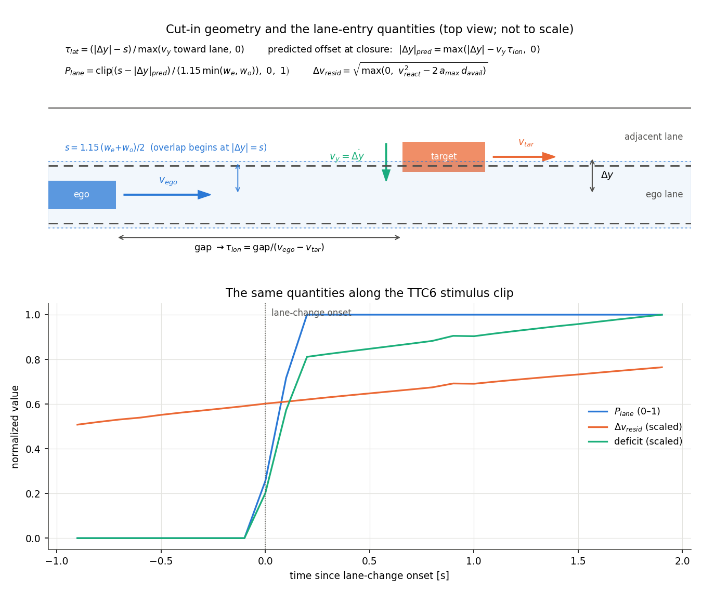

# Making lane entry continuous: the cut-in modification to the preference function

*2026-08-27. This note settles the open design question recorded in handbook chapter 04
("The cut-in's open problem") and in `handover_2026-08-26.md` section 4: the released
preference function gates its conflict terms on binary lane tests, which makes the
comfort-zone field a step function through a cut-in. The change argued here is a
modification to the authors' preference function, not a parameter choice, which is why it
gets an explicit argument rather than a line in a configuration file. Implementation:
`src/aidriver/preferences.py` (flags `lane_entry_continuous` and
`counterfactual_residual_severity`, both default off = released behavior);
validation: `replication/czb/cutin_field_check.py`.*

## 0 Summary

The released preference function cannot express a cut-in: its safety term switches from
exactly zero to a saturated constant the instant a binary lane test flips, identically for
a cut-in at a 10 m gap and one at 21 m. We replace the binary lane gates with a
**lateral overlap fraction predicted at the moment of longitudinal closure**, and the
saturated safety magnitude with the **relative speed that would remain at impact under
maximal braking**. Both changes are parameter-free, both reduce exactly to the released
forms in every geometry the released scenarios sustain, and together they turn the field
along the study's cut-in clips from one indistinguishable step into graded ramps that are
ordered by criticality at every truncation point the human data samples. Our reading is
that this is not a departure from the model so much as the closed-form completion of what
its closed loop already does; the argument for that reading is section 2.

## 1 The problem, concretely

Running the released preference function over the study's cut-in stimuli
(`external/01_studies/`, see `docs/czb_study1_data_plan.md`) produced the negative result
recorded on 2026-08-26: the comfort-zone deficit along a TTC4 clip (10.2 m gap at
manoeuvre onset) and a TTC8 clip (21.3 m) are almost identical, and both move as a step.
Decomposing the six terms located three causes:

1. **The safety term is a binary lane test times a saturated constant.** It applies only
   when the target's lateral offset satisfies |Δy| ≤ 1.15 w, and then costs
   0.5 g_C (0.2 + 0.8 Δv/10) whenever the required avoidance deceleration exceeds the
   ego's capability. Both cut-ins end under 0.75 s time headway, so both saturate the
   indicator; the term is exactly 0 before lane entry and exactly −2112 after, for both.
2. **The τ⁻¹ preference has no lateral gate at all.** Any vehicle "ahead" triggers it,
   including one a full lane away — a case the released scenarios never expose, since
   their leads are always in lane. Unmodified, it would charge the ego for merely
   passing a slower vehicle in the adjacent lane.
3. **The desired speed was mis-staged** (default 15 m/s against a 30.5 m/s stimulus),
   putting a constant −483 into every frame. This one is staging, not structure: the
   released scenarios always set `v_ego_des` to the scenario's initial speed, and the
   cut-in evaluation now does the same (`cutin_params` sets it from the clip).

A cut-in target straddles the lane boundary for 2.4–2.6 s in the recorded clips. That
entire continuum — the part of the event the participant is actually watching when they
decide to intervene — is invisible to a binary gate.

## 2 Why changing the preference function is justified, and in what sense it is not a change

The binary gates are not a defect in the released model. Its three scenarios never
sustain a partially-in-lane target: the rear-end lead is always fully in lane, the
oncoming and crossing vehicles are lateral or opposing throughout. On that support the
binary tests are exact, and nothing in the deposited results depends on what happens in
between.

More importantly, the closed-loop model does not actually respond to lane entry as a
step. Its expected free energy is an average over predicted rollouts in which the other
vehicle's steering varies (the `w_sd_model` dial — 0.4575 in the lateral scenarios
precisely so that lane changes are futures the driver entertains). A target near the
boundary produces some rollouts where it enters and some where it does not, and the
averaged conflict cost grades smoothly with how committed the manoeuvre looks. The
binary tests inside each rollout become continuous in expectation.

The comfort-zone field deliberately has no rollouts — evaluating the preference function
pointwise on recorded kinematics is what makes the method cheap enough for naturalistic
data. So the field must supply in closed form the expectation the closed loop computes by
sampling. That is what the two constructions below are: not new preferences, but the
marginalization the model already implies, written down. It seems to us this is the right
way to read the modification, and it is why we would defend presenting the transfer-test
results as results *of the model* rather than of a variant — though that reading should
be argued explicitly in any write-up, and an author of the original might see it
differently.

## 3 The lane-entry weight

**Definition.** P_lane ∈ [0, 1] is the lateral overlap fraction predicted at the moment
of longitudinal closure:

> |Δy|_pred = max( |Δy| − max(lateral closing rate, 0) · τ_lon, 0 )
>
> P_lane = clip( (s − |Δy|_pred) / (1.15 · min(w_e, w_o)), 0, 1 ),  s = 1.15 (w_e + w_o)/2

where w_e and w_o are the two vehicles' widths, τ_lon is the longitudinal
time-to-collision, and 1.15 is the released code's own inflation factor. The lateral
offset is projected forward at the current lateral closing rate over τ_lon, clamped at
perfect centering — a lane-changing target aims into the lane, not through it — and the
overlap of the two width intervals at that predicted offset, as a fraction of the
narrower width, is the weight.

**Why predicted at closure rather than measured now.** A collision requires lateral
overlap to have begun by the time the longitudinal gap closes. The overlap that matters
is therefore the one at closure, not the one at present; the present overlap is the
τ_lon → 0 special case, and the formula contains it. This is also where the comparison
Jonas proposed — predicted time-to-in-lane against longitudinal TTC — lives inside the
construction: projecting by the closing rate over τ_lon is exactly that comparison,
expressed as an overlap rather than as a time difference.

**Why lane-change duration is the wrong variable**, consistent with the QUADRARUM
group's finding that duration did not predict: duration is a property of the manoeuvre in
isolation. What the driver is exposed to is the lateral closing rate *relative to* the
longitudinal one — a slow lane change into a large gap and a fast one into a small gap
can share a duration and pose entirely different problems. P_lane depends on the rates,
not the duration.

**Properties.**

- *Parameter-free.* Widths, the 1.15 factor, and two kinematic rates the traces supply.
  Nothing is fitted.
- *Reduces to the released gates.* A target centered in lane gives exactly 1; a target in
  the adjacent lane with no lateral motion gives exactly 0, however hard the ego closes
  on it; the overlap-onset threshold coincides with the released box's 1.15 w for equal
  widths. Every geometry the released scenarios sustain is one of these cases.
- *Continuous.* In every argument, verified on a fine grid (`tests/test_cutin.py`). The
  one exception — τ_lon jumping to infinity as longitudinal closing stops — multiplies
  terms that are zero there.
- *Weights both conflict terms.* p_safe is multiplied by P_lane, and so is the τ⁻¹
  excess inside p_coll, which fixes cause 2 of section 1: passing an adjacent-lane
  vehicle costs nothing until the manoeuvre makes overlap at closure credible.

**A discarded intermediate.** A first construction combined the instantaneous overlap
with a separate anticipation factor via a maximum. It was discontinuous at overlap onset
(the anticipation factor saturates the instant overlap begins, while the instantaneous
fraction starts at zero) and was caught by the continuity property test. Recorded because
the failure mode — two semantics spliced with max() — seems easy to reinvent.

## 4 The counterfactual residual severity

Continuity in the lateral direction is not enough: with the lane gate continuous, TTC4
and TTC8 still saturate to the same penalty, because the safety term's magnitude is a
step in the longitudinal state as well. The released magnitude is
0.5 g_C (0.2 + 0.8 Δv/10) with Δv the *current* relative speed — the same for a cut-in at
10 m and at 21 m — applied whenever the required deceleration exceeds a_max.

The replacement grades by how unavoidable the counterfactual crash actually is:

> Δv_resid = sqrt( max(0, v_react² − 2 a_max d_avail) )
>
> p_safe = P_lane · 0.5 g_C · 0.8 Δv_resid / 10

with v_react and d_avail exactly as in the released required-deceleration construction
(SI Eq. 51). Δv_resid is the relative speed that would remain at impact if the ego braked
at its full capability after its reaction time, against the worst-case lead. It is zero
precisely where a_req ≥ −a_max — **the term still switches on exactly at the model's own
comfort-zone boundary; only the cliff beyond it becomes a ramp** — and it grows
continuously to v_react as the gap disappears.

Two remarks on what is dropped. The current-Δv severity factor is dropped because in the
counterfactual the lead has braked to a stop, so the relevant impact speed is the ego's
residual speed, which Δv_resid is; using the present-moment Δv was, as we read it, a
reuse of the collision term's severity for convenience rather than a modeled choice. The
0.2 severity *floor* is dropped because its purpose is to keep gentle real collisions
from being cheap (p_coll keeps it); in a counterfactual, Δv_resid → 0 means the crash is
exactly avoidable and the penalty should genuinely vanish — keeping the floor would
preserve a step of 0.1 g_C at the boundary, which is the pathology being removed.

On the study's stimuli the discrimination this buys is large: at 1.5 s after manoeuvre
onset, Δv_resid is 17.2 m/s for the TTC4 cut-in against 11.0 m/s for TTC8, giving safety
terms of −6894 and −4381 where the released form gives −2112 for both.

## 5 What the field now looks like on the study's stimuli

`replication/czb/cutin_field_check.py` runs both configurations over all twelve cut-in
stimuli; the figure is `figures/cutin_field_check.png`.

With the released binary forms and default staging: a constant −483 floor (the mis-staged
speed term), a single step near lane entry, and no ordering by criticality. With the
continuous forms and clip staging:

- the deficit is exactly zero before manoeuvre onset in every clip — so the pre-onset C1
  condition is predicted to elicit no crossing, and any C1 response is response bias,
  which is what the study design uses C1 for;
- the deficit is **ordered by criticality at every truncation point C2–C6** the
  fixed-clip design samples, for the car family (TTC4 ≥ TTC5 ≥ … ≥ TTC8) and the truck
  family alike;
- within the response window the field is a ramp (largest single-frame change a fraction
  of the level), so a threshold placed anywhere in it produces a crossing time that moves
  with the threshold — which is the property level-set fitting needs and the step
  destroyed. The remaining large jump in each trace is the real collision at the end of
  the recording, outside the response window.

Deficits at the six truncation points, car family (continuous forms):

| stimulus | C1 | C2 | C3 | C4 | C5 | C6 |
|---|---|---|---|---|---|---|
| TTC4 | 121 | 6192 | 6404 | 6575 | 6733 | 6895 |
| TTC5 | 1082 | 5632 | 5821 | 5999 | 6178 | 6354 |
| TTC6 | 1207 | 4949 | 5159 | 5436 | 5568 | 5754 |
| TTC7 | 1399 | 4058 | 4322 | 4556 | 4797 | 5018 |
| TTC8 | 2126 | 3229 | 3550 | 3848 | 4122 | 4381 |

(The C1 column is evaluated exactly at onset, where the anticipation term rises earlier
for the milder clips — their longer τ_lon projects the entry further ahead — while the
magnitude is still small; the ordering from C2 on is the one the data can test.)

**A finding to carry into the fitting design.** The mild truck cut-ins (TTC6–TTC8) show
zero or near-zero deficit through most of the response window: at a ~36 m gap and small
closing speed, the counterfactual crash is genuinely avoidable at a_max = 8 m/s², so the
*dread* field is silent. If participants nevertheless press for these clips — and the
study's own summaries suggest some do — a threshold on the dread field cannot explain it.
The comfort–dread distinction the method already carries (allowed deceleration well below
capability) is then not a refinement but a necessity, and the fitting should treat the
allowed deceleration as the axis on which the boundary lives. This is taken up in
`docs/czb_fitting_plan.md`.

## 6 What this does and does not change elsewhere

- Both flags default to off. The released scenarios, the crash-causation study, the OSF
  validation and every published number are computed with the released binary forms and
  are unaffected; the full test suite passes unchanged either way.
- The cut-in evaluation (`comfortzone.cutin`) switches both flags on and stages the
  desired speed from the clip. Any cross-scenario transfer test must run all scenarios
  under the same flags — fitting on a continuous field and predicting on a stepped one
  would confound the transfer question with the representation.
- The OSF brake-onset calibration (median error 0.0 s) was validated with the released
  forms on rear-end kinematics, where the lead is always in lane and P_lane = 1
  throughout; the lane-entry weight cannot change those results. The residual-severity
  flag does rescale deficit magnitudes, so a fitted level c is only comparable between
  runs with the same flags.

## 7 Parameter reference for the cut-in evaluation

*(Added 2026-08-27 at Jonas's request.)* Every quantity entering the cut-in field, its
meaning, its value, and where the value comes from. None is fitted; the only fitted
quantity in the whole pipeline is the later per-driver boundary level c.

*(Figure by `replication/czb/make_cutin_param_diagram.py`. The lower panel shows the
division of labor on a real clip: P_lane switches the conflict geometry on — near-zero
before onset, saturating early in the manoeuvre — while Δv_resid carries the graded
criticality; the deficit is essentially their product plus the small τ⁻¹ and effort
terms. Δv_resid is nonzero even before onset because it is computed from the
longitudinal state alone; it only enters the field multiplied by P_lane.)*

**Geometry and kinematics (from the traces)**

| symbol | meaning | value / source |
|---|---|---|
| Δy | lateral offset between vehicle centres | trace (`Location_Y` difference) |
| v_y | lateral closing rate, d(Δy)/dt | differentiated trace position (never the acceleration column) |
| gap | bumper-to-bumper longitudinal distance | x_tar − (L_ego + L_tar)/2 |
| v_ego, v_tar | speeds | trace `Speed_mps` |
| w_e | ego width | 1.72 m (`BicycleParams`, the model's vehicle) |
| w_o | target width | trace `Width_m`; trucks 2.55 m from `TRUCK_DIMS` (trace boxes broken) |
| L_ego | ego length | 4.2 m (l_f + l_r) |
| onset | first lateral displacement > 0.03 m | absolute threshold (the 2%-of-span rule fired late) |

**The lane-entry weight (this note, section 3)**

| symbol | meaning | value / source |
|---|---|---|
| 1.15 | collision-box inflation | released code, inherited unexamined |
| s | \|Δy\| at which lateral overlap begins | 1.15 (w_e + w_o)/2, ≈ 2.0 m for two cars |
| τ_lon | longitudinal time-to-collision | gap / (v_ego − v_tar); ∞ when not closing |
| τ_lat | time until overlap begins | (\|Δy\| − s) / max(v_y toward lane, 0) |
| \|Δy\|_pred | predicted offset at closure | max(\|Δy\| − v_y τ_lon, 0), clamped at centering |
| P_lane | applicability of the conflict geometry | clip((s − \|Δy\|_pred)/(1.15 min(w_e, w_o)), 0, 1) |

**The safety counterfactual (SI Eq. 51 conventions; the "stated conventions" of the
project's standing warning)**

| symbol | meaning | value / source |
|---|---|---|
| a_OV,min | assumed worst-case lead deceleration | −6 m/s² (authors' calibration; assumption, not measurement) |
| t_react | reaction budget in the counterfactual | 1.0 s (authors') |
| a_max | ego braking capability | 8 m/s² (authors'); the dread axis — a_allowed < a_max gives the comfort family |
| v_react, d_avail | speed after reacting; distance then available | Eq. 51 as released |
| Δv_resid | residual impact speed under maximal braking | √max(0, v_react² − 2 a_max d_avail) |
| g_C | collision cost | −10 000 (authors'); safety magnitude is P_lane · 0.5 g_C · 0.8 Δv_resid/10 |

**The remaining preference terms**

| symbol | meaning | value / source |
|---|---|---|
| v_desired | desired speed | the clip's median ego speed (staging, as the released scenarios stage `v_ego_des`) |
| σ_v | speed-preference width | 0.5 m/s (authors') |
| τ⁻¹ preference | one-sided Gaussian on inverse tau | μ = 0.2 s⁻¹, σ = 0.125 s⁻¹ (authors'); multiplied by P_lane |
| lane width | study road geometry | 3.5 m (trace lane centres) |
| w_sd_model | assumed steering variability of the other vehicle | 0.4575 (lateral scenarios); relevant to closed-loop *prediction* only — the pointwise field does not use it |

## 8 Remaining freedoms, stated so they are not mistaken for settled

1. **The linear projection with clamp-at-centering** is the simplest form consistent
   with "aims into the lane". A saturating lateral-velocity profile would differ in the
   first ~0.2 s of the manoeuvre; we would not expect the fitting to notice, but it has
   not been checked.
2. **The lateral closing rate comes from differentiating the trace's lateral offset**
   (10 Hz, `np.gradient`), which smears the onset by about one frame. Acceptable at the
   data's resolution; a Kalman or spline pre-smoother is the upgrade if it ever matters.
3. **The 1.15 inflation factor is inherited unexamined**, as is the use of the two
   vehicles' physical widths rather than a perceptual width.
4. **The manoeuvre-progress norm** (`cutin_norm_weight`) remains deliberately neutral
   (no penalty during a normally-paced lane change). Its categorization defect — the
   straddling region was empty by construction — is fixed, but the time-dependence stays
   off until there is a reason to switch it on; it is a separate object from P_lane and
   should not be conflated with it.

## 6 The ramp's shape: linear or S-curve? (added 2026-08-28)

Jonas proposed that the ramp from no overlap to full overlap should be a sigmoid rather
than the linear form above: a sliver of predicted overlap does not yet feel like a
rear-end conflict, but once the overlap is established the situation becomes one
relatively quickly. The argument is behavioral rather than geometric, and it is
testable, so it was implemented as a nested one-parameter family rather than adopted.

`aidriver.preferences.lane_entry_shape(u, k)` remaps the overlap fraction by a
normalized logistic with three properties that matter:

* **g(0) = 0 and g(1) = 1 exactly, for every k.** The released-limit identities of
  section 3 are what make the continuous form a refinement rather than a different
  model, and a bare logistic — which only approaches its asymptotes — would break both.
* **g(u; 0) = u.** The published linear ramp is nested at k = 0, so the proposal is a
  statement about one number, and `lane_entry_shape_k` defaults to 0: every number
  published before this date is untouched.
* **Negative k is the functional inverse of positive k**, not a duplicate of it. Worth
  stating because the obvious construction is even in k and silently makes the two the
  same curve; the property test checks it.

Swept on the 18-cell Random cut-in surface with the stage-0 probit refitted at each k
(`replication/czb/lane_entry_shape_check.py`):

| k | 0 (linear) | +6 | +8 | **+12** | +16 | +20 | +100 (≈ step) | −4 | −8 |
|---|---|---|---|---|---|---|---|---|---|
| RMSE | 0.1189 | 0.1167 | 0.1156 | **0.1154** | 0.1181 | 0.1230 | 0.1457 | 0.1199 | 0.1211 |

The proposal's **direction is supported**: positive k fits better, the reflected shape
fits worse, and there is a genuine interior optimum near k ≈ 12 rather than a monotone
drift to the edge of the grid. The **size of the gain is modest** — 2.9% of the linear
form's error — so the shape is real but not load-bearing on this design.

Two things follow that are worth more than the 2.9%. First, the k → ∞ limit is a step at
half overlap, which is effectively the released binary gate, and it is by far the worst
member of the family (0.1457 against the linear 0.1189); the sweep therefore corroborates
this note's central decision independently, since the gain from going continuous was not
an artifact of choosing a linear ramp in particular. Second, the sweep is only
informative where the overlap fraction spans its range: in the cyclist overtake P_lane
never leaves 0.843–1.000 and every k gives the same cell ordering
(`docs/overtake_construction_note.md` §4), so any conclusion here is about cut-in
geometry and does not generalize by itself.

**Whether k should be fitted is deliberately not settled here.** Doing so would make it
the first fitted parameter upstream of the boundary, and the stage-0 result draws much of
its force from the field carrying no fitted constants at all. One shape parameter does
not destroy that, but it would have to be reported as a field parameter and frozen at its
cut-in value before any transfer scenario is scored.
