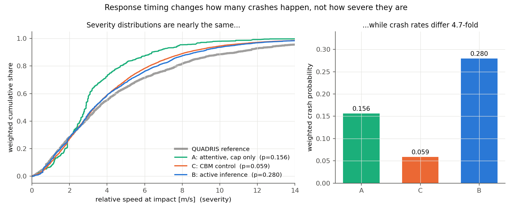
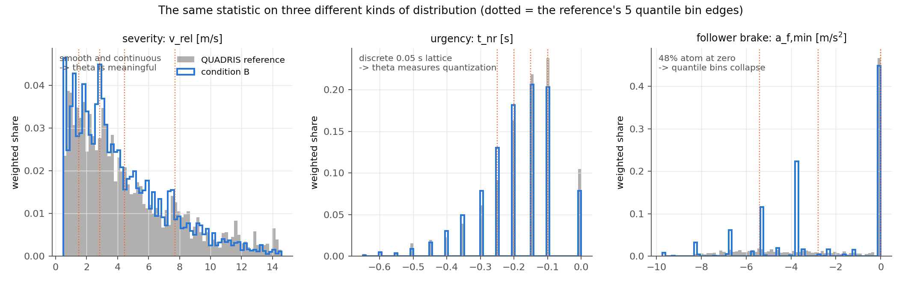

# Why severity matches while timing and braking do not

*Written 2026-08-26. Companion to `docs/crash_causation_results.md`, which reports the
numbers this document explains. Parts of it are intended for the handbook (chapter 08).
Figures are generated by `replication/causation/make_dissociation_figure.py` and
`replication/causation/severity_vs_timing.py`; every number below comes from the
full-population runs on all 5 000 QUADRIS seeds.*

## The puzzle

The full-population readout for condition B (active inference with all five causation
components) against the QUADRIS reference looks internally inconsistent at first reading:

*The thresholds quoted in the table below are Wu's published pair, which is what the study
used when this puzzle surfaced. The project has since derived its own (θthd = 0.188,
Θthd = 0.089) and settled how the reference is treated — see `docs/equivalence_rope_note.md`.
Nothing in this document's argument depends on the threshold: the puzzle is why the metrics
disagree with each other, not where any of them falls relative to a line.*

| metric | θ | Θ | verdict against ROPE 0.10 / 0.05 |
|---|---|---|---|
| severity (P_inj, v_rel, dv_lead) | 0.148 | 0.091 | close |
| urgency (t_nr) | 0.419 | 0.296 | far |
| lead braking (a_l,min) | 0.314 | 0.096 | far on θ |
| follower braking (a_f,min) | 1.058 | 0.802 | very far |

The question this raises is fair: how can the *outcome* of the crashes be almost right
while the *timing* of the response and the *braking* that produced them are so wrong?
Severity is, after all, produced by the timing and the braking.

The short answer, as I read the runs, is that the four rows are not four comparable
measurements. There are three separate things going on, and only one of them is a
statement about the model:

1. **Severity genuinely is well reproduced**, for a reason that is mechanistic rather
   than lucky: in this population, response timing determines *how many* crashes happen,
   while the scenario determines *how hard* they are.
2. **The t_nr and a_f,min rows are largely artifacts of the statistic**, not measurements
   of model error. θ is a worst-bin relative deviation computed on quantile bins of the
   reference. That construction behaves well on a smooth continuous variable and badly on
   a variable that is a discrete lattice (t_nr) or that carries a large atom (a_f,min).
3. **Underneath the artifact there is a real but much smaller braking difference**, which
   is worth reporting — just not as θ = 1.06.

## 1 Severity and timing are close to independent in this population

The clearest evidence is a comparison across conditions that differ enormously in how
often they crash.



| condition | weighted crash probability | v_rel p25 | p50 | p75 | mean P_inj |
|---|---|---|---|---|---|
| QUADRIS reference | — | 1.77 | 3.54 | 6.68 | 0.0062 |
| A: attentive, deceleration cap only | 0.156 | 1.89 | 2.88 | 4.21 | 0.0040 |
| B: active inference + glances, cap, no-response | 0.280 | 1.89 | 3.33 | 5.87 | 0.0052 |
| C: CBM control, same components | 0.059 | 1.89 | 3.34 | 5.57 | 0.0050 |
| B + abnormal acceleration | 0.280 | 1.97 | 3.63 | 6.49 | 0.0069 |
| C + abnormal acceleration | 0.059 | 2.02 | 3.63 | 6.18 | 0.0068 |

Conditions B and C differ by a factor of 4.7 in crash probability (0.280 against 0.059)
because their response processes differ: the active-inference accumulator's attentive
onsets sit at a median 1.25 s after the τ⁻¹ = 0.2 anchor, against the CBM's fixed 0.50 s.
That is a large timing difference, and it produces a large difference in crash count.
It produces almost no difference in severity: the quartiles agree to within 0.30 m/s and
the mean injury risk to within 4%.

The same point appears inside condition B. Splitting its crashes into quintiles of
response-onset delay and asking how severe each quintile is:

| onset delay vs anchor [s] | weighted median v_rel [m/s] | mean P_inj |
|---|---|---|
| −0.50 … 1.05 | 4.14 | 0.0052 |
| 1.05 … 1.45 | 3.35 | 0.0046 |
| 1.45 … 1.90 | 3.90 | 0.0053 |
| 1.90 … 2.85 | 3.78 | 0.0054 |
| 2.85 … 5.35 | 2.15 | 0.0043 |

The relationship is not monotone and the spread in mean injury risk across the whole range
of onset delays is about 20%, against a five-fold range in the delay itself. A variance
decomposition says the same thing: **71% of the variance in relative impact speed is
between-seed**, that is, inherited from the scenario, leaving 29% to the response timing
and the Monte Carlo draws combined.

**Why this happens.** Two mechanisms seem to me to be at work, and they reinforce each
other. First, all conditions run on the *same* 5 000 seeds, so everything the outcome
inherits from the scenario — the lead's braking profile, the initial gap and speed — is
matched by construction. Second, and more interestingly, impact severity saturates. Once
the response is late enough to produce a crash at all, being later adds little, because
the closing speed is already close to what the geometry allows. Responding earlier does
not make crashes milder so much as it removes them: the crashes that an earlier response
eliminates are drawn from across the severity range, not from its top.

There is a corollary worth stating, because it cuts against a natural intuition:
**condition A is the exception that proves the rule.** The attentive driver's crashes are
visibly milder (p75 = 4.21 against 5.87, mean P_inj 0.0040 against 0.0052). That is not a
timing effect either — A differs from B by having no glances and no no-response class, so
its crashes are all cases where a fully attentive driver braked and still hit. Severity in
this population responds to *whether the follower brakes at all*, which is a question
about the causation components, not to *when* it brakes, which is the question the
response models disagree about. The abnormal-acceleration component moves severity most of
all (median 3.33 → 3.63 m/s, mean P_inj 0.0052 → 0.0069), for the same reason: the
follower is accelerating into the conflict rather than braking late into it.

So severity and response timing are measuring close to orthogonal things here. A model can
be right about one and wrong about the other without contradiction.

## 2 Three of the four metrics are the wrong shape for θ

The second half of the explanation is that θ is not doing the same job in each row.



Recall the construction: cut the reference into N quantile bins, apply the same edges to
the model output, and take θ = max_i |ΔP_i / P_ref,i|. This assumes the reference can
actually be cut into N pieces of equal weight. When it cannot, the statistic reports the
failure of that assumption as if it were model error.

**Severity is smooth and continuous.** The bin edges land at 1.48, 2.84, 4.45 and 7.7 m/s,
each bin holds almost exactly 20% of the reference, and the model's shares are 0.174,
0.205, 0.212, 0.229, 0.180. θ = 0.148 is a real, interpretable statement: the worst bin is
misallocated by 15% of its proper share. This row can be trusted.

**t_nr is a discrete lattice.** The no-return time is computed on the QUADRIS 20 Hz grid,
and its reference distribution is a picket fence of spikes at multiples of 0.05 s — just
**25 distinct values in the entire reference**, against 45 in condition B. The
quantile bin edges come out at −0.25, −0.20, −0.15 and −0.10 — successive lattice points.
Bins cannot be equalized on a lattice, and indeed the reference shares are 0.184, 0.209,
0.140, 0.230, 0.236 rather than five 0.20s. What θ = 0.419 then measures is whether the
model lands on the same 0.05 s grid points in the same proportions, which is a far finer
question than any behavioral claim we would want to make. Looking at the middle panel of
the figure, the reference and condition B track each other closely in shape; the
disagreement θ reports is mostly quantization.

**a_f,min is dominated by an atom at zero.** This is the extreme case. In the reference,
**48.0% of the weighted crash mass has a_f,min > −0.5 m/s²** — crashes in which the
follower essentially never braked, because a glance or the no-response class covered the
conflict. A quantile cut cannot split an atom that large. The five bin edges come out as

```
-inf,  -5.4,  -2.8,  -2.84e-14,  -3.55e-15,  +inf
```

The last two inner edges have collapsed onto zero. Bin 4 spans the interval
[−2.84e-14, −3.55e-15] — numerically empty, yet holding 19.6% of the reference weight
through floating-point ties — and condition B places 0.000 there, which yields θ = 1.000
for that bin mechanically. Bin 5 then gives 1.058. **Neither number is a measurement of
the model.**

## 3 What the braking difference actually is

Comparing the same two distributions on quantities chosen in advance rather than on
collapsed quantile bins:

| | no braking (a_f,min > −0.5) | moderate (−4, −0.5] | hard (≤ −4) |
|---|---|---|---|
| QUADRIS reference | 0.480 | 0.208 | 0.312 |
| condition B | 0.502 | 0.259 | 0.239 |
| relative difference | **+4.6%** | +24% | −23% |

The headline that the results document already carries — condition B reproduces the
reference's dominant non-braking character — is confirmed and is in fact stronger than
stated: the non-braking share agrees to within 4.6%, which would pass a ROPE of 0.10
comfortably. The real disagreement is a redistribution *within* the braking crashes:
condition B produces too many moderate decelerations and too few hard ones, by roughly a
quarter in each direction.

That is a genuine and explainable model difference. The follower's deceleration magnitude
is drawn from the digitized 45-crash maximum-deceleration histogram of Bärgman et al.
(2024), which is a coarse discrete distribution: condition B produces **375 distinct
a_f,min values against the reference's 1 853**, and only 275 distinct values among braking
crashes against 1 799. The reference's follower (a modified IDM plus the Svärd et al.
brake-response model) brakes on a continuum; ours draws from about a dozen histogram bins
and then executes a shared jerk-ramp. This is the a_f,min lever that the handover already
lists as open item 4, and this analysis sharpens what it is: not a failure to reproduce
non-braking, but a failure to reproduce the *shape of the braking magnitude distribution*,
traceable to a discrete draw and a fixed execution model.

Re-running the same comparison on fixed physical bins (−∞, −6, −4, −2, −0.5, +∞) instead of
reference quantiles separates the two contributions:

| binning | θ | Θ |
|---|---|---|
| reference quantiles (as reported) | 1.058 | 0.802 |
| fixed physical bins | 0.704 | 0.241 |

So roughly a third of the reported θ, and about two thirds of the reported Θ, was binning
artifact; the remainder is the real discrete-draw difference. My reading is that a_f,min
should be reported on fixed bins with the three-way summary above, and that the quantile
construction should not be applied to it at all.

## 4 What I would change in how these results are reported

These are recommendations rather than findings, and I would want your view before acting
on them:

1. **Report severity as one metric, not three.** For the reference, v_rel is defined as
   2 × dv_lead under the equal-mass assumption and P_inj is a deterministic logistic
   function of dv_lead (verified: maximum absolute difference 1.0e-16). The three rows are
   monotone transforms of one number and therefore share every bin and every θ. Printing
   them as three rows reads as three pieces of agreeing evidence when it is one.
2. **Do not apply θ to a metric with an atom or a lattice.** Use pre-specified physical
   bins, and state them in advance. The equivalence module could refuse quantile binning
   when the reference's largest tie exceeds 1/N of the weight, which would have caught
   a_f,min automatically.
3. **Report the dissociation as a result rather than an anomaly.** That response timing
   moves crash count by a factor of 4.7 while leaving severity almost unchanged is, I
   think, one of the more useful things this study found. It says that a model validated
   only on crash severity distributions is close to unconstrained in its response timing,
   which matters for anyone using this kind of comparison to accept a driver model.

## 5 Caveats

- Everything above is conditioned on the QUADRIS crash-only seeds, so the independence of
  severity and timing is a property of *this* population and may not survive on
  unconditioned exposure. Section 7 of the results document bounds how far the two differ.
- The variance decomposition (71% between-seed) uses the Eq. 10 crash weights and treats
  the Monte Carlo glance draws as within-seed variation, so it mixes response timing with
  draw noise; it should be read as an upper bound on how much timing could explain.
- The t_nr lattice is shared, not a definitional mismatch: both sides use the same
  `no_return_time` function on the QUADRIS 20 Hz trajectories, and every value on both
  sides is an exact multiple of 0.05 s (verified). The quantization argument is therefore
  clean, and if anything understated — the reference has only **25 distinct t_nr values in
  total**, so asking for five equally weighted quantile bins is asking for something the
  metric's resolution cannot supply.
