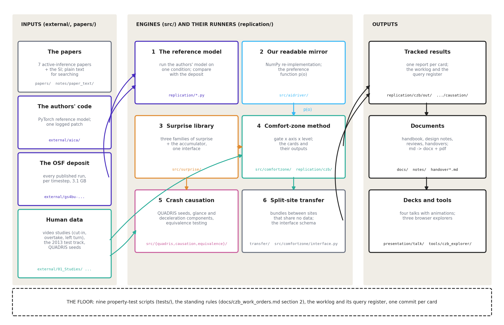
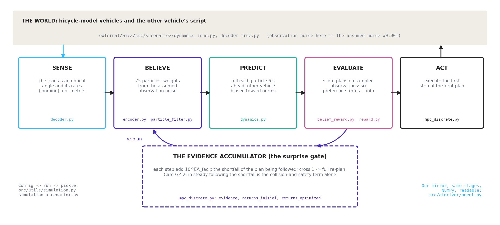
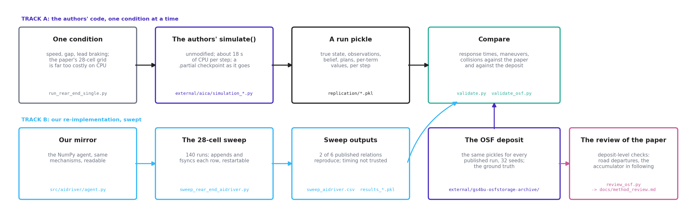
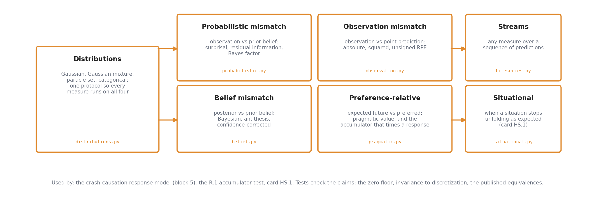
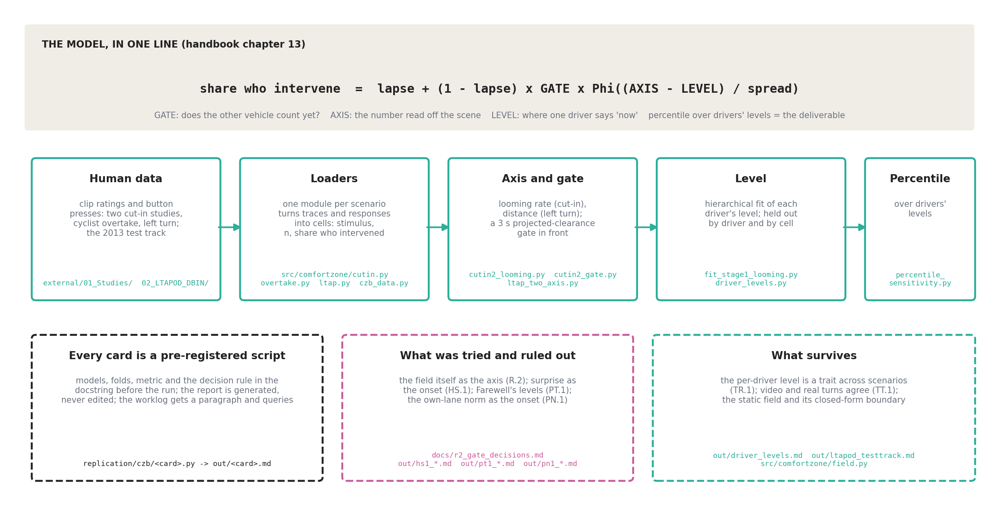
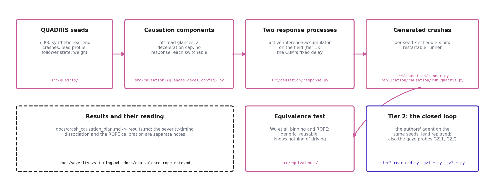
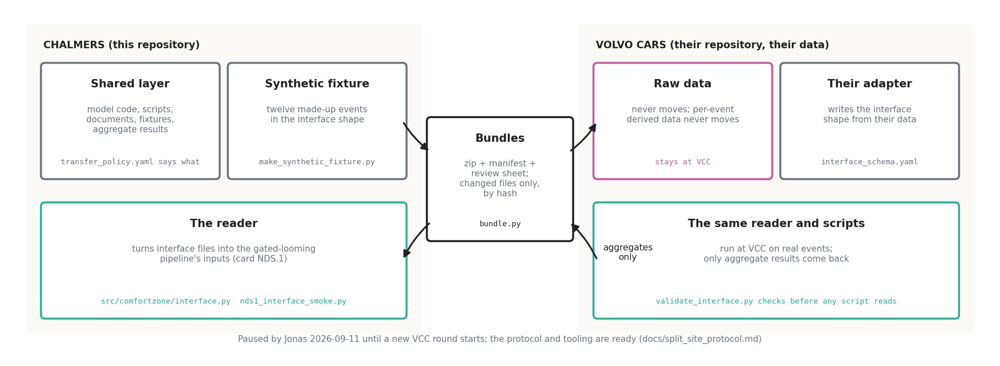
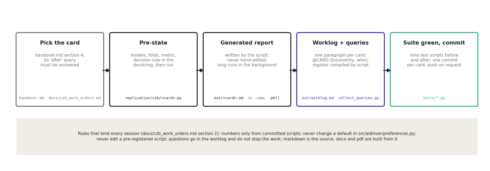

# The software in blocks: a map of the repository for jumping into the work

*2026-09-16. Written at Jonas's request for the two of us: what the software is, divided into
blocks one can hold in the head, with a figure per block and the files to open. It explains
structure and flow, not the science; the handbook (`docs/handbook/`) explains the model, and its
chapter 12 gives the class-and-parameter table of the authors' code. Where this document and the
repository disagree, the repository wins. Figures are generated by
`docs/make_software_overview_figures.py` into `docs/software_overview_figures/`; the Word and PDF
versions are built from this markdown.*

## 1 The whole thing in one picture

The repository does four kinds of work, on three kinds of input, and writes three kinds of output.
The inputs are the papers, the authors' released code with its data deposit, and human data. The
engines are a reference model and our mirror of it, a library of surprise measures, the
comfort-zone measurement method, and a crash-causation study; a sixth block moves work between
sites that cannot share data. The outputs are tracked results, documents, and decks and tools.
Underneath everything sits a floor of property tests and working rules.

| block | folder(s) | what it is for | first file to open | state |
|---|---|---|---|---|
| 1 The reference model | `external/aica/`, `replication/` | run the published model on one condition; compare with the paper and its deposit | `replication/run_rear_end_single.py` | works; two conditions replicated; one logged patch |
| 2 Our readable mirror | `src/aidriver/` | the same model in NumPy, readable and ablatable; supplies the preference function | `src/aidriver/preferences.py` | preferences verified; closed-loop timing not trusted |
| 3 Surprise library | `src/surprise/` | every surprise measure the papers use, on one interface | `src/surprise/__init__.py` | complete; 31 property tests |
| 4 Comfort-zone method | `src/comfortzone/`, `replication/czb/` | measure comfort-zone boundaries from human data: gate, axis, level, percentile | `docs/handbook/13_glossary.md`, then `replication/czb/out/` | the current model of the project; two scenarios fitted |
| 5 Crash causation | `src/quadris/`, `src/causation/`, `src/equivalence/`, `replication/causation/` | crashes generated around an active-inference response and tested for equivalence | `docs/crash_causation_results.md` | complete study; the gaze probes GZ.1 and GZ.2 live here too |
| 6 Split-site transfer | `transfer/`, `src/comfortzone/interface.py` | work with Volvo Cars without moving their data | `transfer/README.md` | ready; paused by Jonas 2026-09-11 |
| Outputs | `replication/*/out/`, `docs/`, `notes/`, `presentation/`, `tools/` | reports, documents, decks, explorers | `handover.md` | living |
| The floor | `tests/`, `docs/czb_work_orders.md` §2 | nine test scripts and the standing rules | `handover.md` §0 and §2 | 353 checks, all passing on 2026-09-16 |

## 2 Block 1: the reference model, and how it is replicated

The published model (Schumann et al., 2026) is a driver that senses, believes, predicts, evaluates
and acts, once every 0.2 s, with a surprise accumulator that decides when to throw the current
plan away. The authors' PyTorch code is cloned unmodified under `external/aica/` and is the ground
truth for every number that will be compared or published. The figure names the file behind each
stage.

In plain words. The driver does not see the lead car in meters; it sees an optical angle and how
fast that angle grows (`decoder.py`). It holds 75 hypotheses about where both cars are and what
the lead is doing, weighted by how well each explains what was seen, given the noise the model
*assumes* its senses have (`encoder.py`, `particle_filter.py`). Each hypothesis is rolled six
seconds ahead with the other car biased toward normal behavior (`dynamics.py`). Candidate plans
are scored on those imagined futures against six preferences and an information term
(`belief_reward.py`, `reward.py`), and the first step of the best plan is executed
(`mpc_discrete.py`). Meanwhile the accumulator adds up, every step, how far the plan being
followed falls short of the preferred future; when the sum crosses one, the driver re-plans from
scratch. That accumulator is the model's response-time mechanism, and it is also the piece that
card GZ.2 found re-planning by itself in steady following, driven by the collision-and-safety term
alone (`replication/causation/gz2/gz2_following_braking.md`).

Two things about the code that are easy to get wrong. The observation noise scales in the
configuration are the noise the model *assumes*; the world's true observation noise is those
values times 0.001 (`simulation_benign.py`, `Decoder_true`). The Supplementary Information and the
released code disagree in more than a dozen places, listed in `docs/method_review.md` §5; the code
wins, and `src/aidriver/preferences.py` documents each difference.

Replication runs the authors' own `simulate()` for one condition at a time, because the paper's
grid costs about 18 s of CPU per simulated step per run here. Track A is that path; Track B is our
mirror swept over the paper's 28 conditions. Both are compared against the paper and against the
OSF deposit, which holds the authors' own per-timestep output for every published run and beats
the printed figures whenever they disagree.

| file | role |
|---|---|
| `replication/run_rear_end_single.py` | one condition through the authors' code; `--checkpoint-every` writes a `.partial` pickle because long jobs get killed in this environment |
| `replication/validate.py`, `validate_osf.py` | compare a run, or the deposit, with the published values; `replication/osf/report.md` is the deposit comparison |
| `replication/review_osf.py` | the deposit-level checks behind `docs/method_review.md` |
| `replication/sweep_rear_end_aidriver.py` | the 140-run sweep of the mirror; appends and fsyncs each row, restartable |
| `replication/PATCHES.md` | the one local patch in `external/aica/` (a hard-coded `device='cuda'`); keep it the only one |
| `notes/03_replication.md`, `notes/05_validation.md` | what matched, what did not, and why |

## 3 Block 2: our readable mirror

`src/aidriver/` re-implements the agent in NumPy so that mechanisms can be read and switched off.
`agent.py` is the belief-plus-CEM loop; `bicycle.py` the vehicle model; `scenarios.py` the
worlds; `params.py` the parameter objects; and `preferences.py` the preference function p(o),
which is the one part of the model the comfort-zone work depends on. The preferences were
verified against the SI and then aligned with the released code (2026-08-23); the closed-loop
response timing is not trusted and should not be used for timing claims (`notes/05_validation.md`).

Two traps recorded in `HANDOFF.md` §4 apply here: the `AgentParams` defaults do not match the
validated sweep configuration (`alpha` and `a_other_min_assumed` differ), and `a_other_min_assumed`
in the agent and `a_other_min` in the preferences are different parameters that describe the same
physical assumption. Rule 3 of the standing rules says never change a default in `preferences.py`;
new behavior goes behind a flag that defaults off, as `lane_entry_horizon_s` does.

## 4 Block 3: the surprise library

`src/surprise/` implements every surprise measure the papers use, organized by what is compared
with what, and runs each on any of four belief representations through one protocol. The
accumulator that turns preference-relative surprise into a response time lives in
`pragmatic.py`; `situational.py` (card HS.1) asks when a whole situation stops unfolding as
expected. The tests check the claims, not just that the code runs: the zero floor, invariance to
discretization, and the published equivalences between measures.

Where it is used: the crash-causation response model (block 5), the R.1 accumulator test on the
cut-in data, and card HS.1. `demo_surprise.py` runs the measures on a cut-in and the agent on a
rear-end conflict in minutes.

## 5 Block 4: the comfort-zone method

This is the project's objective and its current model. It has two layers that should be kept
apart in the head.

**The static layer** (`src/comfortzone/field.py`, `boundary.py`, `calibrate.py`) is the original
idea: the preference function gives a scalar field over the state space, a comfort-zone boundary
is a level set of that field, car following has a closed-form boundary, and the level can be
calibrated from recorded kinematics alone, without running the closed loop. It works and is
tested (`demo_comfort_zone.py`; 33 property tests). On human data, however, the field's kinematic
content was ruled out as the axis (gate R.2, `docs/r2_gate_decisions.md`).

**The empirical layer** is what the project measures now. The model is one line:

> share who intervene = lapse + (1 − lapse) × GATE × Φ((AXIS − LEVEL) / spread)

The gate says whether the other vehicle counts yet; the axis is the number read off the scene (the
optical expansion rate on the cut-in, the oncoming car's distance on the left turn); the level is
where one driver says "now"; the deliverable is a percentile over drivers' levels. Every term is
defined in plain words in `docs/handbook/13_glossary.md`.

How the pipeline is built. One loader module per scenario (`cutin.py`, `overtake.py`, `ltap.py`,
`czb_data.py`) turns the study traces and button presses into cells: a stimulus, how many saw it,
and how many intervened. Each analysis is a card: a script in `replication/czb/` whose docstring
states the models, folds, metric and decision rule before it runs, and which writes its report to
`replication/czb/out/`. The current results, each with its script, are:

| what | script | report |
|---|---|---|
| the cut-in axis is the looming rate | `cutin2_looming.py` | `out/cutin2_looming.md` |
| the anticipatory gate in front of it | `cutin2_gate.py` | `out/cutin2_gate.md` |
| the per-driver level on the gated looming axis | `fit_stage1_looming.py` | `out/stage1_looming.md` |
| the left turn's axis is distance | `ltap_two_axis.py` | `out/ltap_two_axis.md` |
| the level is a trait across scenarios | `driver_levels.py`, `cross_scenario_consistency.py` | `out/driver_levels.md`, `out/cross_scenario_consistency.md` |
| video against real turns on the test track | `ltapod_testtrack.py` | `out/ltapod_testtrack.md` |
| how much the percentile choice matters | `percentile_sensitivity.py` | `out/percentile_sensitivity.md` |
| tried and ruled out: surprise as the onset, Farewell's levels, the own-lane norm | `hs1_situational_surprise.py`, `pt1_farewell_thresholds.py`, `pn1_cutin_norm.py` | `out/hs1_*.md`, `out/pt1_*.md`, `out/pn1_*.md` |

The next card, PC.1, generalizes the gate from lateral clearance to a projected conflict between
the ego's path and the other road user's, so that the same construction runs in all four
scenarios (`handover.md` §4). The data itself is under `external/01_Studies/` and
`external/02_LTAPOD_DBIN/`, untracked; `docs/czb_study1_data_plan.md` and the studies' own data
dictionary list the traps.

## 6 Block 5: crash causation

A separate study with its own plan and results documents: the four crash-causation mechanisms of
Bärgman et al. (2024) implemented as switchable components around two response processes, crashes
generated from the QUADRIS seed scenarios, and the generated population tested for practical
equivalence against the reference with the Wu et al. (2026) binning-and-ROPE framework. The
equivalence package knows nothing about driving and is reusable for any metric.

Tier 1 times the response on the seed kinematics with the surprise accumulator on the
comfort-zone field, which is cheap; tier 2 runs the authors' closed-loop agent on the same seeds
with the lead vehicle replayed (`replication/causation/tier2_rear_end.py`), which is slow. The
tier-2 adapter is also where the gaze probes of September 2026 live (`gz1_gaze_choice_probe.py`,
`gz2_following_braking.py`), because it is the one place the released model can be run with a
scripted lead and instrumented step by step. Results: `docs/crash_causation_results.md`; the
severity-timing dissociation and the ROPE calibration are separate notes.

## 7 Block 6: working with a partner that cannot move its data

Volvo Cars holds naturalistic data that will not leave their site, and the two sides share
neither a repository nor a drive. The split-site protocol (`docs/split_site_protocol.md`) moves
code, documents and aggregate results as reviewed bundles; raw and per-event data never move.
The only data shape the shared code reads is `transfer/interface_schema.yaml`; VCC's adapter
produces it, our synthetic fixture imitates it, and `src/comfortzone/interface.py` reads it into
the gated-looming pipeline (card NDS.1, `replication/czb/out/nds1_interface_smoke.md`).

The track is paused by Jonas since 2026-09-11 until a new VCC round starts. When it resumes, the
first action is to revise the interface schema with the five gaps card NDS.1 found (queries
NDS.Q2 to NDS.Q5) before VCC writes their adapter.

## 8 Outputs: results, documents, decks and tools

**Tracked results.** Every card writes a report into `replication/czb/out/` or
`replication/causation/`; the worklog `replication/czb/out/worklog.md` is the source of truth for
decisions and for the queries raised to Jonas or to a reviewing session; `collect_queries.py`
compiles them into `out/query_register.md`.

**Documents** (`docs/`). Markdown is the source; Word and PDF are built from it with pandoc and
`docs/build_pdf.py`. Three families: the handbook (`docs/handbook/`, the internal understanding
pack, 17 chapters and appendices, built with `build_handbook.py` and `build_combined.py`) and its
separate authors' edition (`docs/handbook_authors/`, which does not track the internal one); the
design and construction notes, one per idea, each read before the card that implements it; and
the reviews and decision records (`method_review.md`, `r2_gate_decisions.md`,
`r2_pipeline_review.md`). `notes/` holds the older research notes, and the dated
`handover_YYYY-MM-DD.md` files record each work arc.

**Decks and tools.** `presentation/talk/` holds four decks built by script on the Chalmers
template, with animations rendered once to GIF and transcoded to MP4 (the rules that keep the
videos right are in `docs/skill_additions_video.md`). `tools/czb_explorer/` holds three static
browser pages: the closed-form boundary explorer, the norm-tournament sandbox, and a browser of
all 224 rear-end runs in the deposit.

## 9 The floor: tests, the working cycle, and the rules

Nine test scripts, each a plain script that counts checks in the `check(...)` style, must pass
before and after every card. `pytest` reports fewer and is not the suite.

| script | checks | covers |
|---|---|---|
| `tests/test_surprise.py` | 31 | the surprise measures and their claimed properties |
| `tests/test_comfortzone.py` | 33 | the static field, its closed-form boundary, calibration |
| `tests/test_causation.py` | 40 | the causation components and the equivalence package |
| `tests/test_cutin.py` | 96 | lane entry, the cut-in and overtake loaders, the covariate window |
| `tests/test_ltap.py` | 62 | the left-turn loader and geometry |
| `tests/test_transfer.py` | 20 | the bundle tool and its policy |
| `tests/test_interface.py` | 28 | the split-site interface reader |
| `tests/test_situational.py` | 27 | situational surprise |
| `tests/test_norms.py` | 16 | the cut-in norm |

The cycle every card follows is the same, and the figure shows it with the files at each step.

The rules that bind every session are listed in full in `docs/czb_work_orders.md` §2 and
summarized in `handover.md` §2. The ones that bite most often: every quoted number comes from a
committed script with a tracked output; never change a default in `src/aidriver/preferences.py`;
never modify a script whose docstring says it is pre-registered; questions go into the worklog as
queries and do not stop the work; a PermissionError on a build means the file is open in Word or
PowerPoint, so write a `-vN` copy.

## 10 Jumping in

**The entry sequence.** Read `handover.md` in full (it says where the project stands, what is
waiting on Jonas, and the queue in order), then `docs/czb_work_orders.md` §2, then the card or
note for the task. Run the nine test scripts. Check `git status`. The `performing-research` skill
sets the working mode.

**Where to go for a question.**

| I want to ... | open |
|---|---|
| understand the model in words | `docs/handbook/00_reading_guide.md`, then chapters 02, 03, 13 |
| see the current comfort-zone results | `replication/czb/out/stage1_looming.md`, `cutin2_gate.md`, `cutin2_looming.md`, `driver_levels.md` |
| know what was decided and why | `replication/czb/out/worklog.md` (newest at the end), `docs/r2_gate_decisions.md` |
| know what is waiting on Jonas | `replication/czb/out/query_register.md`, `handover.md` §3 |
| run the published model | `replication/run_rear_end_single.py`; expect hours, use `--checkpoint-every` |
| instrument the published model step by step | `replication/causation/gz2_following_braking.py` is the pattern |
| read the preference function | `src/aidriver/preferences.py` and `docs/method_review.md` §5 |
| compute a surprise measure | `src/surprise/__init__.py`, the quick start in its docstring |
| add a scenario to the comfort-zone pipeline | `docs/ltap_construction_note.md` is the pattern; a construction note first, then a loader, tests, a card |
| build a document | `pandoc docs/X.md -o docs/X.docx --from markdown --resource-path docs`, then `python docs/build_pdf.py docs/X.md` |
| rebuild a deck | `presentation/talk/README.md`; never onto a file Jonas may have edited |
| work with the Volvo Cars data | `transfer/README.md`, `docs/split_site_protocol.md`; paused until Jonas says |

**Environment.** Windows 11, Python 3.14, torch CPU-only, pandoc on PATH, no LaTeX, no GPU, no
`gh`. The repository lives in OneDrive, so open Office files are locked. `external/`, `papers/`
(except their READMEs), `OthersWork/` and the `.pptx` decks are untracked. Long runs go in the
background with a log; a hierarchical fit takes 5 to 35 minutes; the closed loop takes 5 to 100 s
per step depending on machine load.

**Five first exercises** for a first afternoon are in handbook chapter 12; each is under an hour
and touches a different block.

## 11 What this document leaves out, on purpose

The science and its numbers, which live in the reports and the handbook; the authors' code at the
class level, which is handbook chapter 12; the history of decisions, which is the worklog and the
dated handovers; and `OthersWork/`, a colleague's parallel analysis that is not context for this
project beyond handbook appendix 16.
